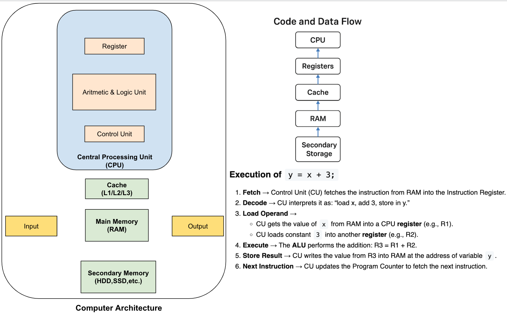
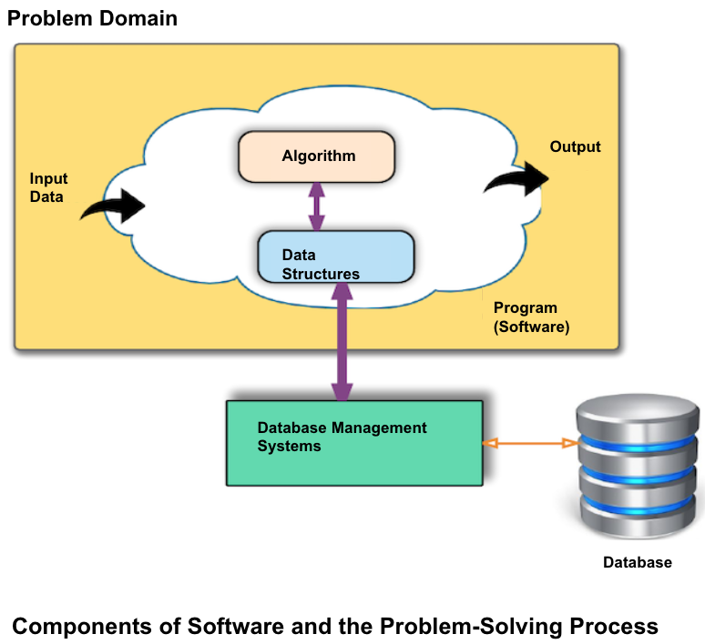

***

---
# Foundations of Information and Communication Technologies(ICT)
***

---

<!-- TOC -->
* [Foundations of Information and Communication Technologies(ICT)](#foundations-of-information-and-communication-technologiesict)
  * [Overview of ICT](#overview-of-ict)
    * [What is ICT?](#what-is-ict)
    * [Why is ICT Important?](#why-is-ict-important)
    * [Key Elements of ICT](#key-elements-of-ict)
      * [1. Hardware](#1-hardware)
      * [2. Software](#2-software)
      * [3. Networks & Infrastructure](#3-networks--infrastructure)
      * [4. Communication Technologies](#4-communication-technologies)
      * [5. People & Procedures: The Human Element and Governance](#5-people--procedures-the-human-element-and-governance)
      * [6. Data: The Information Itself](#6-data-the-information-itself)
    * [Functions of ICT](#functions-of-ict)
  * [Computer Hardware Components](#computer-hardware-components)
    * [Central Processing Unit (CPU)](#central-processing-unit-cpu)
    * [Memory](#memory)
    * [Storage (Secondary Memory)](#storage-secondary-memory)
    * [Input and Output (I/O) Devices](#input-and-output-io-devices)
    * [Motherboard](#motherboard)
  * [Software Types](#software-types)
    * [System Software](#system-software)
    * [Application Software](#application-software)
    * [Middleware](#middleware)
  * [The Internet and World Wide Web](#the-internet-and-world-wide-web)
    * [Internet](#internet)
    * [World Wide Web (WWW)](#world-wide-web-www)
  * [Introduction to Programming, Databases, and Networking](#introduction-to-programming-databases-and-networking)
    * [Programming](#programming)
    * [Databases](#databases)
    * [Networking](#networking)
  * [Setting Up the Development Environment](#setting-up-the-development-environment)
    * [1. IntelliJ IDEA (for Java Development)](#1-intellij-idea-for-java-development)
    * [2. Node.js (for Web Development)](#2-nodejs-for-web-development)
    * [3. HTTP Client (for testing web services)](#3-http-client-for-testing-web-services)
    * [4. PostgreSQL (for DB Operations)](#4-postgresql-for-db-operations)
<!-- TOC -->

---
## Overview of ICT

### What is ICT?
- **Information and Communication Technologies (ICT)** is the combination of  systems, tools, and resources that enables the acquisition (capturing), creation, storage, processing, transmission, and exchange of information.
- It includes both **computing technologies** (hardware, software, databases) and **communication technologies** (networks, internet, broadcasting, telephony).

**Official Definitions**

**UNESCO**
> ICT is a diverse set of technological tools and resources used to **transmit, store, create, share, or exchange information**.  
These technological tools and resources include computers, the Internet (websites, blogs and emails), live broadcasting technologies (radio, television and webcasting), recorded broadcasting technologies 
(podcasting, audio and video players and storage devices) and telephony (fixed or mobile, satellite, visio/video-conferencing, etc.).

**Eurostat / European Commission**
> ICT covers all **technical means** used to **handle information** and **aid communication**, including **computer and network hardware** as well as **software**.

### Why is ICT Important?

- **Enables Communication** → Connects people globally through email, video calls, and social media, breaking down geographical barriers.
- **Drives Global Economy** → Powers businesses, banking, e-commerce, and innovation across all industries.
- **Supports Decision-Making** → Provides tools for data collection, analytics, and visualization.
- **Boosts Productivity and Efficiency** → Automates tasks, streamlines processes, and allows for the rapid processing of vast amounts of data.
- **Facilitates Access to Information** → Makes knowledge and resources widely available.
- **Enhances Quality of Life** → Supports healthcare systems, government services, transportation, entertainment, etc.

### Key Elements of ICT

>  | 1.Hardware | 2.Software | 3.Networks & Infrastructure | 4.Communication Technologies | 5.People & Procedures | 6.Data (Information) |
>  |------------|------------|-----------------------------|------------------------------|-----------------------|----------------------|

#### 1. Hardware
Physical devices that support information handling and communication.
- **Input devices**: keyboard, mouse, scanner, barcode readers, camera, sensors
- **Processing devices**: CPU, GPU, microcontrollers
- **Storage devices**: HDDs, SSDs, cloud storage servers
- **Output devices**: monitors, printers, speakers, projectors
- **Networking devices**: routers, switches, modems, satellites

#### 2. Software
Programs and instructions that control hardware and perform tasks.
- **System software**: operating systems (Windows, Linux, macOS), drivers
- **Application software**: browsers, office tools, media players, collaboration platforms
- **Database software**: PostgreSQL, MySQL, Oracle, MSSQL, MongoDB, Redis, Cassandra, etc.
- **Middleware**: software that links applications and databases or facilitates communication

#### 3. Networks & Infrastructure
Systems that enable connectivity and data exchange.
- **Wired networks**: Ethernet, fiber optics
- **Wireless networks**: Wi-Fi, Bluetooth, 4G/5G
- **Internet backbone**: servers, ISPs, data centers
- **Protocols**: TCP/IP, HTTP/HTTPS, DNS

#### 4. Communication Technologies
Tools and platforms that support human-to-human or system-to-system communication.
- **Telephony**: fixed-line, mobile, VoIP
- **Broadcasting**: radio, television, streaming platforms
- **Internet services**: email, messaging, video conferencing, social media
- **Collaboration tools**: Zoom, Teams, Slack, Google Meet

#### 5. People & Procedures: The Human Element and Governance
The most critical component. Technology only works when guided by people and policies.

- **People**: End-users, developers, system administrators, data analysts, network engineers, managers, policymakers
- **Procedures**:
    - Security policies
    - Privacy laws (e.g., GDPR)
    - Standard operating procedures (SOPs)
    - User manuals and best practices
    - Ethical guidelines for ICT use

#### 6. Data: The Information Itself
The central element of ICT — the content that is acquired, created, processed, stored, transmitted, and exchanged.

- Text documents, images, audio, video
- Databases, spreadsheets, logs
- Big data repositories, sensor readings, analytics results

### Functions of ICT
ICT systems enable us to:

- **Acquire / Capture / Create information**
  - *Enabled by*: **Hardware** (sensors, input devices), **Software** (data entry apps, content creation tools), **People** (users, developers)

- **Store information**
  - *Enabled by*: **Hardware** (storage devices, cloud servers), **Software** (databases, file systems), **Data** (the stored content itself)

- **Process information**
  - *Enabled by*: **Hardware** (CPU, GPU), **Software** (analytics tools, algorithms), **People** (analysts, decision-makers)

- **Transmit information**
  - *Enabled by*: **Networks & Infrastructure** (wired, wireless, Internet), **Protocols** (TCP/IP, HTTP/HTTPS), **Hardware** (routers, switches)

- **Share / Exchange information**
  - *Enabled by*: **Communication Technologies** (email, video conferencing, social media, broadcasting)**People & Procedures** (policies, ethical use)

---
## Computer Hardware Components

[A sample motherboard](https://freebloet.click/product_details/60960180.html)

### Central Processing Unit (CPU)

- Executes instructions using the **fetch–decode–execute** cycle.
- Performance factors:
  - **Clock speed** (GHz) → how fast it processes instructions.
  - **Cores** → multiple cores allow parallel processing.
- Example: Intel Core i7, AMD Ryzen, M1/M2/M3 ...

### Memory
- **RAM (Random Access Memory) - Main Memory**
  - Volatile (data lost when power is off).
  - Stores program code and temporary data for active programs.
  - Faster than storage.
- **ROM (Read Only Memory)**
  - Non-volatile (keeps data without power).
  - Stores firmware or permanent instructions.

### Storage (Secondary Memory)
- **HDD (Hard Disk Drive)**
  - Magnetic storage, larger capacity, cheaper, slower.
- **SSD (Solid State Drive)**
  - Flash-based storage, faster, lighter, more expensive.
- **Cloud storage**
  - Remote servers accessed via the Internet.
  - Example: Google Drive, Dropbox, AWS S3.

### Input and Output (I/O) Devices
- **Input**: keyboard, mouse, microphone, scanner, barcode reader, sensors.
- **Output**: monitor, printer, speakers, projectors.
- **I/O ports**: USB, HDMI, Ethernet, WiFi for device connectivity.

### Motherboard
It connects and allows communication between all the different hardware components.
- **Provides physical structure**: Holds the CPU, memory, and other components.
- **Connects components**: Uses buses and circuits to let the CPU, memory, storage, and peripherals communicate.
- **Distributes power**: Supplies electrical power to different parts of the computer.
- **Hosts firmware**: Stores the BIOS/UEFI, which starts up the computer and manages low-level hardware settings.

---
## Software Types

### System Software
- Manages hardware and provides the foundation for applications.
- Examples: Operating Systems (Windows, Linux, macOS), device drivers, utilities.

### Application Software
- Programs for end users to perform specific tasks.
- Examples: MS Word, browsers, games, media players.

### Middleware
- Acts as a **bridge** between applications, databases, or systems.
- Examples:
  - Database middleware (JDBC, ODBC)
  - Message brokers ( Kafka, MQTT, RabbitMQ)

---
## The Internet and World Wide Web

### Internet
- The Internet is a global network that connects devices and people, allowing them to share data and services.
- Uses TCP/IP protocols for communication.
- Provides services: www, email, file transfer, remote access,etc.

### World Wide Web (WWW)
- A **service** that runs on top of the Internet.
- Uses **HTTP/HTTPS** protocols to access web pages.
- Components:
  - **Web servers** → host and deliver web pages.
  - **Browsers & Applications** → access, display, or use content to trigger actions.
  - **Devices** → desktops, laptops, mobile devices, tablets, and IoT systems.

---
## Introduction to Programming, Databases, and Networking

### Programming
- Writing instructions for a computer using programming languages.
- Programming languages are divided into two main classes based on their execution method:
  - **Compiled languages**: C, C++, Rust, Go → need compilation before execution.
  - **Interpreted languages**: Python, JavaScript, Ruby, PHP → executed line by line.
  - **Hybrid Approach (JIT Compilation)**: Java, C#, Python (with PyPy) - Source code → Bytecode → Just-In-Time Compiler → Native Machine Code
- Programming paradigms:
  - Procedural (step-by-step)
  - Object-Oriented Programming (OOP)
  - Functional programming

### Databases
- Collection of related data stored in files is called a database.
- **Relational databases (RDBMS)**: PostgreSQL, MySQL, Oracle, MSSQL, etc.
  - **SQL (Structured Query Language)** for data operations.
  - Example operations: SELECT, INSERT, UPDATE, DELETE.
- **NoSQL databases**: MongoDB, Redis, Cassandra, etc.

### Networking
- Connecting computers to share resources and communicate.
- Types: **LAN**, **WAN**, **Internet**.
- Key elements: IP addresses, DNS, ports, sockets.

---

## Setting Up the Development Environment

To practice throughout this course, install and configure the following tools:

### 1. IntelliJ IDEA (for Java Development)
- Popular IDE for Java based development. 
- For accessing a free IDE, you can visit (https://www.jetbrains.com/shop/eform/students)
- Download Link: [IntelliJ](https://www.jetbrains.com/idea/download)
- File -> New -> Project -> Java
  - name, location
  - JDK -> download if not exist
  - check "add sample code" option
  - write the following code snippet

~~~java
/**
 * Must be stored as HelloWorld.java
 *
 */
public class HelloWorld {

    public static void main(String[] s) {

        System.out.println("Hello World");
    }

}
~~~

  - Open a terminal
  - Compiling
~~~console
javac HelloWorld.java
~~~

  - Running
~~~console
java HelloWorld.java
~~~

  - Output
~~~console
Hello World
~~~

### 2. Node.js (for Web Development)
- JavaScript runtime environment for server-side(backend) development.
- Used for building web applications and services(APIs).
- Download Link: [Node.js](https://nodejs.org/en/download)

    * Setting up Intellij for Node.js based development
      - IntelliJ IDEA -> Preferences -> Plugins -> Node.js
      - IntelliJ IDEA -> File -> Settings -> Plugins -> Node.js

    * Initialize a new Node.js project
      - IntelliJ IDEA -> File -> New -> Project -> Empty Project (Give the project an appropriate name.)
      - Open a terminal in IntelliJ
      - npm init -y
      - Make a /src folder to hold the source code of the project

    * Make a /src/hello-world.js file and write the following code:
      
~~~javascript
console.log('Hello world.');
~~~

  * Run the app:
      - node hello-world.js

  * Make a /src/server.js file and write the following code:

~~~javascript
const express = require("express");
const app = express();
const PORT = 3000;

app.get("/", (req, res) => {
  res.send("Hello World.");
});

app.listen(PORT, () => {
  console.log(`Server is running on http://localhost:${PORT}`);
});
~~~ 
   * Run the app:
      - node server.js

### 3. HTTP Client (for testing web services)
- Provides the ability to compose and execute HTTP requests from the code editor.

* Setting up Intellij for http client
  - IntelliJ IDEA -> Preferences -> Plugins -> HTTP Client

* Make a rest-api-test.http file and write the following code:

~~~http request
GET localhost:3000/
~~~

### 4. PostgreSQL (for DB Operations)
- PostgreSQL is an open-source and powerful relational database management system.
- Complies with SQL standards and supports Linux, macOS, and Windows.
- Download Link: [Download PostgreSQL](https://www.postgresql.org/download/)
