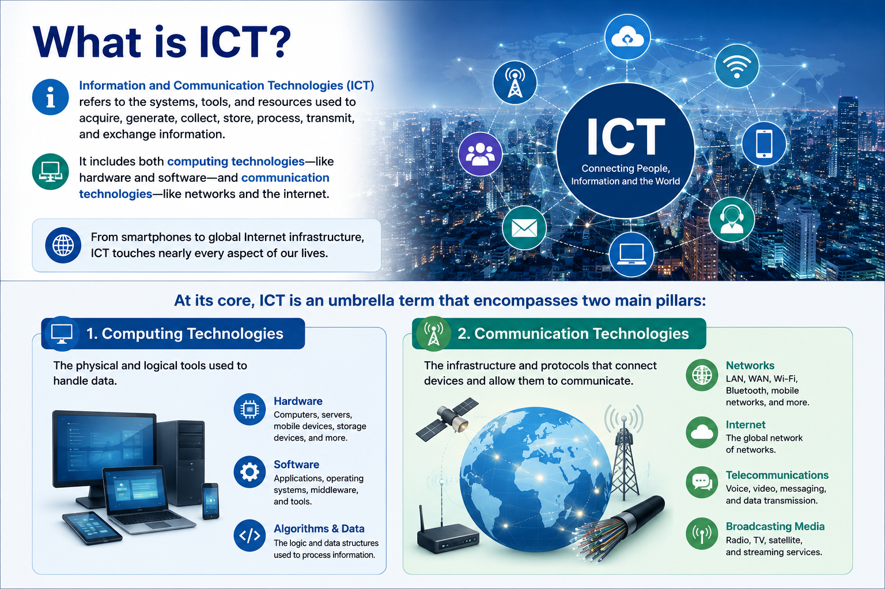
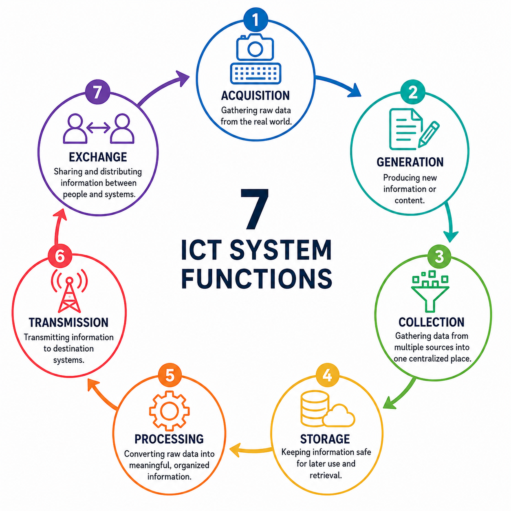
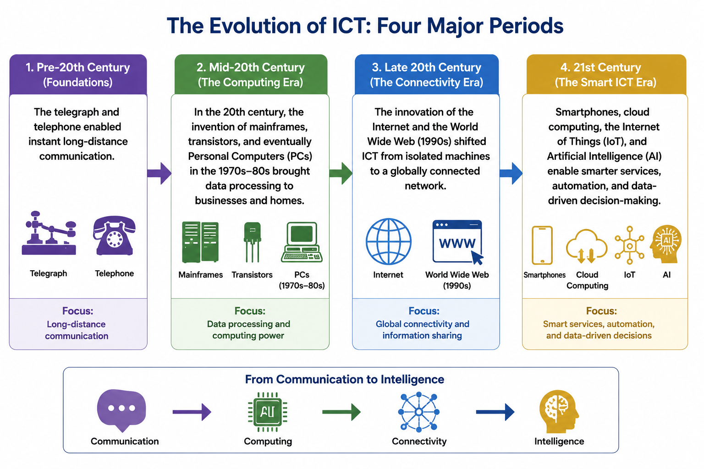
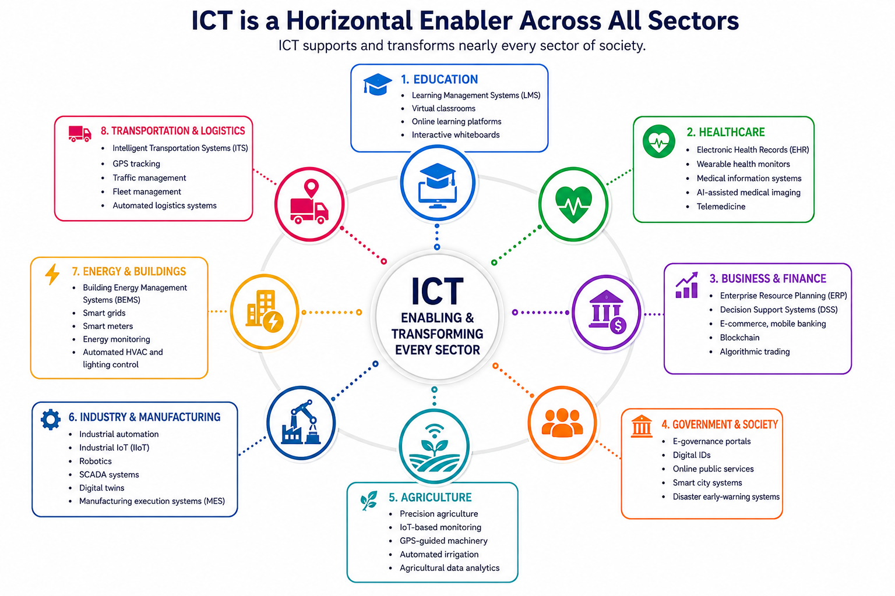
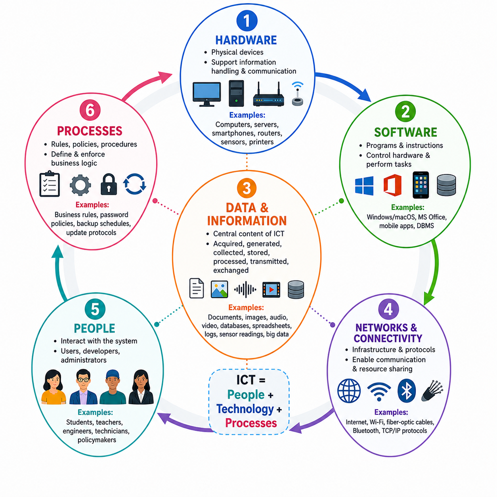
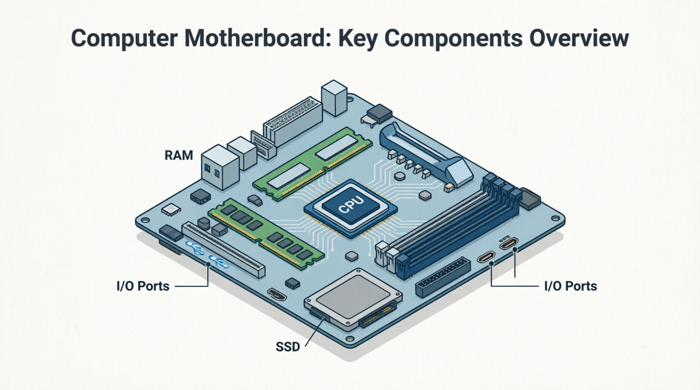
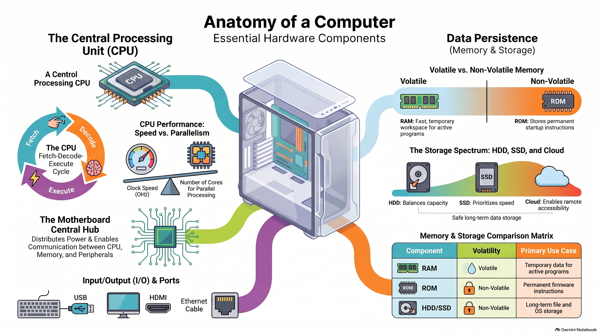
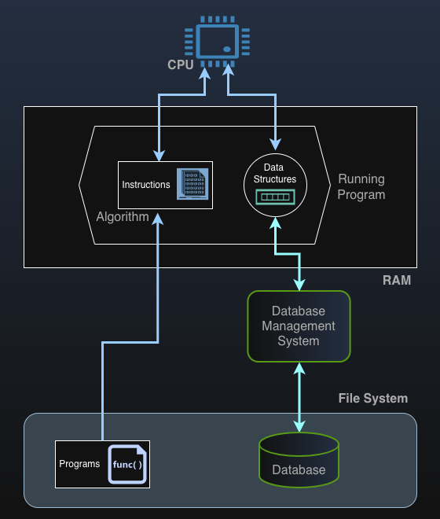

# Foundations of Information and Communication Technologies(ICT)
***

---

<!-- TOC -->
* [Foundations of Information and Communication Technologies(ICT)](#foundations-of-information-and-communication-technologiesict)
  * [1. Overview of ICT](#1-overview-of-ict)
    * [What is ICT?](#what-is-ict)
  * [2. ICT System Functions](#2-ict-system-functions)
  * [3. A Brief History of ICT](#3-a-brief-history-of-ict)
  * [4. ICT Across Different Sectors](#4-ict-across-different-sectors)
  * [5. Key Elements of ICT](#5-key-elements-of-ict)
  * [6. Computer Hardware Components](#6-computer-hardware-components)
    * [Central Processing Unit (CPU)](#central-processing-unit-cpu)
    * [Memory](#memory)
    * [Storage (Secondary Memory)](#storage-secondary-memory)
    * [Input and Output (I/O) Devices](#input-and-output-io-devices)
    * [Motherboard](#motherboard)
  * [7. Software Types](#7-software-types)
    * [System Software](#system-software)
    * [Application Software](#application-software)
    * [Middleware](#middleware)
  * [8. The Internet and World Wide Web](#8-the-internet-and-world-wide-web)
    * [Internet](#internet)
    * [World Wide Web (WWW)](#world-wide-web-www)
  * [9. Introduction to Programming, Databases, and Networking](#9-introduction-to-programming-databases-and-networking)
    * [Programming](#programming)
    * [Databases](#databases)
    * [Networking](#networking)
  * [Summary](#summary-)
  * [Setting Up the Development Environment](#setting-up-the-development-environment)
    * [1. IntelliJ IDEA Ultimate (for Java-Based Program Development)](#1-intellij-idea-ultimate-for-java-based-program-development)
    * [2. Node.js (for Web Development)](#2-nodejs-for-web-development)
    * [3. HTTP Client (for testing web services)](#3-http-client-for-testing-web-services)
    * [4. PostgreSQL (for DB Operations)](#4-postgresql-for-db-operations)
<!-- TOC -->

---
## 1. Overview of ICT

### What is ICT?
- **Information and Communication Technologies (ICT)** refers to the systems, tools, and
resources used to acquire, generate, collect, store, process, transmit, and exchange information.
- It includes both **computing technologies** —like hardware and software— and **communication technologies**
—like networks and the internet.

From smartphones to global Internet infrastructure, ICT touches nearly every aspect of our lives.

**Official Definitions**

**UNESCO**
> ICT is a diverse set of technological tools and resources used to **transmit, store, create, share, or exchange information**.  
These technological tools and resources include computers, the Internet (websites, blogs and emails), live broadcasting technologies (radio, television and webcasting), recorded broadcasting technologies
(podcasting, audio and video players and storage devices) and telephony (fixed or mobile, satellite, visio/video-conferencing, etc.).

**Eurostat / European Commission**
> ICT covers all **technical means** used to **handle information** and **aid communication**, including **computer and network hardware** as well as **software**.

At its core, ICT is an umbrella term that encompasses two main pillars:
*   **Computing Technologies:** The physical and logical tools used to handle data, such as hardware (computers, servers, mobile devices) and software (applications, operating systems, algorithms).
*   **Communication Technologies:** The infrastructure and protocols that connect devices and allow them to communicate, such as networks, the internet, telecommunications, and broadcasting media.

---

## 2. ICT System Functions

ICT systems perform seven 
fundamental functions to handle data from its origin to its final destination.

| Function | Meaning | Example Tools |
| :--- | :--- | :--- |
| **Acquisition (Capturing)** | Gathering raw data from the real world. | Keyboard, scanner, camera, microphone, sensors, barcode reader |
| **Generation** | Producing new information or content. | Word processors, report generators, AI systems |
| **Collection** | Gathering data from multiple sources into one centralized place. | Online forms, surveys, web crawlers |
| **Storage** | Keeping information safe for later use and retrieval. | Hard disk, SSD, flash drive, cloud storage, databases |
| **Processing** | Converting raw data into meaningful, organized information. | CPU, spreadsheets, database management systems (DBMS) |
| **Transmission** | Sending information across distances. | Networks, fiber optics, radio waves, satellites |
| **Exchange** | Sharing and distributing information between people and systems. | Email, messaging apps, file sharing, APIs |

---

## 3. A Brief History of ICT

The evolution of ICT can be broadly divided into four major periods, each representing significant advances in information processing and communication technologies.

*   **Pre-20th Century (Foundations):** The telegraph and telephone enabled instant long-distance communication.
*   **Mid-20th Century (The Computing Era):** The invention of mainframes, transistors, and eventually Personal Computers (PCs) in the 1970s-80s brought data processing to businesses and homes.
*   **Late 20th Century (The Connectivity Era):** The innovation of the Internet and the World Wide Web (1990s) shifted ICT from isolated machines to a globally connected network.
*   **21st Century – The Smart ICT Era:** Smartphones, cloud computing, the Internet of Things (IoT), and Artificial Intelligence (AI) enable smarter services, automation, and data-driven decision-making.

---

## 4. ICT Across Different Sectors

ICT is not a standalone industry; it is a horizontal enabler that supports and transforms nearly every sector of society. 
Some of these sectors include:

| Sector | Key ICT Applications & Tools |
| :--- | :--- |
| **Education** | Learning Management Systems (LMS), virtual classrooms, online learning platforms, interactive whiteboards. |
| **Healthcare** | Electronic Health Records (EHR), telemedicine, wearable health monitors, medical information systems, AI-assisted medical imaging. |
| **Business & Finance** | Enterprise Resource Planning (ERP), Decision Support Systems (DSS), e-commerce, mobile banking, blockchain, algorithmic trading. |
| **Government & Society** | E-governance portals, digital IDs, online public services, smart city systems, disaster early-warning systems. |
| **Agriculture** | Precision agriculture, IoT-based monitoring, GPS-guided machinery, automated irrigation, and agricultural data analytics. |
| **Industry & Manufacturing** | Industrial automation, Industrial IoT (IIoT), robotics, SCADA systems, digital twins, and manufacturing execution systems (MES). |
| **Energy & Buildings** | Building Energy Management Systems (BEMS), smart grids, smart meters, energy monitoring, and automated HVAC and lighting control. |
| **Transportation & Logistics** | Intelligent Transportation Systems (ITS), GPS tracking, traffic management, fleet management, and automated logistics systems. |

---

## 5. Key Elements of ICT

ICT is not just a collection of gadgets; it is a **socio-technical system** where people, technology, and rules work together.

ICT = Technology + People + Rules

For any ICT system to function effectively, the following core elements must work together in harmony.

| Key Element | Description                                                                                                                           | Examples                                                                                                                       |
| :--- |:--------------------------------------------------------------------------------------------------------------------------------------|:-------------------------------------------------------------------------------------------------------------------------------|
| **1. Hardware** | Physical devices that support information handling and communication.                                                                 | Computers, servers, smartphones, routers, sensors, printers.                                                                   |
| **2. Software** | Programs and instructions that control hardware and perform tasks.                                                                    | Windows/macOS, Microsoft Office, mobile apps, database management systems.                                                     |
| **3. Data & Information** | The central element of ICT — the content that is acquired, generated, collected, stored, processed, transmitted, and exchanged.       | Text documents, images, audio, video, databases, spreadsheets, logs, big data repositories, sensor readings, analytics results |
| **4. Networks & Connectivity** | The infrastructure and protocols that allow hardware and software to communicate and share resources.                                 | The Internet, Wi-Fi, fiber-optic cables, Bluetooth, TCP/IP protocols.                                                          |
| **5. People** | The most critical element. Includes everyone who interacts with the system, from end-users to developers and IT administrators.       | Students, teachers, software engineers, network technicians, policymakers.                                                     |
| **6. Processes** | The rules, procedures, policies, and workflows that govern how the ICT system is used and maintained.                                 | Password policies, data backup schedules, software update protocols, privacy guidelines (e.g., GDPR).                          |

---
## 6. Computer Hardware Components

### Central Processing Unit (CPU)

- Executes instructions using the **fetch–decode–execute** cycle.
- Performance factors:
  - **Clock speed** (GHz) → how fast it processes instructions.
  - **Cores** → multiple cores allow parallel processing.
- Example: Intel Core i7, AMD Ryzen, M1/M2/M3 ...

### Memory
- **RAM (Random Access Memory) - Main Memory**
  - Volatile (data lost when power is off).
  - Stores program code and temporary data for active programs.
  - Faster than storage.
- **ROM (Read Only Memory)**
  - Non-volatile (keeps data without power).
  - Stores firmware or permanent instructions.

### Storage (Secondary Memory)
- **HDD (Hard Disk Drive)**
  - Magnetic storage, larger capacity, cheaper, slower.
- **SSD (Solid State Drive)**
  - Flash-based storage, faster, lighter, more expensive.
- **Cloud storage**
  - Remote servers accessed via the Internet.
  - Example: Google Drive, Dropbox, AWS S3.

### Input and Output (I/O) Devices
- **Input**: keyboard, mouse, microphone, scanner, barcode reader, sensors.
- **Output**: monitor, printer, speakers, projectors.
- **I/O ports**: USB, HDMI, Ethernet, WiFi for device connectivity.

### Motherboard
It connects and allows communication between all the different hardware components.
- **Provides physical structure**: Holds the CPU, memory, and other components.
- **Connects components**: Uses buses and circuits to let the CPU, memory, storage, and peripherals communicate.
- **Distributes power**: Supplies electrical power to different parts of the computer.
- **Hosts firmware**: Stores the BIOS/UEFI, which starts up the computer and manages low-level hardware settings.

---
## 7. Software Types

### System Software
- Manages hardware and provides the foundation for applications.
- Examples: Operating Systems (Windows, Linux, macOS), device drivers, utilities.

### Application Software
- Programs for end users to perform specific tasks.
- Examples: MS Word, browsers, games, media players.

### Middleware
- Acts as a **bridge** between applications, databases, or systems.
- Examples:
  - Database middleware (JDBC, ODBC)
  - Message brokers ( Kafka, MQTT, RabbitMQ)

---
## 8. The Internet and World Wide Web

### Internet
- The Internet is a global network that connects devices and people, allowing them to share data and services.
- Uses TCP/IP protocols for communication.
- Provides services: www, email, file transfer, remote access,etc.

### World Wide Web (WWW)
- A **service** that runs on top of the Internet.
- Uses **HTTP/HTTPS** protocols to access web pages.
- Components:
  - **Web servers** → host and deliver web pages.
  - **Browsers & Applications** → access, display, or use content to trigger actions.
  - **Devices** → desktops, laptops, mobile devices, tablets, and IoT systems.

---
## 9. Introduction to Programming, Databases, and Networking

### Programming
- Writing instructions for a computer using programming languages to perform tasks.
- Programming languages are divided into two main classes based on their execution method:
  - **Compiled languages**: C, C++, Rust, Go → need compilation before execution.
  - **Interpreted languages**: Python, JavaScript, Ruby, PHP → executed line by line.
  - **Hybrid Approach (JIT Compilation)**: Java, C#, Python (with PyPy) - Source code → Bytecode → Just-In-Time Compiler → Native Machine Code
- Programming paradigms:
  - Procedural (step-by-step)
  - Object-Oriented Programming (OOP)
  - Functional programming

### Databases
- Collection of related data stored in files is called a database.
- **Relational databases (RDBMS)**: PostgreSQL, MySQL, Oracle, MSSQL, etc.
  - **SQL (Structured Query Language)** for data operations.
  - Example operations: SELECT, INSERT, UPDATE, DELETE.
- **NoSQL databases**: MongoDB, Redis, Cassandra, etc.

### Networking
- Connecting computers to share resources and communicate.
- Types: **LAN**, **WAN**, **Internet**.
- Key elements: IP addresses, DNS, ports, sockets.

---

## Summary 
*   ICT is the integration of computing and communication technologies to manage information.
*   It is ubiquitous, impacting almost every facet of modern society.
*   All ICT systems, regardless of how complex, ultimately perform one or more of the seven information-handling functions: Acquisition, Generation, Collection, Storage, Processing, Transmission, and Exchange.
*   ICT has evolved rapidly from early mechanical communication to globally connected, AI-driven ecosystems.
*   ICT is a foundational enabler across all sectors of society, driving efficiency, accessibility, and innovation in education, healthcare, business, government, and beyond.

---
***

## Setting Up the Development Environment

To practice throughout this course, install and configure the following tools:

### 1. IntelliJ IDEA Ultimate (for Java-Based Program Development)
- Popular IDE for Java based development. 
- For accessing a free IDE, you can visit (https://www.jetbrains.com/shop/eform/students)
- Download Link: [IntelliJ](https://www.jetbrains.com/idea/download)
- File -> New -> Project -> Java
  - give a name, choose a location
  - Build system: IntelliJ
  - JDK -> choose a proper JDK, download if not exist
  - check "add sample code" option
  - write the following code snippet

~~~java
/**
 * Must be stored as HelloWorld.java
 *
 */
public class HelloWorld {

    public static void main(String[] s) {

        System.out.println("Hello World");
    }

}
~~~

  - Open a terminal
  - Compiling
~~~console
javac HelloWorld.java
~~~

  - Running
~~~console
java HelloWorld.java
~~~

  - Output
~~~console
Hello World
~~~

### 2. Node.js (for Web Development)
- JavaScript runtime environment for server-side(backend) development.
- Used for building web applications and services(APIs).
- Download Link: [Node.js](https://nodejs.org/en/download)

    * Setting up Intellij for Node.js based development
      - IntelliJ IDEA -> Preferences -> Plugins -> Node.js
      - IntelliJ IDEA -> File -> Settings -> Plugins -> Node.js

    * Initialize a new Node.js project
      - IntelliJ IDEA -> File -> New -> Project -> Empty Project (Give the project an appropriate name.)
      - Open a terminal in IntelliJ
      - npm init -y
      - Make a /src folder to hold the source code of the project

    * Make a /src/hello-world.js file and write the following code:
      
~~~javascript
console.log('Hello world.');
~~~

  * Run the app:
      - node hello-world.js

  * Make a /src/server.js file and write the following code:

~~~javascript
const express = require("express");
const app = express();
const PORT = 3000;

app.get("/", (req, res) => {
  res.send("Hello World.");
});

app.listen(PORT, () => {
  console.log(`Server is running on http://localhost:${PORT}`);
});
~~~ 
   * Run the app:
      - node server.js

### 3. HTTP Client (for testing web services)
- Provides the ability to compose and execute HTTP requests from the code editor.

* Setting up Intellij for http client
  - IntelliJ IDEA -> Preferences -> Plugins -> HTTP Client

* Make a rest-api-test.http file and write the following code:

~~~http request
GET localhost:3000/
~~~

### 4. PostgreSQL (for DB Operations)
- PostgreSQL is an open-source and powerful relational database management system.
- Complies with SQL standards and supports Linux, macOS, and Windows.
- Download Link: [Download PostgreSQL](https://www.postgresql.org/download/) any version that can
  be installed without issues.
