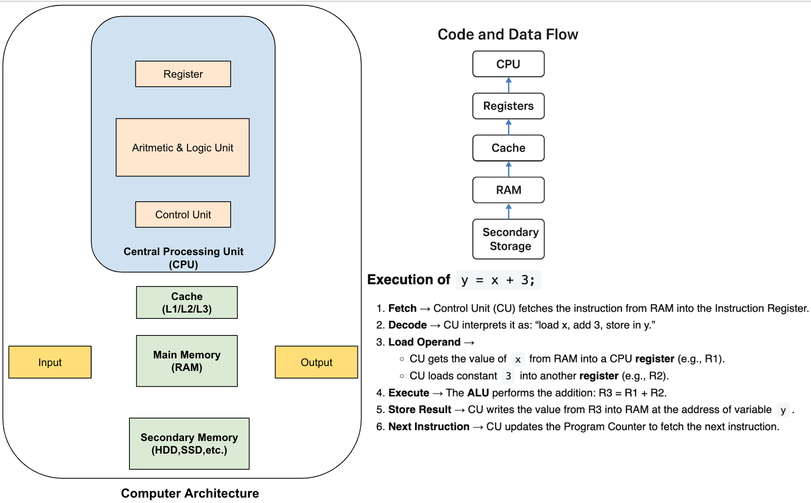
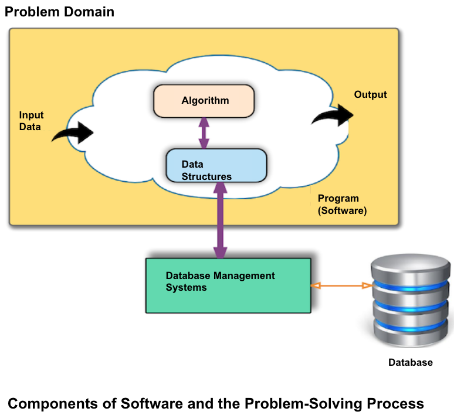

# Foundations of Information and Communication Technologies(ICT)
***

---

<!-- TOC -->
* [Foundations of Information and Communication Technologies(ICT)](#foundations-of-information-and-communication-technologiesict)
  * [1. Overview of ICT](#1-overview-of-ict)
    * [What is ICT?](#what-is-ict)
  * [2. ICT System Functions](#2-ict-system-functions)
  * [3. A Brief History of ICT](#3-a-brief-history-of-ict)
  * [4. ICT Applications by Sector](#4-ict-applications-by-sector)
  * [5. Key Elements of ICT](#5-key-elements-of-ict)
  * [6. Computer Hardware Components](#6-computer-hardware-components)
    * [Central Processing Unit (CPU)](#central-processing-unit-cpu)
    * [Memory](#memory)
    * [Storage (Secondary Memory)](#storage-secondary-memory)
    * [Input and Output (I/O) Devices](#input-and-output-io-devices)
    * [Motherboard](#motherboard)
  * [7. Software Types](#7-software-types)
    * [System Software](#system-software)
    * [Application Software](#application-software)
    * [Middleware](#middleware)
  * [8. The Internet and World Wide Web](#8-the-internet-and-world-wide-web)
    * [Internet](#internet)
    * [World Wide Web (WWW)](#world-wide-web-www)
  * [9. Introduction to Programming, Databases, and Networking](#9-introduction-to-programming-databases-and-networking)
    * [Programming](#programming)
    * [Databases](#databases)
    * [Networking](#networking)
  * [Summary](#summary-)
  * [Setting Up the Development Environment](#setting-up-the-development-environment)
    * [1. IntelliJ IDEA Ultimate (for Java-Based Program Development)](#1-intellij-idea-ultimate-for-java-based-program-development)
    * [2. Node.js (for Web Development)](#2-nodejs-for-web-development)
    * [3. HTTP Client (for testing web services)](#3-http-client-for-testing-web-services)
    * [4. PostgreSQL (for DB Operations)](#4-postgresql-for-db-operations)
<!-- TOC -->

---
## 1. Overview of ICT

### What is ICT?
- **Information and Communication Technologies (ICT)** refers to the systems, tools, and
resources used to acquire, generate, collect, store, process, transmit, and exchange information.
- It includes both **computing technologies** —like hardware and software— and **communication technologies**
—like networks and the internet.

From smartphones to global Internet infrastructure, ICT touches nearly every aspect of our lives.

**Official Definitions**

**UNESCO**
> ICT is a diverse set of technological tools and resources used to **transmit, store, create, share, or exchange information**.  
These technological tools and resources include computers, the Internet (websites, blogs and emails), live broadcasting technologies (radio, television and webcasting), recorded broadcasting technologies
(podcasting, audio and video players and storage devices) and telephony (fixed or mobile, satellite, visio/video-conferencing, etc.).

**Eurostat / European Commission**
> ICT covers all **technical means** used to **handle information** and **aid communication**, including **computer and network hardware** as well as **software**.

At its core, ICT is an umbrella term that encompasses two main pillars:
*   **Computing Technologies:** The physical and logical tools used to handle data, such as hardware (computers, servers, mobile devices) and software (applications, operating systems, algorithms).
*   **Communication Technologies:** The infrastructure and protocols that connect devices and allow them to communicate, such as networks, the internet, telecommunications, and broadcasting media.

[//]: # (> **Instructor Note:** *Emphasize to students that ICT is not just "computers" or "the internet." 
It is the entire ecosystem and lifecycle of how human beings handle information.*)

---

## 2. ICT System Functions

To understand how ICT works in practice, we must look at the lifecycle of information. ICT systems perform seven 
fundamental functions to handle data from its origin to its final destination.

| Function | Meaning | Example Tools |
| :--- | :--- | :--- |
| **Acquisition (Capturing)** | Gathering raw data from the real world. | Keyboard, scanner, camera, microphone, sensors, barcode reader |
| **Generation** | Producing new information or content. | Word processors, report generators, AI systems |
| **Collection** | Gathering data from multiple sources into one centralized place. | Online forms, surveys, web crawlers |
| **Storage** | Keeping information safe for later use and retrieval. | Hard disk, SSD, flash drive, cloud storage, databases |
| **Processing** | Converting raw data into meaningful, organized information. | CPU, spreadsheets, database management systems (DBMS) |
| **Transmission** | Sending information across distances. | Networks, fiber optics, radio waves, satellites |
| **Exchange** | Sharing and distributing information between people and systems. | Email, messaging apps, file sharing, APIs |

[//]: # (## 💡 Teaching Tips & Class Activities)

[//]: # ()
[//]: # (### Activity: Trace the Information Lifecycle)

[//]: # (**Instructions:** Ask students to work in pairs and trace the journey of a single piece of information through all seven functions.)

[//]: # (*Example Scenario: Taking a photo of a whiteboard and sending it to a study group via WhatsApp.*)

[//]: # (1.  **Acquisition:** The smartphone camera captures the light/image.)

[//]: # (2.  **Processing:** The phone's CPU processes the image &#40;adjusts lighting, compresses the file&#41;.)

[//]: # (3.  **Storage:** The image is temporarily stored in the phone's RAM/SSD.)

[//]: # (4.  **Collection:** The messaging app gathers the image data and the recipient's contact info.)

[//]: # (5.  **Transmission:** The data is sent via radio waves to a cell tower, then through fiber optics to the internet.)

[//]: # (6.  **Exchange:** The app delivers the image to the recipients' phones.)

[//]: # (7.  **Generation:** *&#40;Optional extension&#41;* A student uses the image to generate a new study guide using a word processor.)

[//]: # (### Key Distinctions to Highlight)

[//]: # (*   **Processing vs. Generation:** Make sure students understand the difference. *Processing* is about transforming or organizing existing data &#40;e.g., calculating a sum in Excel&#41;. *Generation* is about creating entirely new content &#40;e.g., writing a new essay in Word&#41;.)

[//]: # (*   **Transmission vs. Exchange:** *Transmission* is the physical/digital movement of data packets across a medium &#40;the "pipes"&#41;. *Exchange* is the actual sharing and receipt of the message between the end-users or systems &#40;the "delivery"&#41;.)

---

---

## 3. A Brief History of ICT

The evolution of ICT can be understood through four major waves of innovation, each dramatically shrinking the world and accelerating information handling:

*   **Pre-20th Century (Foundations):** The telegraph and telephone laid the groundwork for instant long-distance communication.
*   **Mid-20th Century (The Computing Era):** The invention of mainframes, transistors, and eventually Personal Computers (PCs) in the 1970s-80s brought data processing to businesses and homes.
*   **Late 20th Century (The Connectivity Era):** The creation of the Internet and the World Wide Web (1990s) shifted ICT from isolated machines to a globally connected network.
*   **21st Century (The Ubiquity & Intelligence Era):** The rise of smartphones, cloud computing, the Internet of Things (IoT), and Artificial Intelligence (AI) has made ICT invisible, omnipresent, and predictive.

[//]: # (Instructor Note: Keep this historical overview high-level and fast-paced. Consider displaying a visual timeline on the board or slides. Emphasize the *exponential* rate of change—what took decades in the past now takes years or months.)

---

## 4. ICT Applications by Sector

ICT is not a standalone industry; it is a horizontal enabler that transforms every vertical sector of society.

| Sector | Key ICT Applications & Tools |
| :--- | :--- |
| **Education** | Learning Management Systems (LMS like Moodle/Canvas), virtual classrooms, interactive whiteboards, adaptive learning AI. |
| **Healthcare** | Electronic Health Records (EHR), telemedicine platforms, wearable health monitors, AI-assisted medical imaging. |
| **Business & Finance** | Enterprise Resource Planning (ERP), e-commerce platforms, mobile banking, blockchain, and algorithmic trading. |
| **Government & Society** | E-governance portals (tax filing, digital IDs), smart city infrastructure (traffic sensors, smart grids), disaster early-warning systems. |
| **Agriculture** | Precision farming using drone imagery, soil moisture sensors, and GPS-guided automated machinery. |

[//]: # (Instructor Note: Make this relatable. Pause here and ask students: "Think of the last three apps you used today. Which sector do they serve, and which of the 7 information-handling functions do they primarily perform?" This bridges the theory to their daily lived experience.)

## 5. Key Elements of ICT

ICT is not merely a collection of gadgets; it is a **socio-technical system**. For any ICT system to function effectively, six core elements must work together in harmony.

| Key Element | Description                                                                                                                           | Examples                                                                                                                       |
| :--- |:--------------------------------------------------------------------------------------------------------------------------------------|:-------------------------------------------------------------------------------------------------------------------------------|
| **1. Hardware** | Physical devices that support information handling and communication.                                                                 | Computers, servers, smartphones, routers, sensors, printers.                                                                   |
| **2. Software** | Programs and instructions that control hardware and perform tasks.                                                                    | Windows/macOS, Microsoft Office, mobile apps, database management systems.                                                     |
| **3. Data & Information** | The central element of ICT — the content that is acquired, generated, collected, stored, processed, transmitted, and exchanged.       | Text documents, images, audio, video, databases, spreadsheets, logs, big data repositories, sensor readings, analytics results |
| **4. Networks & Connectivity** | The infrastructure and protocols that allow hardware and software to communicate and share resources.                                 | The Internet, Wi-Fi, fiber-optic cables, Bluetooth, TCP/IP protocols.                                                          |
| **5. People** | The most critical element. Includes everyone who interacts with the system, from end-users to developers and IT administrators.       | Students, teachers, software engineers, network technicians, policymakers.                                                     |
| **6. Processes** | The rules, procedures, policies, and workflows that govern how the ICT system is used and maintained.                                 | Password policies, data backup schedules, software update protocols, privacy guidelines (e.g., GDPR).                          |

[//]: # (Instructor Note: Use the "Human Body" or "Restaurant" analogy to make this stick. For example: Hardware is the kitchen equipment, Software is the recipe, Data is the ingredients, Networks are the waiters delivering food, Processes are the health and safety rules, and People are the chefs and customers. Emphasize that without *People* and *Processes*, the technology is useless or even dangerous.)

---

[//]: # (### 💡 Class Discussion Prompt)

[//]: # (**"The Weakest Link"**  )

[//]: # (Ask students: *"If you have the fastest computer &#40;Hardware&#41;, the best software, and a gigabit internet connection &#40;Network&#41;, but the user doesn't know how to operate it or shares their password with everyone &#40;People/Processes&#41;, is the ICT system effective?"*  )

[//]: # (This drives home the point that ICT is a holistic system, and the human/procedural elements are often the most vulnerable or critical to success.)

---
## 6. Computer Hardware Components

[A sample motherboard](https://freebloet.click/product_details/60960180.html)

### Central Processing Unit (CPU)

- Executes instructions using the **fetch–decode–execute** cycle.
- Performance factors:
  - **Clock speed** (GHz) → how fast it processes instructions.
  - **Cores** → multiple cores allow parallel processing.
- Example: Intel Core i7, AMD Ryzen, M1/M2/M3 ...

### Memory
- **RAM (Random Access Memory) - Main Memory**
  - Volatile (data lost when power is off).
  - Stores program code and temporary data for active programs.
  - Faster than storage.
- **ROM (Read Only Memory)**
  - Non-volatile (keeps data without power).
  - Stores firmware or permanent instructions.

### Storage (Secondary Memory)
- **HDD (Hard Disk Drive)**
  - Magnetic storage, larger capacity, cheaper, slower.
- **SSD (Solid State Drive)**
  - Flash-based storage, faster, lighter, more expensive.
- **Cloud storage**
  - Remote servers accessed via the Internet.
  - Example: Google Drive, Dropbox, AWS S3.

### Input and Output (I/O) Devices
- **Input**: keyboard, mouse, microphone, scanner, barcode reader, sensors.
- **Output**: monitor, printer, speakers, projectors.
- **I/O ports**: USB, HDMI, Ethernet, WiFi for device connectivity.

### Motherboard
It connects and allows communication between all the different hardware components.
- **Provides physical structure**: Holds the CPU, memory, and other components.
- **Connects components**: Uses buses and circuits to let the CPU, memory, storage, and peripherals communicate.
- **Distributes power**: Supplies electrical power to different parts of the computer.
- **Hosts firmware**: Stores the BIOS/UEFI, which starts up the computer and manages low-level hardware settings.

---
## 7. Software Types

### System Software
- Manages hardware and provides the foundation for applications.
- Examples: Operating Systems (Windows, Linux, macOS), device drivers, utilities.

### Application Software
- Programs for end users to perform specific tasks.
- Examples: MS Word, browsers, games, media players.

### Middleware
- Acts as a **bridge** between applications, databases, or systems.
- Examples:
  - Database middleware (JDBC, ODBC)
  - Message brokers ( Kafka, MQTT, RabbitMQ)

---
## 8. The Internet and World Wide Web

### Internet
- The Internet is a global network that connects devices and people, allowing them to share data and services.
- Uses TCP/IP protocols for communication.
- Provides services: www, email, file transfer, remote access,etc.

### World Wide Web (WWW)
- A **service** that runs on top of the Internet.
- Uses **HTTP/HTTPS** protocols to access web pages.
- Components:
  - **Web servers** → host and deliver web pages.
  - **Browsers & Applications** → access, display, or use content to trigger actions.
  - **Devices** → desktops, laptops, mobile devices, tablets, and IoT systems.

---
## 9. Introduction to Programming, Databases, and Networking

### Programming
- Writing instructions for a computer using programming languages to perform tasks.
- Programming languages are divided into two main classes based on their execution method:
  - **Compiled languages**: C, C++, Rust, Go → need compilation before execution.
  - **Interpreted languages**: Python, JavaScript, Ruby, PHP → executed line by line.
  - **Hybrid Approach (JIT Compilation)**: Java, C#, Python (with PyPy) - Source code → Bytecode → Just-In-Time Compiler → Native Machine Code
- Programming paradigms:
  - Procedural (step-by-step)
  - Object-Oriented Programming (OOP)
  - Functional programming

### Databases
- Collection of related data stored in files is called a database.
- **Relational databases (RDBMS)**: PostgreSQL, MySQL, Oracle, MSSQL, etc.
  - **SQL (Structured Query Language)** for data operations.
  - Example operations: SELECT, INSERT, UPDATE, DELETE.
- **NoSQL databases**: MongoDB, Redis, Cassandra, etc.

### Networking
- Connecting computers to share resources and communicate.
- Types: **LAN**, **WAN**, **Internet**.
- Key elements: IP addresses, DNS, ports, sockets.

---

## Summary 
*   ICT is the integration of computing and communication technologies to manage information.
*   It is ubiquitous, impacting almost every facet of modern society.
*   All ICT systems, regardless of how complex, ultimately perform one or more of the seven information-handling functions: Acquisition, Generation, Collection, Storage, Processing, Transmission, and Exchange.
*   ICT has evolved rapidly from early mechanical communication to globally connected, AI-driven ecosystems.
*   ICT is a foundational enabler across all sectors of society, driving efficiency, accessibility, and innovation in education, healthcare, business, government, and beyond.

---
***

## Setting Up the Development Environment

To practice throughout this course, install and configure the following tools:

### 1. IntelliJ IDEA Ultimate (for Java-Based Program Development)
- Popular IDE for Java based development. 
- For accessing a free IDE, you can visit (https://www.jetbrains.com/shop/eform/students)
- Download Link: [IntelliJ](https://www.jetbrains.com/idea/download)
- File -> New -> Project -> Java
  - give a name, choose a location
  - Build system: IntelliJ
  - JDK -> choose a proper JDK, download if not exist
  - check "add sample code" option
  - write the following code snippet

~~~java
/**
 * Must be stored as HelloWorld.java
 *
 */
public class HelloWorld {

    public static void main(String[] s) {

        System.out.println("Hello World");
    }

}
~~~

  - Open a terminal
  - Compiling
~~~console
javac HelloWorld.java
~~~

  - Running
~~~console
java HelloWorld.java
~~~

  - Output
~~~console
Hello World
~~~

### 2. Node.js (for Web Development)
- JavaScript runtime environment for server-side(backend) development.
- Used for building web applications and services(APIs).
- Download Link: [Node.js](https://nodejs.org/en/download)

    * Setting up Intellij for Node.js based development
      - IntelliJ IDEA -> Preferences -> Plugins -> Node.js
      - IntelliJ IDEA -> File -> Settings -> Plugins -> Node.js

    * Initialize a new Node.js project
      - IntelliJ IDEA -> File -> New -> Project -> Empty Project (Give the project an appropriate name.)
      - Open a terminal in IntelliJ
      - npm init -y
      - Make a /src folder to hold the source code of the project

    * Make a /src/hello-world.js file and write the following code:
      
~~~javascript
console.log('Hello world.');
~~~

  * Run the app:
      - node hello-world.js

  * Make a /src/server.js file and write the following code:

~~~javascript
const express = require("express");
const app = express();
const PORT = 3000;

app.get("/", (req, res) => {
  res.send("Hello World.");
});

app.listen(PORT, () => {
  console.log(`Server is running on http://localhost:${PORT}`);
});
~~~ 
   * Run the app:
      - node server.js

### 3. HTTP Client (for testing web services)
- Provides the ability to compose and execute HTTP requests from the code editor.

* Setting up Intellij for http client
  - IntelliJ IDEA -> Preferences -> Plugins -> HTTP Client

* Make a rest-api-test.http file and write the following code:

~~~http request
GET localhost:3000/
~~~

### 4. PostgreSQL (for DB Operations)
- PostgreSQL is an open-source and powerful relational database management system.
- Complies with SQL standards and supports Linux, macOS, and Windows.
- Download Link: [Download PostgreSQL](https://www.postgresql.org/download/) any version that can
  be installed without issues.
