***

# Module 2: Programming Fundamentals

***

<!-- TOC -->
* [Module 2: Programming Fundamentals](#module-2-programming-fundamentals)
  * [1. What is Programming](#1-what-is-programming)
  * [2. Software Types](#2-software-types)
    * [System Software](#system-software)
    * [Application Software](#application-software)
    * [Middleware](#middleware)
  * [3. Programming Paradigms](#3-programming-paradigms)
    * [Procedural Programming (PP)](#procedural-programming-pp)
    * [Object-Oriented Programming (OOP)](#object-oriented-programming-oop)
    * [Procedural Programming vs. Object-Oriented Programming (OOP)](#procedural-programming-vs-object-oriented-programming-oop)
    * [Functional Programming](#functional-programming)
  * [4. Programming Languages](#4-programming-languages)
  * [5. Writing and running programs in Java](#5-writing-and-running-programs-in-java)
  * [Hands-on Exercise 1](#hands-on-exercise-1)
  * [6. Variables, Data Types, and Operators](#6-variables-data-types-and-operators)
    * [Primitive Types](#primitive-types)
    * [Reference Types](#reference-types)
    * [Operators in Java](#operators-in-java)
    * [Operator Precedence in Java](#operator-precedence-in-java)
    * [Package in Java](#package-in-java)
  * [Hands-on Exercise 2](#hands-on-exercise-2)
    * [Type Conversion](#type-conversion)
  * [7. Control Flow: Conditional statements (if/else, switch-case), Loops (for, while, do-while)](#7-control-flow-conditional-statements-ifelse-switch-case-loops-for-while-do-while)
    * [if / else](#if--else)
    * [Nested if / else](#nested-if--else)
    * [switch-case](#switch-case)
    * [Loops](#loops)
      * [for loop](#for-loop)
      * [while loop](#while-loop)
      * [do-while loop](#do-while-loop)
      * [Control Statements in Loops](#control-statements-in-loops)
  * [8. Basic Data Structures: Arrays](#8-basic-data-structures-arrays)
  * [9. Functions (Methods): Definition, parameters, return values, overloading](#9-functions-methods-definition-parameters-return-values-overloading)
    * [Why Use Functions?](#why-use-functions)
    * [Method Signature](#method-signature)
    * [Method Overloading](#method-overloading)
  * [Hands-on Exercise 3](#hands-on-exercise-3)
<!-- TOC -->

---

## 1. What is Programming

Writing instructions for a computer using programming languages to perform tasks.

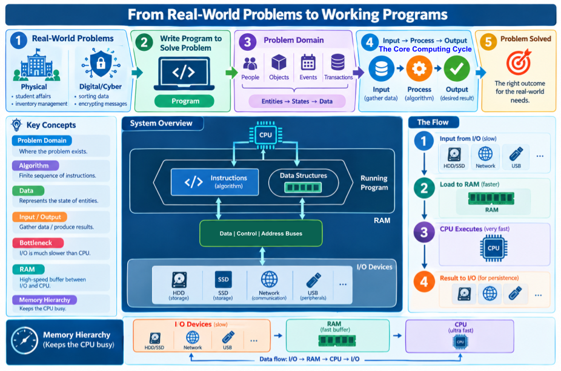

1. Problems & Programs

> Real-world problems — whether **physical** (e.g., calculating trajectories, managing inventory) or **cyber/digital** (
> e.g., sorting data, encrypting messages) — are solved by writing **programs** that instruct computers to perform the
> necessary work.

2. The Problem Domain

> The context or environment where a problem exists is called the **problem domain**. Within it, **entities** (people,
> objects, events, transactions) exist in specific **states**, and those states are represented as **data**.

3. The Core Computing Cycle

> To solve a problem, we:
> 1. **Gather** data (input)
> 2. **Process** it using an algorithm
> 3. **Produce** the desired outcome (output)
>
> This is the classic **Input → Process → Output (IPO)** model.

4. Algorithms

> An **algorithm** is a finite, well-defined sequence of instructions that describes *how* to solve a problem.
> Algorithms operate on data — without data, there is nothing to process.

5. The Speed Mismatch Problem

> | Component | Role | Speed |
> |---|---|---|
> | **I/O Devices** (HDD, SSD, network, keyboard, etc.) | Provide data to the system |  **Slow** |
> | **CPU** | Executes algorithm instructions | 🚀 **Extremely Fast** |
>
> The CPU can execute billions of instructions per second, but I/O devices deliver data at a fraction of that speed.
> If the CPU had to wait for data directly from I/O, it would sit idle most of the time — leading a **bottleneck**.

6. The Role of RAM (The Bridge)

> **Random Access Memory (RAM)** acts as a high-speed **buffer** between slow I/O and the fast CPU:
> - Data is **loaded from I/O into RAM** (relatively fast)
> - The **CPU reads/writes data from RAM** (very fast)
> - Results are eventually **written back to I/O** for persistence
>
> This **memory hierarchy** ensures the CPU stays busy and programs run efficiently.
---

## 2. Software Types

Software systems can be categorized into three main types:

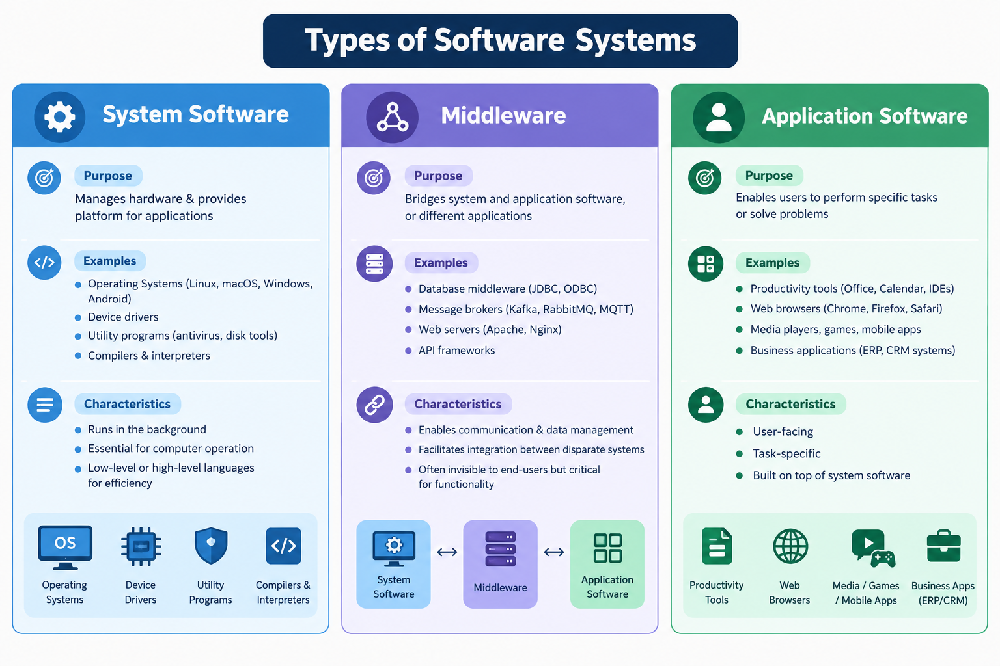

### System Software

- **Purpose:** Manages computer hardware and provides a platform for running application software
- **Examples:**
    - Operating Systems (Linux, macOS, Windows, Android)
    - Device drivers
    - Utility programs (antivirus, disk management tools)
    - Compilers and interpreters
- **Characteristics:**
    - Runs in the background
    - Essential for computer operation
    - Written in low-level or high-level languages for efficiency

### Application Software

- **Purpose:** Enables users to perform specific tasks or solve particular problems
- **Examples:**
    - Productivity tools (Office Apps, Calendar, IDEs)
    - Web browsers (Chrome, Firefox, Safari)
    - Media players, games, mobile apps
    - Business applications (ERP, CRM systems)
- **Characteristics:**
    - User-facing
    - Built on top of system software

### Middleware

- **Purpose:** Acts as a bridge between system software and application software, or between different applications
- **Examples:**
    - Database middleware (JDBC, ODBC)
    - Message brokers (Kafka, RabbitMQ, MQTT)
    - Web servers (Apache, Nginx)
    - API frameworks (Spring Boot, Node.js (with Express))
- **Characteristics:**
    - Facilitates integration between disparate systems
    - Often invisible to end-users but critical for system functionality

---

## 3. Programming Paradigms

A programming paradigm is a style, approach, or philosophy of programming, dictating (determining) how you organize your
code,
how you handle data, and how you control the flow of execution.

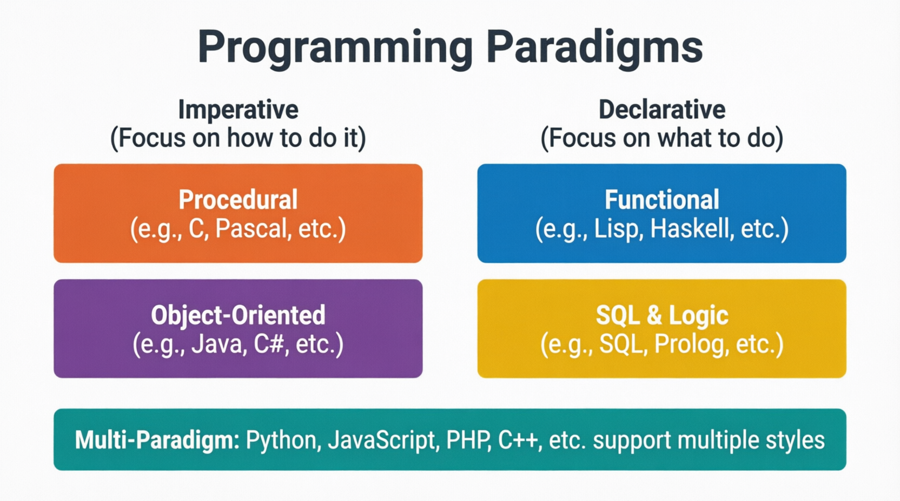


**Imperative Programming (The "How to do")**: You give the computer a step-by-step list of instructions. You explicitly
control the flow of execution (using loops, if/else statements) and change the program's state along the way.

**Declarative Programming (The "What to do")**: You describe the desired outcome or the logic of the computation without
explicitly describing the step-by-step control flow. The underlying system figures out the "how."

### Procedural Programming (PP)

Procedural programming: Functions + interactions between functions

- In procedural programming, we structure the system around functions and the interactions between them.
- A **function (methods)** is the smallest piece of the program.
- We have data, and functions operate on that data.
- The **main function** serves as the entry point of the program.
    - Execution starts in the main function.
- From there, related functions are called in sequence as needed.
- The focus is directly on the **problem**, and methods are developed to solve it (**control-centric** approach).

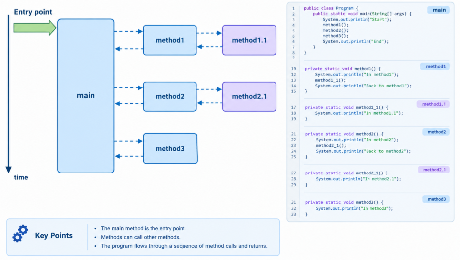

### Object-Oriented Programming (OOP)

OOP: Objects + interactions between objects

- The fundamental building blocks in OOP are **objects**, and programs are composed of objects and their interactions.
- An object contains both **data** and the **methods** that operate on that data.
- Developers focus on designing and implementing **classes**, which serve as blueprints for making (instantiating)
  objects.
- ***This way, the program's logic is distributed across all modules in a object-centric manner.***

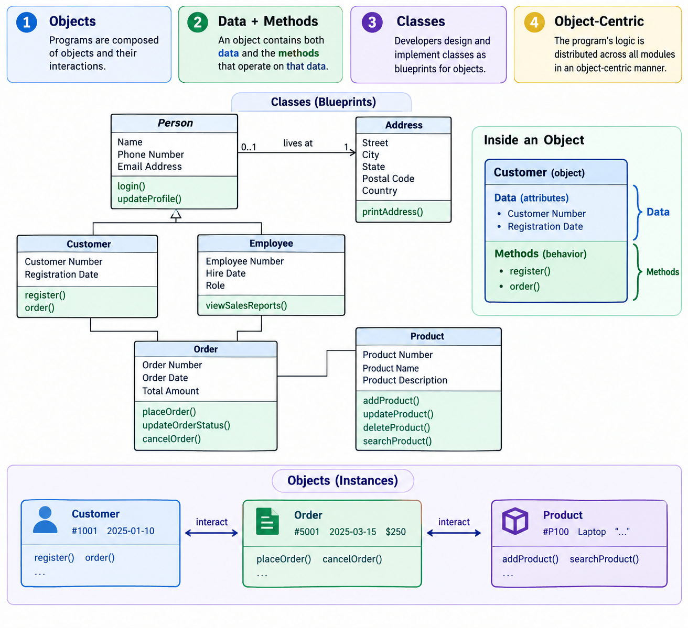

### Procedural Programming vs. Object-Oriented Programming (OOP)

- In software development, ***change is inevitable, not optional.*** — requirements evolve, errors must be fixed, and
  new features are added.
- As systems grow larger, **relationships among components become more complex**, and making changes becomes difficult
  and error-prone.

**Procedural Programming**

- PP separates data and logic. When data is broadly shared, multiple functions may access or modify it, making data
  access harder to control.
- When shared data changes, it may be difficult to identify all the functions that depend on it and may need
  modification.
- This can lead to **unexpected side effects** when modifying or extending the program.

**Object-Oriented Programming (OOP)**

- OOP takes a different approach. We organize the system around **objects**, where data and the behavior that manages
  that data are combined.

- **Encapsulation** controls access to the object's data, while **abstraction** hides implementation details and exposes
  only what is necessary.

- As a result, good OOP design (aligned with design principles) can **reduce coupling and localize changes**, making the
  system easier to maintain and extend.

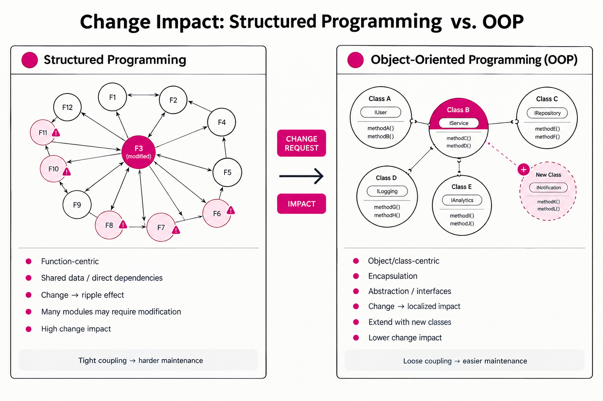

### Functional Programming

Functional programming is widely used to perform operations on collections and process streaming data efficiently,
thanks to its immutability and support for parallelism.
> - Programs are built using **pure functions** as the main building blocks.
> - For the same input, a function always produces the **same output** (no side effects).
> - **No shared or global variables** are used.
> - **Immutability**: the state of objects passed as parameters cannot be modified.
> - **No iterative loops** (for, while); instead, recursion and higher-order functions are used.
> - Because **state changes are not allowed**, functional programming naturally supports **parallelism and stream
    processing**.

~~~java
List<Customer> customers = Arrays.asList(
        new Customer("Alice", 30, "Astana"),
        new Customer("Bob", 25, "Almaty"),
        new Customer("Charlie", 35, "New York"),
        new Customer("Diana", 28, "Petropavlovsk"),
        new Customer("Ethan", 40, "London")
);
// One pipeline: filter, map, sort, collect — in parallel
List<String> result = customers.parallelStream()
        .filter(c -> c.getAge() > 25)           // filter
        .map(c -> c.getName().toUpperCase())    // map
        .sorted()                               // sort
        .collect(Collectors.toList());          // collect

System.out.

println("Result: "+result);
// Output
// Result: [ALICE, CHARLIE, DIANA, ETHAN]
~~~

> Structured Programming is a discipline or technique of avoiding chaotic code jumps (like GOTO). While Procedural and
> OOP achieve this using explicit control-flow mechanisms, such as conditional statements (if/else, switch-case) and
> iterative loops (for, while, do-while), Functional Programming achieves it using pure functions, recursion, and
> immutability.

## 4. Programming Languages

A programming language is a formal language that provides syntax and rules to write programs.

Programming languages are classified by their level of abstraction:

1) Low-level Languages (closer to machine code - Assembly)
2) High-level Languages (closer to human language - Java, Python, C++, etc.).

Programming languages are divided into two main classes based on their execution method:

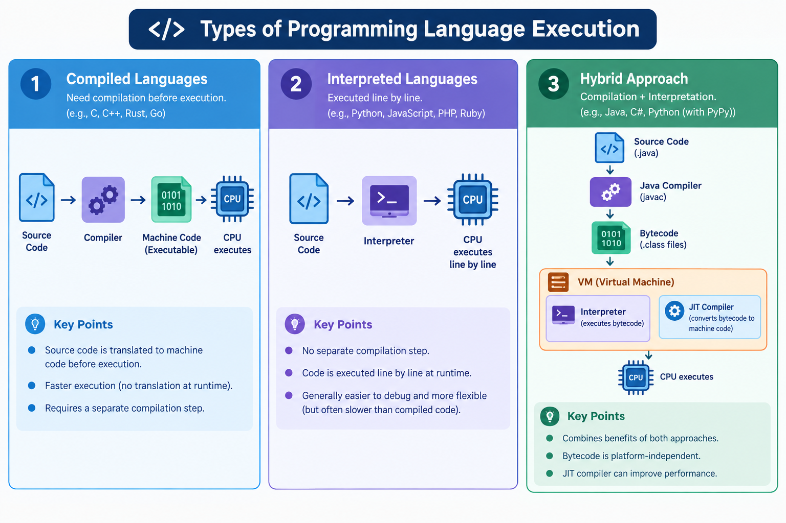


***A virtual machine, such as the Java Virtual Machine (JVM), is a computer architecture implemented in
software rather than hardware. It simulates a physical machine so programs can run in a platform-independent way.***

## 5. Writing and running programs in Java

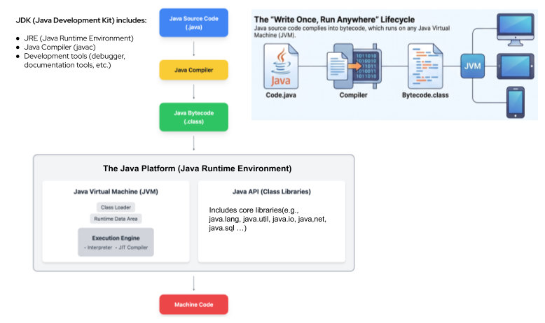

* Programs are written in Java source code (.java files).

* Source code is compiled into bytecode (.class file).

* Bytecode runs on the Java Virtual Machine (JVM), which makes Java platform-independent.

***To develop Java applications, you need to install the Java Development Kit (JDK). The JDK provides all the necessary
tools to write, compile, debug, and run Java programs, including the Java compiler (javac) and
the Java Runtime Environment (JRE).***

**Code Example**
> [HelloWorldMain.java](./hello/HelloWorldMain.java)

~~~java

public class HelloWorldMain {
    // 'public' → This class is accessible from anywhere in the project.
    // In Java, if a class is declared 'public', the filename must match the class name.
    // So here, the file must be named 'HelloWorldMain.java'.
    // Internal or helper classes are typically left package-private (no access modifier) to enforce encapsulation and
    // hide implementation details.

    public static void main(String[] args) { // Entry point of the application
        // 'public' → Java applications start execution from the main method.
        // It must be accessible (public) to the Java runtime (so it can find and run the program).
        // Every Java application must include exactly one main method as the entry point.

        System.out.println("Hello World!");
        // Prints the text "Hello World!" to the console, followed by a new line.
    }
}
~~~

Compiling

~~~console
javac HelloWorld.java
~~~

Running

~~~console
java HelloWorld.java
~~~

Output

~~~console
Hello World
~~~

***

## Hands-on Exercise 1

Write and run your first "Hello, World!" in Java
***

## 6. Variables, Data Types, and Operators

You must define variables before using them as java is a `statically typed language`.

~~~java
// Defining a variable.
int x = 5;
// Operating system allocates memory for x in RAM and stores the value 5.
~~~

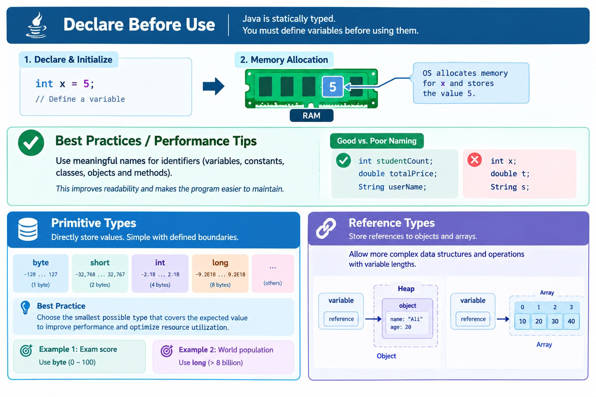


***Best Practices / Performance Tips***

    Use meaningful names for identifiers i.e.;variables, constants, classes, objects and methods.**  
      This improves readability and makes the program easier to maintain.

### Primitive Types

Directly store values and are simple with defined boundaries.

* As a best practice, we should select the **smallest possible type that covers the expected value** to improve
  performance
  and optimize resource utilization.
* For the exam score, we can choose byte since its range (0 to 127) covers 0-100.
* For the world population, we can choose long since the value exceeds 8 billion.

| **Variable Type**        | **Description**                          | **Example**               | **Range**                                                                                                |
|--------------------------|------------------------------------------|---------------------------|----------------------------------------------------------------------------------------------------------|
| **Integer Types**        | Stores whole numbers.                    |                           |                                                                                                          |
| - `int`                  | 32-bits signed integer.                  | `int age = 30;`           | -2,147,483,648 to 2,147,483,647                                                                          |
| - `byte`                 | 8-bits signed integer.                   | `byte b = 127;`           | -128 to 127                                                                                              |
| - `short`                | 16-bits signed integer.                  | `short s = 1000;`         | -32,768 to 32,767                                                                                        |
| - `long`                 | 64-bits signed integer.                  | `long l = 100000L;`       | -9,223,372,036,854,775,808 to 9,223,372,036,854,775,807                                                  |
| **Floating-Point Types** | Stores numbers with decimal points.      | `float`, `double`         |                                                                                                          |
| - `float`                | Single-precision 32-bits floating point. | `float f = 3.14f;`        | Approx. ±3.40282347E+38 (6–7 significant decimal digits(whole + fractional parts combined))              |
| - `double`               | Double-precision 64-bits floating point. | `double d = 3.14159;`     | Approx. ±1.79769313486231570E+308 (15–17 significant decimal digits (whole + fractional parts combined)) |
| **Character Type**       | Stores single characters.                | `char`                    |                                                                                                          |
| - `char`                 | 16-bits Unicode character.               | `char c = 'A';`           | 0 to 65,535                                                                                              |
| **Boolean Type**         | Stores true or false values.             | `boolean`                 |                                                                                                          |
| - `boolean`              | Represents true or false.                | `boolean isValid = true;` | `true` or `false`                                                                                        |

### Reference Types

Store references to objects and arrays, allowing for more complex data structures and operations with variable lengths.

| **Variable Type**  | **Description**                          | **Example**                          | **Range**                           |
|--------------------|------------------------------------------|--------------------------------------|-------------------------------------|
| **String**         | Represents a sequence of characters.     | `String`                             | Variable length                     |
| - `String`         | A sequence of characters.                | `String name = "John";`              | Length can vary                     |
| **Arrays**         | Stores multiple values of the same type. | `int[]`, `String[]`                  | Variable length                     |
| - `int[]`          | Array of integers.                       | `int[] numbers = {1, 2, 3};`         | Length is defined at initialization |
| - `String[]`       | Array of strings.                        | `String[] names = {"John", "Jane"};` | Length is defined at initialization |
| **Custom Objects** | Instances of user-defined classes.       |                                      |                                     |
| - `Car`            | A class representing a car.              | `Car myCar = new Car();`             | Depends on class design             |

***Best Practices / Performance Tips***

    Select the smallest possible type that covers the expected value to improve performance and optimize resource utilization.  This improves readability and makes the program easier to maintain.

> **Activity: Choose the Right Data Type**
> * A person's age (0 to 150)?
> * The temperature in Celsius (-50 to 50)?
> * The number of days in a year (365 or 366)?
> * A student's GPA (0.0 to 4.0)?
> * Whether a user is logged in (true or false)?
> * The letter grade for a course (A, B, C, D, or F)?
> * A product price ($0.01 to $999.99)?
> * The number of employees in a small company (1 to 500)?
> * Shopping cart: like an ArrayList or Array, to allow for variable lengths?
> * User profile: an Object or Class, to group complex data structures together?

### Operators in Java

| **Operator**                | **Type**      | **Syntax/Usage** | **Description**                                                  | **Example**                       |
|-----------------------------|---------------|------------------|------------------------------------------------------------------|-----------------------------------|
| **`+`** (plus)              | Arithmetic    | `a + b`          | Adds two values                                                  | `3 + 2 // returns 5`              |
| **`-`** (minus)             | Arithmetic    | `a - b`          | Subtracts second operand from the first                          | `5 - 2 // returns 3`              |
| **`*`** (multiply)          | Arithmetic    | `a * b`          | Multiplies two values                                            | `4 * 3 // returns 12`             |
| **`/`** (divide)            | Arithmetic    | `a / b`          | Divides the first operand by the second                          | `10 / 2 // returns 5`             |
| **`%`** (modulus)           | Arithmetic    | `a % b`          | Modulus (remainder of division)                                  | `10 % 3 // returns 1`             |
| **`++`** (increment)        | Increment     | `++a` or `a++`   | Increments value by 1 (pre/post increment)                       | `int a = 1; ++a; // a = 2`        |
| **`--`** (decrement)        | Decrement     | `--a` or `a--`   | Decreases value by 1 (pre/post decrement)                        | `int a = 2; --a; // a = 1`        |
| **`==`** (equal)            | Comparison    | `a == b`         | Checks if two values are equal                                   | `5 == 5 // returns true`          |
| **`!=`** (not equal)        | Comparison    | `a != b`         | Checks if two values are not equal                               | `5 != 3 // returns true`          |
| **`>`** (greater)           | Comparison    | `a > b`          | Checks if first operand is greater than the second               | `5 > 3 // returns true`           |
| **`<`** (less)              | Comparison    | `a < b`          | Checks if first operand is less than the second                  | `3 < 5 // returns true`           |
| **`>=`** (greater or equal) | Comparison    | `a >= b`         | Checks if first operand is greater than or equal to the second   | `5 >= 5 // returns true`          |
| **`<=`** (less or equal)    | Comparison    | `a <= b`         | Checks if first operand is less than or equal to the second      | `3 <= 5 // returns true`          |
| **`&&`** (logical AND)      | Logical (AND) | `a && b`         | Logical AND, returns true if both operands are true              | `true && false // returns false`  |
| `\|\|` (logical OR)         | Logical (OR)  | `a \|\| b`       | Logical OR, returns true if at least one operand is true         | `true \|\| false // returns true` || **`!`** (logical NOT)| Logical (NOT)        | `!a`             | Logical NOT, inverts the boolean value                          | `!true // returns false`        |
| **`=`** (assignment)        | Assignment    | `a = b`          | Assigns value of right operand to left operand                   | `int a = 5 // a = 5`              |
| **`+=`** (plus equal)       | Assignment    | `a += b`         | Adds right operand to left operand and assigns the result        | `a += 2 // a = a + 2`             |
| **`-=`** (minus equal)      | Assignment    | `a -= b`         | Subtracts right operand from left operand and assigns the result | `a -= 2 // a = a - 2`             |
| **`*=`** (multiply equal)   | Assignment    | `a *= b`         | Multiplies and assigns the result                                | `a *= 3 // a = a * 3`             |
| **`/=`** (divide equal)     | Assignment    | `a /= b`         | Divides and assigns the result                                   | `a /= 2 // a = a / 2`             |
| **`%=`** (modulus equal)    | Assignment    | `a %= b`         | Modulus and assigns the result                                   | `a %= 3 // a = a % 3`             |

### Operator Precedence in Java

Operator precedence determines the order in which operators are evaluated in an expression — just like in mathematics.

***Parentheses `()` have the highest precedence. We can use them to override the default operator precedence.***

| **Precedence(Highest to Lowest)** | **Operator**                 | **Type**                            | **Associativity** | **Example**               |
|-----------------------------------|------------------------------|-------------------------------------|-------------------|---------------------------|
| **1**                             | `++` `--`                    | Post-increment/ Post-decrement      | Left to right     | `a++`, `b--`              |
| **2**                             | `++` `--`                    | Pre-increment/ Pre-decrement        | Right to left     | `++a`, `--b`              |
| **2**                             | `+` `-`                      | Unary plus / Unary minus            | Right to left     | `+a`, `-b`                |
| **2**                             | `!`                          | Logical NOT                         | Right to left     | `!a`                      |
| **2**                             | `(type)`                     | Type cast                           | Right to left     | `(int)a`                  |
| **3**                             | `*` `/` `%`                  | Multiplication / Division / Modulus | Left to right     | `a * b`, `a / b`, `a % b` |
| **4**                             | `+` `-`                      | Addition / Subtraction              | Left to right     | `a + b`, `a - b`          |
| **5**                             | `<` `<=` `>` `>=`            | Comparison (less, greater)          | Left to right     | `a > b`, `a <= b`         |
| **6**                             | `==` `!=`                    | Equality / Inequality               | Left to right     | `a == b`, `a != b`        |
| **7**                             | `&&`                         | Logical AND                         | Left to right     | `a && b`                  |
| **8**                             | `\|\|`                       | Logical OR                          | Left to right     | `a \|\| b`                |
| **9**                             | `=` `+=` `-=` `*=` `/=` `%=` | Assignment                          | Right to left     | `a = 5`, `a += 2`         |

**Java Operator Examples**

~~~java
int y = x + 2;
// x + 2 is calculated first since `+` has higher precedence than =,
// and the result is assigned to the newly declared integer variable y.

int result = 22 - 8 / 2 * 5 + 6;
// Step 1: 8 / 2 = 4 (integer division)
// Step 2: 4 * 5 = 20
// Step 3: 22 - 20 = 2
// Step 4: 2 + 6 = 8


// Post-increment "Return first, then increase"
int a = 5;
int b = a++;   // b = 5, then a = 6
System.out.

println("a = "+a); // 6
System.out.

println("b = "+b); // 5

// Pre-increment (++a) "first increase, then return"
int x = 5;
int y = ++x;   // x = 6 first, then y = 6
System.out.

println("x = "+x); // 6
System.out.

println("y = "+y); // 6


// Pre-decrement (--a) "first decrease, then return"
int x = 5;
int y = --x;   // x = 6 first, then y = 6
System.out.

println("x = "+x); // 6
System.out.

println("y = "+y); // 6

// Compound Assignment (+=)
int n = 10;
n +=5;   // same as n = n + 5
        System.out.

println("n = "+n); // 15


// Example with mixed arithmetic, modulus, parentheses, and unary operators:
int x = 1;
int value = 10 + 20 * 3 % 5 - (4 + 6) / 2 * -3 + ++x; // x = 2    value = 27
// Step 1: Parentheses () have the highest precedence.
// Evaluate (4 + 6) -> 10
// Expression becomes: 10 + 20 * 3 % 5 - 10 / 2 * -3 + ++x

// Step 2: Unary operators (++, --, +, -) are evaluated next (Right to Left).
// Evaluate ++x: x was 1, it increments to 2, and the expression uses the new value (2).
// The unary minus on 3 (-3) is just the negative number -3.
// Expression becomes: 10 + 20 * 3 % 5 - 10 / 2 * -3 + 2

// Step 3: Multiplication (*), Division (/), and Modulus (%) (Left to Right).
// 3a. Evaluate 20 * 3 -> 60
//     Expression becomes: 10 + 60 % 5 - 10 / 2 * -3 + 2
// 3b. Evaluate 60 % 5 -> 0  (60 divided by 5 has a remainder of 0)
//     Expression becomes: 10 + 0 - 10 / 2 * -3 + 2
// 3c. Evaluate 10 / 2 -> 5
//     Expression becomes: 10 + 0 - 5 * -3 + 2
// 3d. Evaluate 5 * -3 -> -15
//     Expression becomes: 10 + 0 - (-15) + 2

// Step 4: Addition (+) and Subtraction (-) (Left to Right).
// 4a. Evaluate 10 + 0 -> 10
//     Expression becomes: 10 - (-15) + 2  (which is 10 + 15 + 2)
// 4b. Evaluate 10 + 15 -> 25
//     Expression becomes: 25 + 2
// 4c. Evaluate 25 + 2 -> 27

// Step 5: Assignment (=) happens last (Right to Left).
// Assign the final result (27) to the variable 'value'.

// Final State:
// x = 2
// value = 27

~~~

### Package in Java

Package structure makes large software systems more manageable, modular, and maintainable. As a best practice,
all classes should be placed inside a package in Java for better organization and to avoid name conflicts.

* Defining a Java package
    * `package cc.ku.ict.module2.variables;`
    * Declares the package (namespace) where this class belongs.
    * Helps organize code and avoid class name conflicts.


* Including a package
    * `import java.util.Scanner;`
    * Imports the Scanner class from the Java library.
      Used to read user input (e.g., from the keyboard).

**Code Example**
> [VariablesMain.java](./variables/VariablesMain.java)

~~~java
package cc.ku.ict.module2.variables; // Define the package (namespace) where this class belongs.
// Helps organize code and avoid class name conflicts.

import java.text.DecimalFormat;
// Imports the DecimalFormat class from the Java library.
// Used for formatting numbers (e.g., rounding or custom number formats).

import java.util.Scanner; // Imports the Scanner class from the Java library.
// Used to read user input (e.g., from the keyboard).

public class VariablesMain {
    public static void main(String[] args) {
        System.out.println();

        // Defining a variable.
        // You must define variables before using them as java is a statically typed language
        // Operating system allocates memory for x in RAM and stores the value 5.
        int x = 5;
        System.out.println("Value of x var is:" + x);

        // Operator Precedence
        // x + 2 is calculated first since + has higher precedence than =,
        // and the result is assigned to the newly declared integer variable y.
        int y = x + 2;
        System.out.println("Value of y:" + y);

        // Instantiating an object from the Scanner class for input from keyboard (System.in)
        Scanner input = new Scanner(System.in);

        System.out.print("Enter the radius of the circle: ");
        int radius = input.nextInt();  // Reading an int value from the keyboard

        /*  Scanner class member methods

        public byte nextByte()
        public short nextShort()
        public int nextInt()
        public long nextLong()

        public float nextFloat()
        public double nextDouble()

        public String next() // Reads until a space
        public String nextLine() // Reads until a new line is encountered
        */


        double area = Math.PI * radius * radius;
        System.out.println("Area of Circle is:" + area);

        // Ensuring that the area of the circle is printed with 4 decimal places
        DecimalFormat fmt = new DecimalFormat("0.####");
        System.out.println("Area of Circle is:" + fmt.format(area));

    }
}

~~~

***In Java, numeric literals are written directly, string literals are placed between double quotes, and character
literals
are placed between single quotes.***


***

## [Hands-on Exercise 2](./exercises/README.md)

***

### Type Conversion

Type conversion is the process of changing a value from one data type to another during operations,
assignments, or method calls.

1. Implicit Conversion (Type Promotion / Widening):
    - Done automatically by the compiler to avoid data loss.
    - Happens when different types appear in the same expression.
    - A value of a narrower type is automatically promoted to a wider type.
    - The order of Java numeric types from smallest to largest:
      > - byte → short → int → long → float → double

2. Explicit Conversion (Narrowing / Casting)
    - Done manually by the programmer using a cast operator (type).
    - Required when assigning a larger type to a smaller type (possible data loss).
    - The programmer is responsible for any potential data loss.

**Default Java Numeric Literal Types and Type Suffixes**

| Literal Type           | Example         | Default Data Type | Suffix Needed for Other Types        |
|------------------------|-----------------|-------------------|--------------------------------------|
| Whole Numbers          | `10`, `-500`    | `int`             | Add `L` or `l` for `long` (`10L`)    |
| Floating-Point Numbers | `3.14`, `-0.01` | `double`          | Add `F` or `f` for `float` (`3.14f`) |

**Code Example**
> [TypeConversion.java](./typeconversion/TypeConversionDemoMain.java)

```java
package cc.ku.ict.module2.typeconversion;

public class TypeConversionDemoMain {
    public static void main(String[] args) {

        // 1. Implicit Conversion (Type Promotion / Widening):
        // Done automatically by the compiler. The compiler always tries to avoid data loss.
        // Happens when different types appear in the same expression.
        // A value of a narrower type is automatically promoted to a wider type.
        // The order of Java numeric types from smallest to largest:
        // byte → short → int → long → float → double

        int i = 100;          // int is 32-bit
        double d = i;         // int → double (automatic widening)
        System.out.println("Implicit Conversion:");
        System.out.println("i = " + i); // 100
        System.out.println("d = " + d); // 100.0

        // 2. Explicit Conversion (Narrowing / Casting)
        // Done manually by the programmer using a cast operator (type).
        // Required when assigning a larger type to a smaller type (possible data loss).
        // The programmer is responsible for any potential data loss.
        double d2 = 9.78;
        int i2 = (int) d2;    // explicit cast double → int
        System.out.println("\nExplicit Conversion:");
        System.out.println("d2 = " + d2); // 9.78
        System.out.println("i2 = " + i2); // 9 (fractional part is lost after converting to int)

        // 3. Mixed Expressions and Promotion
        // In arithmetic, byte/short/char are promoted to int before calculation.
        byte a = 10;
        byte b = 20;
        // byte result = a + b; //  Compile error: a+b is promoted to int
        int result = a + b;    //  must be stored in int
        System.out.println("\nMixed Expression Promotion:");
        System.out.println("result = " + result); // 30

        // 4. Casting with Overflow
        // Narrowing to a smaller type can cause overflow (value wraps around).
        int bigNumber = 130;
        byte smallNumber = (byte) bigNumber;  // narrowing with overflow
        System.out.println("\nCasting with Overflow:");
        System.out.println("big = " + bigNumber);     // 130
        System.out.println("small = " + smallNumber); // -126 (overflow)

        // 5. Numeric Literals with Suffix
        // Suffixes define literal type: F for float, L for long, D optional for double.
        float f = 3.14F;        // 'f' or 'F' required (otherwise 3.14 is double)
        long l = 3000000000L;  // 'L' required (otherwise too big for int)
        double d3 = 2.5d;       // 'd' or 'D' optional (double is default)
        System.out.println("\nNumeric Literals with Suffix:");
        System.out.println("f = " + f); // 3.14
        System.out.println("l = " + l); // 10000000000
        System.out.println("d3 = " + d3); // 2.5


        // Mixed Expressions
        int num1 = 5;
        int num2 = 2;

        double div1 = (float) num1 / num2; // cast before division -> 2.5
        double div2 = num1 / num2;        // int division -> 2, then widened -> 2.0

        System.out.println("\nInteger Division stored in Double:");
        System.out.println("(float)num1 / num2 = " + div1); // 2.5
        System.out.println("num1 / num2 (as double) = " + div2); // 2.0


        // Mixed int and long
        long l1 = 10L;
        int i1 = 4;
        long result1 = l1 + i1;              // int promoted to long -> 14L
        System.out.println("\nMixed int + long:");
        System.out.println("l1 + i1 = " + result1);

        // Mixed int and float
        float f1 = 3.5f;
        int ii2 = 2;                          // fixed variable name to match usage
        float result2 = f1 + ii2;             // int promoted to float -> 5.5f
        System.out.println("\nMixed int + float:");
        System.out.println("f1 + ii2 = " + result2);

        // Mixed long and double
        double d1 = 2.5;
        long l2 = 4L;
        double result3 = d1 + l2;            // long promoted to double -> 6.5
        System.out.println("\nMixed long + double:");
        System.out.println("d1 + l2 = " + result3);

        // Mixed float and double
        float f2 = 1.2f;
        double dd2 = 3.4;
        double result4 = f2 + dd2;            // float promoted to double -> 4.6
        System.out.println("\nMixed float + double:");
        System.out.println("f2 + dd2 = " + result4);
    }
}
```

## 7. Control Flow: Conditional statements (if/else, switch-case), Loops (for, while, do-while)


***"Java's core control flow structures — if-else, switch-case, and the three classic loops (for, while, do-while) — 
all share the exact same foundational syntax with a massive ecosystem of C-family languages, including C, C++, 
JavaScript, C#, PHP, TypeScript, Dart, Objective-C, and Perl. While the structural syntax is identical, minor 
behavioral differences exist (e.g., Java requires strict boolean conditions in if statements, while C/C++ treat 
any non-zero number as true).***

***A common principle in science and engineering education: focus on understanding rather than memorization—learn
the underlying principles, not just formulas.
In programming, as in science and engineering, memorizing syntax is not enough. You must understand the underlying
mechanisms —how the CPU evaluates conditions, how loops actually execute, and why certain programming patterns exist.
Memorization gives you the ability to write code; understanding gives you the ability to debug, optimize, and transfer
that knowledge across languages.***


### if / else

In an `if/else` statement, we have a **conditional test**. The condition is evaluated. If it is **true**,
the statement or block after `if` is executed. Otherwise, the `else` block is executed.

The `if/else` statement is used when we want to make a decision between two options.

* Example: Decide whether a student passed or failed.
    - If the grade is **50 or higher** → print **"Pass"**.
    - Otherwise → print **"Fail"**.

~~~java
int grade = 65;

if(grade>=50){
        System.out.println("Pass");
}else{
        System.out.println("Fail");
}

~~~

### Nested if / else

A `nested if/else` statement is an if-else statement placed inside another if-else statement.
We use this statement when we have multiple conditions (more than 2 options to choose).

* Example: Assigning letter grades.

~~~java

int grade = 85;

if(grade >=90){
        System.out.println("A");
}else if(grade >=80){
        System.out.println("B");
}else if(grade >=70){
        System.out.println("C");
}else if(grade >=60){
        System.out.println("D");
}else{
        System.out.println("F");
}

~~~

The program checks conditions from top to bottom. Only the first true condition is executed.

### switch-case

Traditionally, switch replaces long if-else chains for checking a single variable against constant values.

***However, modern Java expands this capability: by using the modern switch expression syntax (->) (arrow syntax), you can now 
leverage Java 16+ Records to cleanly group multiple values, and Java 21+ Record Patterns to elegantly destructure and 
evaluate those multiple variables simultaneously within a single case.***

**Example: Grade categories.**

```java
char grade = 'B'; 
// Note: Switch traditionally accepts: byte, short, char, int, String, or enum as switch var type.

switch (grade) {
    case 'A':
        System.out.println("Excellent!");
        break; // Exits the switch to prevent "fall-through" to the next case
        
    case 'B':
        System.out.println("Good job!");
        break;
        
    case 'C':
    case 'D': 
        // Fall-through: If grade is 'C', it skips down and executes the 'D' block
        System.out.println("Satisfactory.");
        break;
        
    case 'F':
        System.out.println("Fail.");
        break;
        
    default: // Optional block that runs if none of the cases match
        System.out.println("Invalid grade.");
        break;
}
```

**Example: Grade categories-in modern Java**
```java
char grade = 'B';

switch (grade) {
    case 'A'       -> System.out.println("Excellent!");
    case 'B'       -> System.out.println("Good job!");
    case 'C', 'D'  -> System.out.println("Satisfactory."); // Comma replaces fall-through
    case 'F'       -> System.out.println("Fail.");
    default        -> System.out.println("Invalid grade.");
}
```

***Anything you can do with a switch/case statement can also be done with if/else, but the reverse is not always true.***


**Example: Menu System**

```java
switch (menuChoice) {
    case 1 -> System.out.println("New Game");
    case 2 -> System.out.println("Load Game");
    case 3 -> System.out.println("Settings");
    case 4 -> System.out.println("Exit");
    default -> System.out.println("Invalid choice");
}
```

**Example: State Machines / Status Codes**
```java
switch (httpStatusCode) {
    case 200 -> System.out.println("OK");
    case 404 -> System.out.println("Not Found");
    case 500 -> System.out.println("Server Error");
    default  -> System.out.println("Unknown status");
}
```


### Loops

* A loop is a fundamental programming structure that are used to repeatedly execute a block of code.
* Instead of writing the same lines of code again and again, a loop automates the repetition (iteration).
* Loops help us write shorter, cleaner, and more efficient programs.
* Java has three main types of loops: `for`, `while`, `do-while`.
* Each loop structure is used for different scenarios, but they are interchangeable.
    * Anything that can be done with a `for` loop can also be done with a `while` or a `do-while` loop, and vice versa.


* A loop repeatedly executes a block of code as long as a specified condition remains true.

* During each iteration, the condition is evaluated. If it is true, the loop body is executed, and the process repeats.
  If the condition becomes false, the loop terminates, and the program continues with the code following the loop.

* Control statements such as `break` and `continue` can also be used to control the loop flow. `break` exits the loop
  immediately, while `continue` skips the remaining code in the current iteration and moves to the next iteration.

* This mechanism allows loops to efficiently handle repetitive tasks while providing flexibility in controlling their
  execution.

  

#### for loop

Used when the number of repetitions is known in advance.

~~~java
// A single execution of the loop body is called an *iteration*.

// The for loop has 3 main parts:
// 1. Initialization → int i = 1;  (sets the starting value of the loop control variable)
// 2. Condition → i <= 10;        (checked before each iteration; if true, loop continues)
// 3. Update → i++                (changes the control variable after each iteration)

for(int i = 1;i <=10;i++){
        // Repeated code block- loop body
        System.out.println("Number of iteration is: "+i);
}

// Lifecycle of a for loop:
// Step 1 → Initialization runs once at the start.
// Step 2 → Condition is checked. If true, the loop body executes, otherwise loop statement is terminated.
// Step 3 → Loop body (repeated code block) runs.
// Step 4 → Update is applied to the control variable.
// Step 5 → Go back to Step 2 and repeat until condition is false.

~~~

#### while loop

Used when the number of repetitions is not known in advance, but depends on a condition.

~~~java
// The while loop checks the condition first, then executes the body if true.
// Initialization must happen before the loop.
// Update must be written inside the loop body.


int j = 1; // Initialization
while(j <=10){ // Condition
        System.out.println("Number of iteration is: "+j);
        j++; // Update
}

// Lifecycle of a while loop:
// Step 1 → Initialization happens outside the loop.
// Step 2 → Condition is checked. If true, the loop body executes, otherwise loop statement is terminated.
// Step 3 → Loop body runs (repeated code block).
// Step 4 → Update is applied inside the loop body.
// Step 5 → Go back to Step 2
~~~

#### do-while loop

Similar to while, but the body executes at least once, even if the condition is false from the beginning.

~~~java
// The do-while loop guarantees the body executes at least once,
// because the condition is checked *after* the body runs.

int k = 1; // Initialization
do{
        System.out.println("Number of iteration is: "+k);
        k++; // Update
}while(k <=10); // Condition (checked after body)

// Lifecycle of a do-while loop:
// Step 1 → Initialization happens before the loop.
// Step 2 → Loop body runs once unconditionally.
// Step 3 → Condition is checked. If true, go back to Step 2, otherwise terminate the loop statement.

~~~


**Loop Examples**

- **`for` loop**: Listing students enrolled in a class.
- **`while` loop**: Reading a text file line-by-line until the end is reached.
- **`do-while` loop**: Displaying a main menu and prompting the user for a choice.

#### Control Statements in Loops

```java
int k = 1; // Initialization

do {
    // 1. Skip iteration if k is 5
    if (k == 5) {
        k++; // MUST increment before 'continue' to avoid an infinite loop
        continue; 
    }

    // 2. Exit loop entirely if k is 8
    if (k == 8) {
        System.out.println("Loop terminated early at iteration " + k);
        break; 
    }

    // 3. Normal execution
    System.out.println("Number of iterations: " + k);
    k++; // Update counter

} while (k <= 10); // Condition is checked AFTER the body executes

//Initialize: Variables are set up before the loop begins.
//Execute: The loop body runs at least once, unconditionally.
//Continue: If triggered, it skips the rest of the current iteration and jumps straight to the condition check (Step 5).
//Break: If triggered, it exits the loop immediately, skipping the condition check entirely.
//Evaluate: The while condition is checked. If true, the loop repeats (back to Step 2). If false, the loop terminates.

```

## 8. Basic Data Structures: Arrays

Arrays are collections that hold multiple elements of the same type.

Each element can be accessed by an index (starting from 0).

Loops are a fundamental tool for processing every item within a collection, also known as traversing.

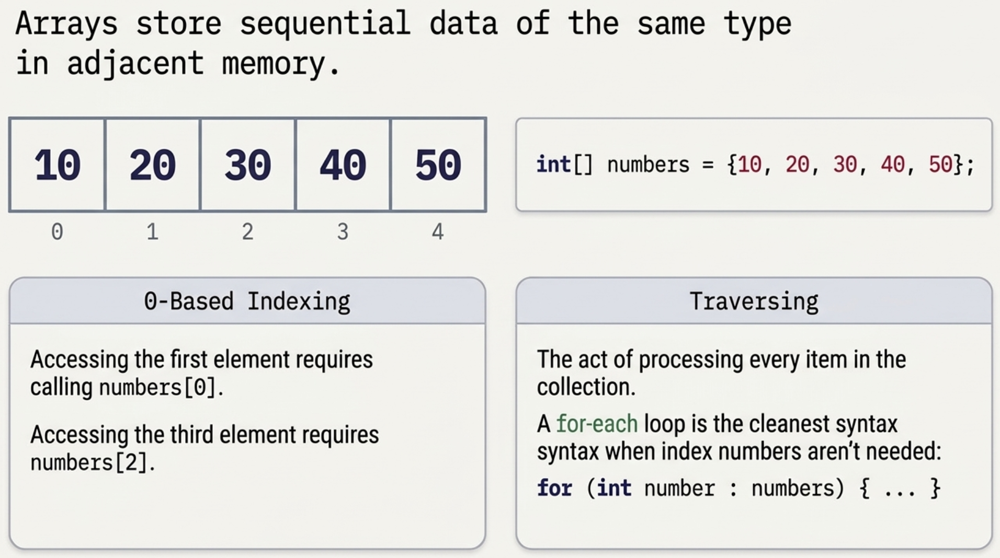

~~~java

// ==================== 1. Static Array Initialization ====================
// Define an integer array with fixed values.
int[] numbers = {10, 20, 30, 40, 50};


// ==================== 2. Accessing Elements ====================
// Access array elements using 0-based indexing.

System.out.println("Value at index 0: " + numbers[0]); // Output: 10
System.out.println("Value at index 2: " + numbers[2]); // Output: 30


// ==================== 3. Updating Elements ====================
// Arrays are mutable, meaning we can change values at specific indices.

// Change the fourth element (index 3) to 60
numbers[3] = 60;
System.out.println("Updated value at index 3: " + numbers[3]); // Output: 60

// Change it back to 40
numbers[3] = 40;


// ==================== 4. Traversing the Array ====================
// Traversing means iterating over every element in an array or collection.
        
System.out.println("\n--- Traversing using a standard 'for' loop ---");
// The condition 'i < numbers.length' ensures the loop runs safely for every element.
for (int i = 0; i < numbers.length; i++) {
        System.out.println("Element at index " + i + ": " + numbers[i]);
}


System.out.println("\n--- Traversing using an enhanced 'for-each' loop ---");
// The for-each loop is cleaner and preferred when you only need the values, not the index.
for (int number : numbers) {
        System.out.println(number);
}


~~~

## 9. Functions (Methods): Definition, parameters, return values, overloading

In Java, functions are called **methods**.

A method is a named block of code, declared inside a class(in OOP languages), that performs a specific task and can be called (reused) 
as many times as needed.

Methods are reusable, which helps organize a program and avoid code repetition.


Defining a method involves two main parts: **the method declaration/header** and **the method body**.

* **Method declaration/header**
  This defines the method's structure, including:

    * Access modifier (public, private, protected) — who can call it
    * `static` keyword (optional) — whether it belongs to the class or an instance
    * The **return type** — the type of value the method returns
    * The **method name**
    * The **parameter list** — the input data (arguments) the method accepts

* **Method body**
  This is the block of code inside the method where the actual work (core logic) is performed.

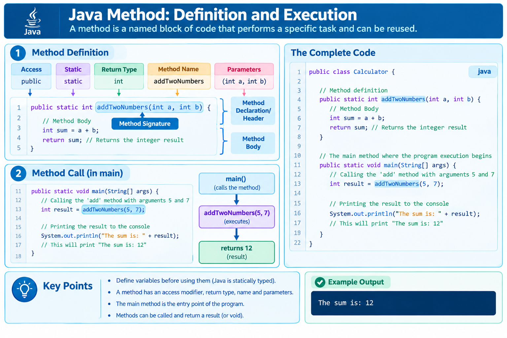

We can call methods within another method.

~~~java
public class Calculator {
    
    // Method definition
// Access|Static|Return|MethodName | Parameters
//    ↓       ↓    ↓       ↓             ↓
    public static int addTwoNumbers(int a, int b) {
        // Method Body
        int sum = a + b;
        return sum; // Returns the integer result
    }

    // The main method where the program execution begins
    public static void main(String[] args) {
        // Calling the 'addTwoNumbers' method with arguments 5 and 7 
        // The method expect 2 parameters
        int result = addTwoNumbers(5, 7);

        // Printing the result to the console
        System.out.println("The sum is: " + result);
        // This will print "The sum is: 12"
    }
}
~~~

***The parameter list defines the variables the method expects, and the arguments are the actual values 
the method accepts when it is called.***


    
### Why Use Functions?

| Benefit | Anchor Term                                       | Concise Explanation                                                                                                                                              |
|---|---------------------------------------------------|------------------------------------------------------------------------------------------------------------------------------------------------------------------|
| **Reusability** | *DRY Principle (Don't Repeat Yourself)*           | Write logic once in `calculateGrade()` and invoke/call it repeatedly across different inputs (e.g., Alice, Bob) without duplicating code.                        |
| **Modularity** | *Single Responsibility Principle (SRP)* | Break a complex program into smaller, focused parts. A function should do one thing and do it well — high cohesion.                                                 |
| **Abstraction** | *Information Hiding/Black Box*                              | Hides internal implementation details from callers. The caller only needs the function signature (input/output contract), keeping caller code clean and readable. |
| **Easier Debugging & Updates** | *Change once → apply everywhere*                  | Fix or update the logic in one place. Fixing/updating `calculateGrade()` fixes/updates grading logic across the entire application simultaneously.               |
| **Collaboration** | *Parallel Development*                             | Enables teams to work in parallel by defining clear function signatures so developers can implement different modules independently.                             |


***Bottom line: All of these benefits contribute to the maintainability of a program.
Maintainability means making a program easier to understand, modify, debug, and extend over time.***


### Method Signature

- The **method signature** is the combination of the method name and its parameter list.
- Example: `add(int a, int b)`
- Note: the return type is *not* part of the method signature.
- In the same scope, the signatures of methods must be unique.

### Method Overloading

- **Method overloading** means defining multiple methods with the same name but different parameter lists.
- The compiler decides which method to use based on the number or type of parameters.
- This allows the same method name to be used for related tasks.
- Example:
    - `add(int, int)` → adds two integers
    - `add(double, double)` → adds two doubles
    - `add(int, int, int)` → adds three integers

~~~java
public static int add(int a, int b) {
    return a + b;
}

public static double add(double a, double b) {
    return a + b;
}

public static int add(int a, int b, int c) {
    return a + b + c;
}
~~~

***

## [Hands-on Exercise 3](./exercises/README.md)

***


