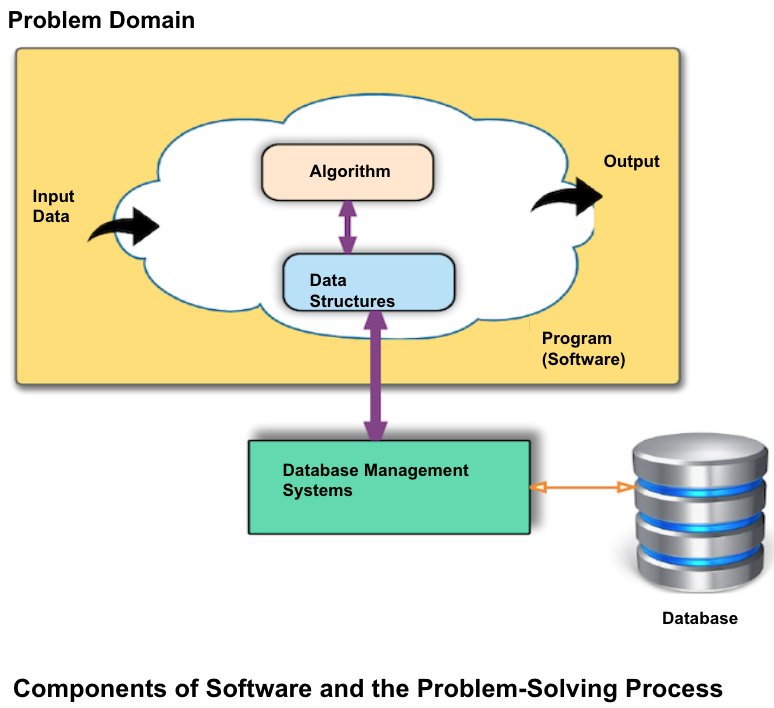
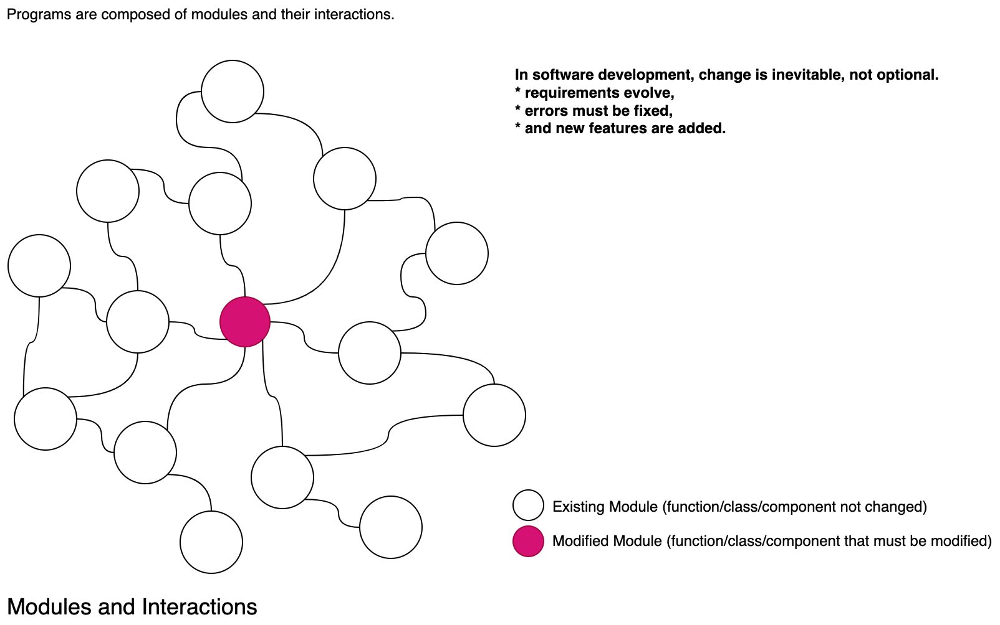

***
# Module 2: Programming Fundamentals
***

<!-- TOC -->
* [Module 2: Programming Fundamentals](#module-2-programming-fundamentals)
    * [What is Programming](#what-is-programming)
    * [Programming Languages](#programming-languages-)
    * [Programming Paradigms](#programming-paradigms)
      * [Structured (Procedural) Programming](#structured-procedural-programming)
      * [Object-Oriented Programming (OOP)](#object-oriented-programming-oop)
      * [Structured (Procedural) Programming vs. Object-Oriented Programming (OOP)](#structured-procedural-programming-vs-object-oriented-programming-oop)
      * [Functional Programming](#functional-programming)
    * [Writing and running programs in Java](#writing-and-running-programs-in-java)
  * [Hands-on Exercise 1](#hands-on-exercise-1)
    * [Variables, Data Types, and Operators](#variables-data-types-and-operators)
  * [Hands-on Exercise 2](#hands-on-exercise-2)
    * [Control Flow: Conditional statements (if/else, switch-case), Loops (for, while, do-while)](#control-flow-conditional-statements-ifelse-switch-case-loops-for-while-do-while)
      * [if / else](#if--else)
      * [Nested if / else](#nested-if--else)
      * [switch-case](#switch-case)
    * [Loops](#loops)
      * [for loop](#for-loop)
      * [while loop](#while-loop)
      * [do-while loop](#do-while-loop)
    * [Basic Data Structures: Arrays](#basic-data-structures-arrays)
    * [Functions (Methods): Declaration, parameters, and return values](#functions-methods-declaration-parameters-and-return-values)
  * [Hands-on Exercise 3](#hands-on-exercise-3)
<!-- TOC -->

---

### What is Programming
Writing instructions for a computer using programming languages to perform tasks.

### Programming Languages 

A programming language is a formal language that provides syntax and rules to write programs.

Programming languages are classified by their level of abstraction: 

1) Low-level Languages (closer to machine code - Assembly)
2) High-level Languages (closer to human language - Java, Python, C++, etc.).

Programming languages are divided into two main classes based on their execution method:

1) Compiled Languages: Need compilation before execution. (e.g., C, C++, Rust, Go)
~~~plain
Source Code  ──► Compiler ──► Machine Code (Executable) ──► CPU executes
~~~

2) Interpreted Languages: Executed line by line. (e.g., Python, JavaScript, PHP, Ruby)
~~~plain
Source Code ──► Interpreter ──► CPU executes line by line
~~~

3) Hybrid Approach:  Compilation + Interpretation (e.g., Java, C#, Python (with PyPy) )

~~~plain
Source Code (.java)
│
▼
Java Compiler (javac)
│
▼
Bytecode (.class files)
│
▼
VM (Virtual Machine- implemented in software) 
├─► Interpreter (executes bytecode)
└─► JIT Compiler (converts bytecode into machine code for faster execution)
│
▼
CPU executes
~~~

***A virtual machine, such as the Java Virtual Machine (JVM), is a computer architecture implemented in 
software rather than hardware. It simulates a physical machine so programs can run in a platform-independent way.***

### Programming Paradigms

#### Structured (Procedural) Programming
> Structured programming is a programming paradigm aimed at improving the clarity, quality, and development 
> time of a computer program by making extensive use of subroutines, block structures and for and while loops 
> in contrast to using simple tests and jumps such as the goto statement which could lead to "spaghetti code" which is 
> difficult both to follow and to maintain.
> (https://en.wikipedia.org/wiki/Structured_programming)
>
> - Programs are collections of functions operating on shared data.
> - A **function** is the smallest piece of the program.
> - The **main function** serves as the entry point of the program.
>   - Execution starts in the main function.
>   - From there, related functions are called in sequence as needed.
> - The focus is directly on the **problem**, and methods are developed to solve it (**control-centric** approach).
> - If a function requires data to perform a task, the necessary data is passed as **parameters**.

#### Object-Oriented Programming (OOP)

> - The fundamental component is the object (data-centric), and programs are composed of objects and interactions among objects. 
> - An object contains both data and the methods that process that data. 
> - Developers concentrate on designing and developing the classes that construct these objects.
> - ***This way, the program's logic is distributed across all modules in a data-centric manner.***

#### Structured (Procedural) Programming vs. Object-Oriented Programming (OOP)
>
> - In software development, ***change is mandatory, not an option, when developing software.*** — requirements evolve, errors must be fixed, and new features are added.
> - As systems grow larger, **relationships among components become more complex**, and making changes becomes difficult and error-prone.
>
> **Structured Programming**
> - Functions have unrestricted access to data, making it harder to control changes.
> - When we are required to change data, it is difficult to track which functions use it, and this makes handling the change difficult.
> - This lack of control can lead to **unexpected side effects** when modifying or extending the program.
>
> **Object-Oriented Programming (OOP)**
> - Provides mechanisms that make change more manageable and less risky.
> - When we need to change data, encapsulation makes it easy to track which functions use it. Mechanisms that ensure 
low coupling (such as abstraction in SOLID) also prevent change requests from affecting dependent modules.ny chang requests from affecting the depended modules.
> - Key features:
>  - **Access specifiers** (public, private, protected) → control how data can be accessed.
>  - **Encapsulation** → bundle data and behavior together.
>  - **Inheritance** → reuse and extend existing code.
>  - **Polymorphism** → design flexible and extensible systems.
>  - **Abstraction** → hide complexity, expose only essentials.
>- These features allow OOP systems to **adapt to change more effectively** than purely procedural systems.

#### Functional Programming

>Functional programming is widely used to perform operations on collections and process streaming data efficiently, 
thanks to its immutability and support for parallelism.
> - Programs are built using **pure functions** as the main building blocks.
> - For the same input, a function always produces the **same output** (no side effects).
> - **No shared or global variables** are used.
> - **Immutability**: the state of objects passed as parameters cannot be modified.
> - **No iterative loops** (for, while); instead, recursion and higher-order functions are used.
> - Because **state changes are not allowed**, functional programming naturally supports **parallelism and stream processing**.

### Writing and running programs in Java

* Programs are written in Java source code (.java files).

* Source code is compiled into bytecode (.class file).

* Bytecode runs on the Java Virtual Machine (JVM), which makes Java platform-independent.

***To develop Java applications, you need to install the Java Development Kit (JDK). The JDK provides all the necessary 
tools to write, compile, debug, and run Java programs, including the Java compiler (javac) and 
the Java Runtime Environment (JRE).***
~~~java

public class HelloWorldMain {
  // 'public' → This class is accessible from anywhere in the project.
  // In Java, if a class is declared 'public', the filename must match the class name.
  // So here, the file must be named 'HelloWorldMain.java'.

  public static void main(String[] args) { // Entry point of the application
    // 'public' → Java applications start execution from the main method.
    // It must be accessible to the Java runtime (so it can find and run the program).
    // Every Java application must include exactly one main method as the entry point.

    System.out.println("Hello World!");
    // Prints the text "Hello World!" to the console, followed by a new line.
  }
}
~~~

Compiling
~~~console
javac HelloWorld.java
~~~

Running
~~~console
java HelloWorld.java
~~~

Output
~~~console
Hello World
~~~

***
## Hands-on Exercise 1
Write and run your first "Hello, World!" in Java
***

### Variables, Data Types, and Operators

You must define variables before using them as java is a statically typed language.

~~~java
// Defining a variable.
int x = 5;
// Operating system allocates memory for x in RAM and stores the value 5.
~~~

**Primitive Types**

Directly store values and are simple with defined boundaries.

* As a best practice, we should select the smallest possible type that covers the expected value to improve performance 
and optimize resource utilization.
* For the exam score, we can choose byte since its range (0 to 127) covers 0-100.
* For the world population, we can choose long since the value exceeds 8 billion.

| **Variable Type**    | **Description**                          | **Example**              | **Range**                |
|----------------------|------------------------------------------|--------------------------|--------------------------|
| **Integer Types**    | Stores whole numbers.                    |                          |                          |
| - `int`              | 32-bits signed integer.                  | `int age = 30;`          | -2,147,483,648 to 2,147,483,647 |
| - `byte`             | 8-bits signed integer.                   | `byte b = 127;`          | -128 to 127              |
| - `short`            | 16-bits signed integer.                  | `short s = 1000;`        | -32,768 to 32,767        |
| - `long`             | 64-bits signed integer.                  | `long l = 100000L;`      | -9,223,372,036,854,775,808 to 9,223,372,036,854,775,807 |
| **Floating-Point Types** | Stores numbers with decimal points.      | `float`, `double`        |                          |
| - `float`            | Single-precision 32-bits floating point. | `float f = 3.14f;`       | Approx. ±3.40282347E+38 (7 decimal digits) |
| - `double`           | Double-precision 64-bits floating point. | `double d = 3.14159;`    | Approx. ±1.79769313486231570E+308 (15 decimal digits) |
| **Character Type**   | Stores single characters.                | `char`                   |                          |
| - `char`             | 16-bits Unicode character.               | `char c = 'A';`          | 0 to 65,535              |
| **Boolean Type**     | Stores true or false values.             | `boolean`                |                          |
| - `boolean`          | Represents true or false.                | `boolean isValid = true;`| `true` or `false`        |

**Reference Types**

Store references to objects and arrays, allowing for more complex data structures and operations with variable lengths.

| **Variable Type**    | **Description**                                     | **Example**              | **Range**                |
|----------------------|-----------------------------------------------------|--------------------------|--------------------------|
| **String**           | Represents a sequence of characters.               | `String`                 | Variable length          |
| - `String`           | A sequence of characters.                          | `String name = "John";`  | Length can vary          |
| **Arrays**           | Stores multiple values of the same type.           | `int[]`, `String[]`      | Variable length          |
| - `int[]`            | Array of integers.                                 | `int[] numbers = {1, 2, 3};` | Length is defined at initialization |
| - `String[]`         | Array of strings.                                  | `String[] names = {"John", "Jane"};` | Length is defined at initialization |
| **Custom Objects**   | Instances of user-defined classes.                  |                          |                          |
| - `Car`              | A class representing a car.                        | `Car myCar = new Car();` | Depends on class design   |

**Operators in Java**

| **Operator**        | **Type**             | **Syntax/Usage**           | **Description**                                        | **Example**                    |
|---------------------|----------------------|----------------------------|--------------------------------------------------------|--------------------------------|
| **`+`** (plus)      | Arithmetic            | `a + b`                    | Adds two values                                         | `3 + 2 // returns 5`           |
| **`-`** (minus)     | Arithmetic            | `a - b`                    | Subtracts second operand from the first                 | `5 - 2 // returns 3`           |
| **`*`** (multiply)  | Arithmetic            | `a * b`                    | Multiplies two values                                   | `4 * 3 // returns 12`          |
| **`/`** (divide)    | Arithmetic            | `a / b`                    | Divides the first operand by the second                 | `10 / 2 // returns 5`          |
| **`%`** (modulus)   | Arithmetic            | `a % b`                    | Modulus (remainder of division)                         | `10 % 3 // returns 1`          |
| **`++`** (increment)| Increment             | `++a` or `a++`             | Increments value by 1 (pre/post increment)              | `int a = 1; ++a; // a = 2`     |
| **`--`** (decrement)| Decrement             | `--a` or `a--`             | Decreases value by 1 (pre/post decrement)               | `int a = 2; --a; // a = 1`     |
| **`==`** (equal)    | Comparison            | `a == b`                   | Checks if two values are equal                          | `5 == 5 // returns true`       |
| **`!=`** (not equal)| Comparison            | `a != b`                   | Checks if two values are not equal                      | `5 != 3 // returns true`       |
| **`>`** (greater)   | Comparison            | `a > b`                    | Checks if first operand is greater than the second      | `5 > 3 // returns true`        |
| **`<`** (less)      | Comparison            | `a < b`                    | Checks if first operand is less than the second         | `3 < 5 // returns true`        |
| **`>=`** (greater or equal)| Comparison     | `a >= b`                   | Checks if first operand is greater than or equal to the second | `5 >= 5 // returns true` |
| **`<=`** (less or equal)| Comparison        | `a <= b`                   | Checks if first operand is less than or equal to the second | `3 <= 5 // returns true` |
| **`&&`** (logical AND)| Logical (AND)       | `a && b`                   | Logical AND, returns true if both operands are true     | `true && false // returns false` |
| **`||`** (logical OR)| Logical (OR)         | `a || b`                   | Logical OR, returns true if at least one operand is true | `true || false // returns true` |
| **`!`** (logical NOT)| Logical (NOT)        | `!a`                       | Logical NOT, inverts the boolean value                  | `!true // returns false`       |
| **`=`** (assignment)| Assignment            | `a = b`                    | Assigns value of right operand to left operand          | `int a = 5 // a = 5`           |
| **`+=`** (plus equal)| Assignment            | `a += b`                   | Adds right operand to left operand and assigns the result | `a += 2 // a = a + 2`         |
| **`-=`** (minus equal)| Assignment           | `a -= b`                   | Subtracts right operand from left operand and assigns the result | `a -= 2 // a = a - 2`         |
| **`*=`** (multiply equal)| Assignment        | `a *= b`                   | Multiplies and assigns the result                       | `a *= 3 // a = a * 3`          |
| **`/=`** (divide equal)| Assignment          | `a /= b`                   | Divides and assigns the result                          | `a /= 2 // a = a / 2`          |
| **`%=`** (modulus equal)| Assignment         | `a %= b`                   | Modulus and assigns the result                          | `a %= 3 // a = a % 3`          |

**Operator Precedence in Java (Highest to Lowest)**

Operator precedence determines the order in which operators are evaluated in an expression — just like in mathematics.

| **Precedence** | **Operator**             | **Type**                    | **Associativity** | **Example**               |
|----------------|--------------------------|-----------------------------|-------------------|---------------------------|
| **1**          | `++` `--`                 | Post-increment/ Post-decrement | Left to right   | `a++`, `b--`              |
| **2**          | `++` `--`                 | Pre-increment/ Pre-decrement  | Right to left    | `++a`, `--b`              |
| **2**          | `+` `-`                   | Unary plus / Unary minus      | Right to left    | `+a`, `-b`                |
| **2**          | `!`                       | Logical NOT                   | Right to left    | `!a`                      |
| **2**          | `(type)`                  | Type cast                     | Right to left    | `(int)a`                  |
| **3**          | `*` `/` `%`               | Multiplication / Division / Modulus | Left to right | `a * b`, `a / b`, `a % b` |
| **4**          | `+` `-`                   | Addition / Subtraction        | Left to right    | `a + b`, `a - b`          |
| **5**          | `<` `<=` `>` `>=`         | Comparison (less, greater)    | Left to right    | `a > b`, `a <= b`         |
| **6**          | `==` `!=`                 | Equality / Inequality         | Left to right    | `a == b`, `a != b`        |
| **7**          | `&&`                      | Logical AND                   | Left to right    | `a && b`                  |
| **8**          | `||`                      | Logical OR                    | Left to right    | `a || b`                  |
| **9**          | `=` `+=` `-=` `*=` `/=` `%=` | Assignment                | Right to left    | `a = 5`, `a += 2`         |

**Java Operator Examples**
~~~java
int y = x + 2;
// x + 2 is calculated first since `+` has higher precedence than =,
// and the result is assigned to the newly declared integer variable y.

int result = 22 - 8 / 2 * 5 + 6;
// Step 1: 8 / 2 = 4 (integer division)
// Step 2: 4 * 5 = 20
// Step 3: 22 - 20 = 2
// Step 4: 2 + 6 = 8

// Post-increment "Return first, then increase"
int a = 5;
int b = a++;   // b = 5, then a = 6
System.out.println("a = " + a); // 6
System.out.println("b = " + b); // 5

// Pre-increment (++a) "first increase, then return"
int x = 5;
int y = ++x;   // x = 6 first, then y = 6
System.out.println("x = " + x); // 6
System.out.println("y = " + y); // 6

// Pre-decrement (--a) "first decrease, then return"
int x = 5;
int y = --x;   // x = 6 first, then y = 6
System.out.println("x = " + x); // 6
System.out.println("y = " + y); // 6

// Compound Assignment (+=)
int n = 10;
n += 5;   // same as n = n + 5
System.out.println("n = " + n); // 15

// Example with mixed arithmetic, modulus, parentheses, and unary operators:
int value = 10 + 20 * 3 % 7 - (4 + 6) / 2 * -3 + ++x;

~~~

**Package in Java**

Package structure makes large software systems more manageable, modular, and maintainable. As a best practice, 
all classes should be placed inside a package in Java for better organization and to avoid name conflicts.

* package cc.ku.ict.module2.variables;

Declares the package (namespace) where this class belongs.
Helps organize code and avoid class name conflicts.

* import java.util.Scanner;

Imports the Scanner class from the Java library. Used to read user input (e.g., from the keyboard).

**Example**

* cc.ku.ict.module2.variables.VariablesMain.java

~~~java
package cc.ku.ict.module2.variables;
// Declares the package (namespace) where this class belongs.
// Helps organize code and avoid class name conflicts.

import java.text.DecimalFormat;
// Imports the DecimalFormat class from the Java library.
// Used for formatting numbers (e.g., rounding or custom number formats).

import java.util.Scanner;
// Imports the Scanner class from the Java library.
// Used to read user input (e.g., from the keyboard).

public class VariablesMain {
  public static void main(String[] args) {
    System.out.println();

    // Defining a variable.
    // You must define variables before using them as java is a statically typed language
    // Operating system allocates memory for x in RAM and stores the value 5.
    int x = 5;
    System.out.println("Value of x var is:"+x);

    // Operator Precedence
    // x + 2 is calculated first since + has higher precedence than =,
    // and the result is assigned to the newly declared integer variable y.
    int y = x + 2;
    System.out.println("Value of y:"+y);

    // Instantiating an object from the Scanner class for input from keyboard (System.in)
    Scanner input = new Scanner(System.in);

    System.out.print("Enter the radius of the circle: ");
    int radius = input.nextInt();  // Reading an int value from the keyboard

        /*  Scanner class member methods

        public byte nextByte()
        public short nextShort()
        public int nextInt()
        public long nextLong()

        public float nextFloat()
        public double nextDouble()

        public String next() // Reads until a space
        public String nextLine() // Reads until a new line is encountered
        */

    double area = Math.PI * radius * radius;
    System.out.println("Area of Circle is:"+area);

    // Ensuring that the area of the circle is printed with 4 decimal places
    DecimalFormat fmt = new DecimalFormat("0.####");
    System.out.println("Area of Circle is:"+fmt.format(area));

  }
}

~~~

***
## Hands-on Exercise 2
***

**Type Conversion**

### Control Flow: Conditional statements (if/else, switch-case), Loops (for, while, do-while)

#### if / else
The `if/else` statement is used when we want to make a decision between two options.

* Example: Decide whether a student passed or failed.
- If the grade is **50 or higher** → print **"Pass"**.
- Otherwise → print **"Fail"**.

~~~java
int grade = 65;

if (grade >= 50) {
    System.out.println("Pass");
} else {
    System.out.println("Fail");
}

~~~

#### Nested if / else

A `nested if/else` statement is an if-else statement placed inside another if-else statement.
We use this statement when we have multiple conditions (more than 2 options to choose).

* Example: Assigning letter grades.
~~~java

int grade = 85;

if (grade >= 90) {
    System.out.println("A");
} else if (grade >= 80) {
    System.out.println("B");
} else if (grade >= 70) {
    System.out.println("C");
} else if (grade >= 60) {
    System.out.println("D");
} else {
    System.out.println("F");
}

~~~

The program checks conditions from top to bottom. Only the first true condition is executed.

#### switch-case
It is an alternative to a long chain of if-else if-else statements, 
especially when you are checking a single variable against multiple possible constant values.

**Example: Grade categories.**

~~~java
char grade = 'C'; // Variables in switch/case must be (byte, short, char, int, String, or enum).

switch (grade) {
    case 'A':
        System.out.println("Excellent!");
        break; // Exits the switch statement once a match is found to prevent the code from proceeding to the next case.
    case 'B':
        System.out.println("Good job!");
        break;
    case 'C':
        System.out.println("Satisfactory.");
        break;
    case 'D':
        System.out.println("Needs improvement.");
        break;
    case 'F':
        System.out.println("Fail.");
        break;
    default: // An optional block that runs if none of the cases match.
        System.out.println("Invalid grade.");
}
~~~

Anything you can do with a switch/case statement can also be done with if/else, but the reverse is not always true.

### Loops

* A loop is a fundamental programming structure that are used to repeatedly execute a block of code. 
* Instead of writing the same lines of code again and again, a loop automates the repetition.
* Loops help us write shorter, cleaner, and more efficient programs.
* Java has three main types of loops: `for`, `while`, `do-while`. 
* Each loop structure is used for different scenarios, but they are interchangeable. For instance: Anything 
that can be written with a `for` loop can also be written with a `while` or a `do-while` loop, and vice versa.

#### for loop

Used when the number of repetitions is known in advance.

~~~java
// A single execution of the loop body is called an *iteration*.

// The for loop has 3 main parts:
// 1. Initialization → int i = 1;  (sets the starting value of the loop control variable)
// 2. Condition → i <= 10;        (checked before each iteration; if true, loop continues)
// 3. Update → i++                (changes the control variable after each iteration)

for (int i = 1; i <= 10; i++) {
    // Repeated code block- loop body
    System.out.println("Number of iteration is: " + i);
}

// Lifecycle of a for loop:
// Step 1 → Initialization runs once at the start.
// Step 2 → Condition is checked. If true, the loop body executes, otherwise loop statement is terminated.
// Step 3 → Loop body runs (repeated code block).
// Step 4 → Update is applied to the control variable.
// Step 5 → Go back to Step 2 and repeat until condition is false.

~~~

#### while loop

Used when the number of repetitions is not known in advance, but depends on a condition.

~~~java
// The while loop checks the condition first, then executes the body if true.
// Initialization must happen before the loop.
// Update must be written inside the loop body.

int j = 1; // Initialization
while (j <= 10) { // Condition
    System.out.println("Number of iteration is: " + j);
    j++; // Update
}

// Lifecycle of a while loop:
// Step 1 → Initialization happens outside the loop.
// Step 2 → Condition is checked. If true, the loop body executes, otherwise loop statement is terminated.
// Step 3 → Loop body runs (repeated code block).
// Step 4 → Update is applied inside the loop body.
// Step 5 → Go back to Step 2
~~~

#### do-while loop

Similar to while, but the body executes at least once, even if the condition is false from the beginning.

~~~java
// The do-while loop guarantees the body executes at least once,
// because the condition is checked *after* the body runs.

int k = 1; // Initialization
do {
    System.out.println("Number of iteration is: " + k);
    k++; // Update
} while (k <= 10); // Condition (checked after body)

// Lifecycle of a do-while loop:
// Step 1 → Initialization happens before the loop.
// Step 2 → Loop body runs once unconditionally.
// Step 3 → Condition is checked. If true, go back to Step 2, otherwise terminate the loop statement.

~~~

### Basic Data Structures: Arrays

Arrays are collections that hold multiple elements of the same type.

Each element can be accessed by an index (starting from 0).

Loops are a fundamental tool for processing every item within a collection, also known as traversing.

~~~java

// ------------------- Static Array Initialization -------------------
// Define an integer array with fixed values.
int[] numbers = {10, 20, 30, 40, 50};

// ------------------- Accessing Elements -------------------
// Access array elements using indices (0-based indexing).

// Print the value at index 0
System.out.println("Value at index 0: " + numbers[0]); // Output: 10

// Print the value at index 2
System.out.println("Value at index 2: " + numbers[2]); // Output: 30

// ------------------- Updating Elements -------------------
// Arrays are mutable → we can change values at specific indices.

// Change the fourth element (index 3) to 60
numbers[3] = 60;

System.out.println("Updated value at index 3: " + numbers[3]); // Output: 60

// Change it back to 40
numbers[3] = 40;

// Loops are a fundamental tool for processing every item within a collection, also known as traversing.

System.out.println("\nTraversing the array using a for loop:");

for (int i = 0; i < numbers.length; i++) {
        System.out.println("Element at index " + i + ": " + numbers[i]);
}
// This loop will print each element from index 0 to the last index.
// The condition 'i < numbers.length' ensures the loop runs for every element.

// for-each loop - cleaner than for loop 
//  Better for iterating over every element in an array or collection when you don't need the index.
for (int number : numbers) {
        System.out.println(number);
}

~~~

### Functions (Methods): Declaration, parameters, and return values

In Java, functions are called methods. They are blocks of code that perform a specific task and are reusable, which 
helps to organize a program and avoid code repetition.

Defining a method is a two-part process that involves declaring the method and providing its body.

Declaring a method means defining its structure, including its name, the type of data it will return, and 
the data it needs to receive.

Method Body is the block of code inside the method where the actual work is done.

~~~java
// Method to add two integers
// Function Declaration: `public static int add(int a, int b)`
// Function Body: `{ int sum = a + b; return sum; }`
public static int add(int a, int b) {
    // method body

  int sum = a + b;
  return sum; // Returns the integer result
  
}
~~~

We can call methods within another method.

~~~java
public class Calculator {

    // The 'add' method to be called
    public static int add(int a, int b) {
        // method body
        int sum = a + b;
        return sum; // Returns the integer result
    }

    // The main method where the program execution begins
    public static void main(String[] args) {
        // Calling the 'add' method with arguments 5 and 7
        int result = add(5, 7); 

        // Printing the result to the console
        System.out.println("The sum is: " + result); 
        // This will print "The sum is: 12"
    }
}
~~~

***
## Hands-on Exercise 3
***

