***
# Module 3: Object-Oriented Programming (OOP) I
***

<!-- TOC -->
* [Module 3: Object-Oriented Programming (OOP) I](#module-3-object-oriented-programming-oop-i)
  * [Software Development Life Cycle (SDLC)](#software-development-life-cycle-sdlc)
  * [The Core Concepts of OOP: Classes and Objects](#the-core-concepts-of-oop-classes-and-objects)
    * [Modeling Real-World Entities as Objects](#modeling-real-world-entities-as-objects)
    * [Identifying Objects from Requirements](#identifying-objects-from-requirements)
    * [Object Candidates (Craig Larman)](#object-candidates-craig-larman)
    * [Class and Object](#class-and-object)
    * [Constructors](#constructors)
  * [Hands-on Exercise 1](#hands-on-exercise-1)
    * [Encapsulation](#encapsulation)
    * [Access Modifiers: Public, Private, Protected](#access-modifiers-public-private-protected)
    * [Getters and Setters](#getters-and-setters)
  * [Hands-on Exercise 2](#hands-on-exercise-2)
    * [static and final keywords](#static-and-final-keywords)
    * [Scope of a Variable](#scope-of-a-variable)
  * [Collections: ArrayList](#collections-arraylist)
    * [ArrayList](#arraylist)
  * [Hands-on Exercise 3](#hands-on-exercise-3)
<!-- TOC -->

---
## Software Development Life Cycle (SDLC)

The SDLC is a structured process used to develop high-quality software in a systematic and efficient way. It breaks 
software development into distinct phases, each with specific goals and deliverables.

The Software Development Life Cycle (SDLC) consists of five fundamental phases:

1. **Requirement Analysis** — gathering and defining what the software must do.
2. **Design** — planning the system's architecture and structure.
3. **Implementation (Coding)** — writing the actual source code.
4. **Testing** — verifying the software works correctly and meets requirements.
5. **Deployment & Maintenance** — releasing the software and supporting/updating it afterward.


Today, there are different software development process models, such as **Waterfall, Spiral, Iterative/Incremental, 
Agile, and Unified Process**. These are not additional phases — they are different *strategies* for organizing and 
sequencing the same fundamental phases above. What differs between models is the **order, repetition, and overlap** 
of the phases:


All of these models, in one way or another, still include the same fundamental phases.

")

***A software development process model is a structured framework that defines the order, repetition,
and overlap of the fundamental SDLC phases for building a software product.***

## The Core Concepts of OOP: Classes and Objects

### Modeling Real-World Entities as Objects

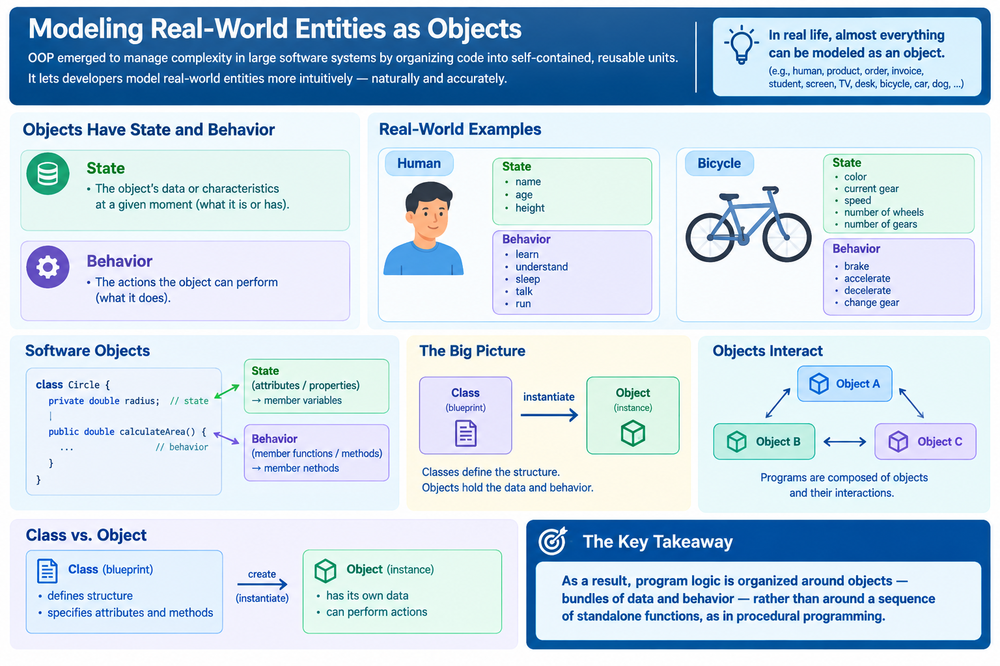


- **Object-Oriented Programming (OOP)** emerged primarily to manage complexity in large software systems by organizing code into self-contained, reusable units.
- It allows developers to model real-world entities more intuitively — naturally and accurately.
- In real life, almost everything can be modeled as an **object** (e.g., human, product, order, invoice, student, screen, TV, desk, bicycle, car, dog, etc.).
- Every object has **state** and **behavior**:
  - **State** — the object's data or characteristics at a given moment (what it *is* or *has*).
  - **Behavior** — the actions the object can perform (what it *does*).
- Example (Human):
  - State → name, age, height
  - Behavior → learn, understand, sleep, talk, run
- Example (Bicycle):
  - State → color, current gear, speed, number of wheels, number of gears
  - Behavior → brake, accelerate, decelerate, change gear
- Software objects mirror this same structure:
  - **State** (also called *attributes* or *properties*) is represented using **member variables**.
  - **Behavior** is represented using **member functions/methods**.
- **Objects** are the fundamental building blocks of OOP — programs are composed of objects and their interactions.
- Each object bundles together its **data** and the **methods** that operate on that data.
- Developers design **classes**, which act as blueprints for making (instantiating) objects.
- As a result, program logic is organized around **objects** — bundles of data and behavior — rather than around a sequence of standalone functions, as in procedural programming.


### Identifying Objects from Requirements

- To identify objects, we use  **object modeling**.
- A textual analysis of the requirement list (such as use case descriptions) can be performed 
during the analysis phase, following **Abbott’s technique**.
- **Nouns and noun phrases** in the requirements often suggest potential **classes or objects**.
- Nouns or noun phrases that have **attributes (data)** or **behaviors (functions)** are strong candidates for **classes**.
- **Verbs** in the requirements often correspond to potential **methods** of objects.

### Object Candidates (Craig Larman)

- **Physical or tangible objects:** product, human, computer, keyboard, screen, etc.
- **Abstract or conceptual objects:** circle, rectangle, shape, account, order, invoice, etc.
- **Places:** school, building, campus, classroom, room, etc.
- **Processes/Transactions:** withdraw money, register, etc.
- **Roles:** administrator, student, staff, registered user, etc.
- **External systems:** databases, drivers, bank information system, web services, etc.
- **Organizations:** school, company, firm, etc.
- **Events:** ActionListener, ActionEvent, KeyListener, KeyEvent, logs, etc.


### Class and Object

A **class** is a blueprint(template or prototype) that defines the **attributes (data)** and **behaviors (methods)** shared by its objects.

An **object** is a concrete **instance of a class**, instantiated at runtime. It has:
- a **unique identity** (reference or memory address)
- its own **state** (current attribute values)
- the class's **behavior**

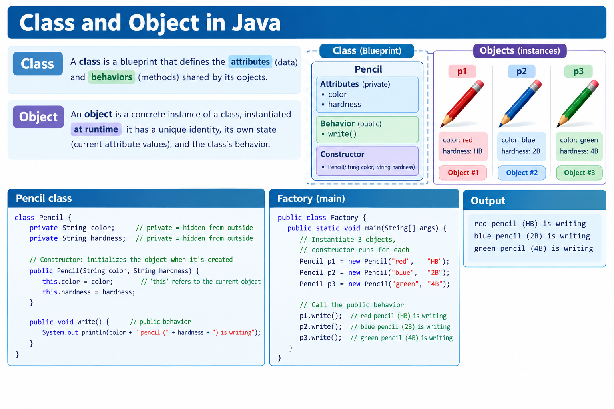


**Other real world examples:**
* Think of a class as a car design, while each object is an actual car produced from that design. The design (class) 
specifies that every car has wheels, an engine, and doors, and can perform actions like start, stop, or accelerate. 
But each real car (object) can have its own unique values, such as being red or blue, having different engine sizes, 
or belonging to different owners.
* Think of a class as a blueprint for building houses, while each object is an individual house built from that 
blueprint. The blueprint defines the design, but each house can have its own paint color, furniture, or garden.

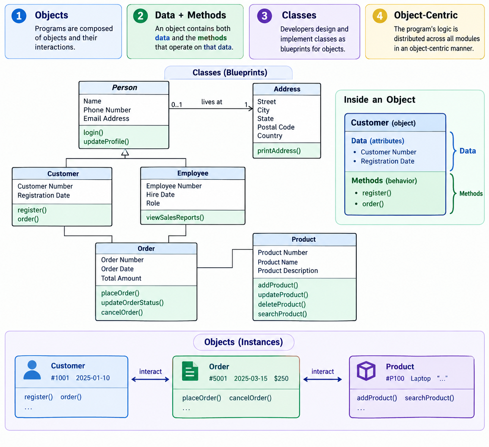

### Constructors
- Constructors are special methods that are called automatically when an object is instantiated.
- They initialize the object by setting initial values and performing any necessary setup operations.
- Have the same name as the class and do not have a return type.
- Can take parameters to set initial values for object attributes.
- In Java, the compiler defines a **default constructor** if none is provided.
  - It initializes the object with default values:
    - Numbers → 0
    - char → '\u0000'
    - Objects → null
    - boolean → false

**Circle Object Example**

"We aim to develop a drawing application. We need to draw a **Circle** with **radius**, **x** and **y** coordinates,
and **color** properties. The Circle's area should also be calculated..."

After analyzing this requirement list, we identified Circle as an object, with
radius, x, y coordinates, and color as its attributes, and the calculate area function as its method.

>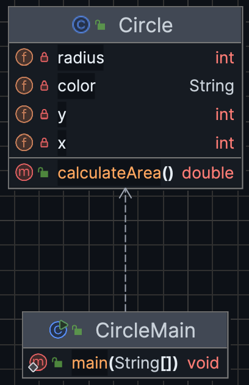
>
>**UML Class Diagram**
 

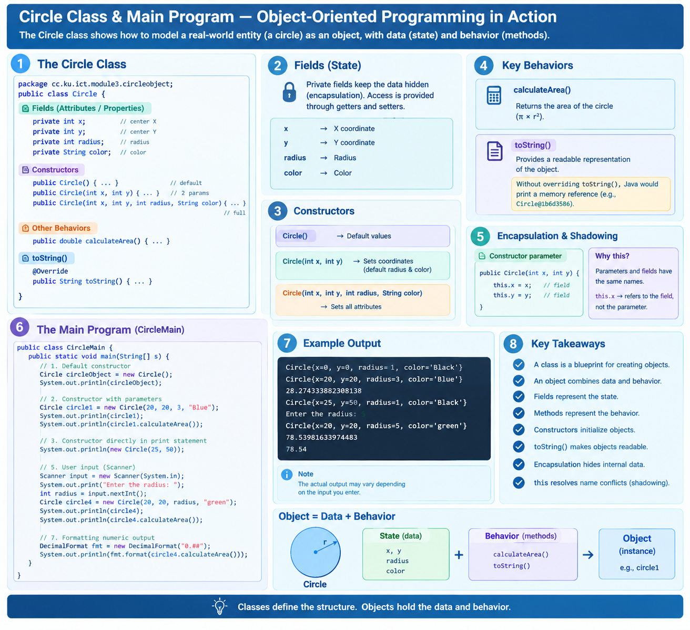


**Code Example**
>[./circleobject/Circle.java](./circleobject/Circle.java) | [./circleobject/CircleMain.java](./circleobject/CircleMain.java)

```java
// Must be stored as Circle.java

package cc.ku.ict.module3.circleobject;

public class Circle {
  // ============================
  // Fields (Attributes / Properties)
  // ============================
  // These describe the state of a Circle object.
  // They are kept private to follow the principle of "encapsulation".
  // Access is provided through getters and setters.
  private int x;        // X coordinate of the circle's center
  private int y;        // Y coordinate of the circle's center
  private int radius;   // Radius of the circle
  private String color; // Color of the circle

  // ============================
  // Constructors
  // ============================

  // No-parameter constructor (Default constructor)
  // This sets some default values for a new Circle object
  public Circle() {
    this.x = 0;          // Default X coordinate
    this.y = 0;          // Default Y coordinate
    this.radius = 1;     // Default radius (a minimal circle)
    this.color = "Black"; // Default color
  }

  // Overloaded constructor: initializes only coordinates
  // Since x and y share the same name with the field,
  // we use "this.x", "this.y" to distinguish the field from the parameter (shadowing).
  public Circle(int x, int y) {
    this.x = x;
    this.y = y;
    // radius and color still need sensible defaults here too,
    // otherwise radius stays 0 (an invalid circle) and color stays null.
    this.radius = 1;
    this.color = "Black";
  }

  // Overloaded full constructor: initializes all attributes
  public Circle(int x, int y, int radius, String color) {
    // "this" refers to the current object.
    // Since the parameters and member variables have the same name,
    // we must use "this" to prevent ambiguity (parameter shadowing the field).
    this.x = x;
    this.y = y;
    this.radius = radius;
    this.color = color;
  }


  // ============================
  // Other Behaviors
  // ============================

  // Calculates the area of the circle using the formula: pi * r^2
  public double calculateArea() {
    return Math.pow(radius, 2) * Math.PI;
  }

  // ============================
  // 7. toString() in action
  // ============================
  // Every System.out.println(circleObject) call  convert the object into a readable String as defined below.
  // Without overriding toString(), Java would print something like
  // "cc.ku.ict.module3.circleobject.Circle@1b6d3586" instead —
  // a memory reference, not useful information.
  @Override  //
  public String toString() {
    return "Circle{" +
            "x=" + x +
            ", y=" + y +
            ", radius=" + radius +
            ", color='" + color + '\'' +
            '}';
  }
}
```

```java
/**
 * Must be stored as CircleMain.java
 * This is the "driver class". It contains the main method,
 * which is the starting point of the program.
 */
package cc.ku.ict.module3.circleobject;

import java.text.DecimalFormat;
import java.util.Scanner;

public class CircleMain {
    public static void main(String[] s) {
        // ============================
        // 1. Instantiating a Circle object using the default constructor
        // ============================
        // IMPORTANT: This only works if Circle has a no-argument constructor (Circle()).
        // Otherwise, you need to add one in Circle class.

        Circle circleObject = new Circle();


        // Printing the circle's details (calls the toString() method)
        System.out.println(circleObject);
        //System.out.println(circleObject.toString());

        // ============================
        // 2. Instantiating a Circle object using a constructor with parameters
        // ============================

        // Example: Circle with center (20,20), radius 3, color "Blue"
         Circle circle1 = new Circle(20, 20, 3, "Blue");

         System.out.println(circle1);    // Prints circle details
         System.out.println(circle1.calculateArea()); // Prints area of the circle

        // ============================
        // 3. Using constructor directly in print statements
        // ============================


        System.out.println(new Circle(25, 50));       // Constructor with 2 parameters


        // ============================
        // 5. Taking user input (Scanner class)
        // ============================

         Scanner input = new Scanner(System.in);  // Instantiate Scanner object

         System.out.print("Enter the radius: ");
         int radius = input.nextInt();            // Read an integer from keyboard

         Circle circle4 = new Circle(20, 20, radius,"green");  // Use input for radius
         System.out.println(circle4);                  // Print details
         System.out.println(circle4.calculateArea());  // Print area


        // ============================
        // 7. Formatting numeric output
        // ============================

         DecimalFormat fmt = new DecimalFormat("0.##"); // Format: 4 decimal places
         System.out.println(fmt.format(circle4.calculateArea()));
    }
}

```


***
## Hands-on Exercise 1
* Define the package `cict.module3.circleobject` in your Java project.
* Place your Java files (`Circle.java`, `CircleMain.java` given above) under this package and run the application.
* We would like to use this circle in a 3-dimensional plane. Please add a z-coordinate and the related constructors to 
the Circle class, and update the main method properly to demonstrate instantiating a new Circle object in a 3-dimensional plane.
* Add a method to calculate circumference, and call it in the main method.
  - Define a new method `calculateCircumference()` using the formula:

    ```
    Circumference = 2 × π × radius
    ```

  - (Note: The circumference is the perimeter of a circle.)


### Encapsulation
- Encapsulation is principle of bundling data (attributes) and methods (functions) into a single unit (class).
- Encapsulation restricts direct access to an object’s internal data and implementation details(information hiding).
- By hiding internal details, encapsulation ensures that dependencies occur only through well-defined interfaces.
- This reduces side effects: changes to the internal implementation do not break other parts of the code.
- Improves maintainability and prevents unintended modifications.


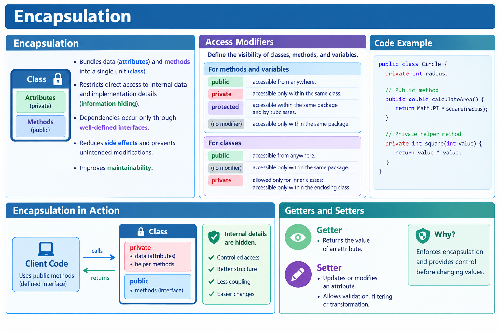

####  Benefits of Encapsulation

* The dependent module (client) cannot break the dependency module (provider). It has no access to the module's 
internals, so it can't corrupt its state — only the module's own methods can modify it. 
* A change in the dependency module (the module's internals) cannot break the dependent module (client). The client only coupled 
itself to the public interface, so internal refactoring causes no side effects outside the module. 
The side effect is contained — inside the class, not propagated to clients.

>**From the interaction perspective, modules can have two roles:**
> * The dependent (uses something) → dependent module, client code, consumer
> * The dependency (is used) → dependency module, provider, supplier

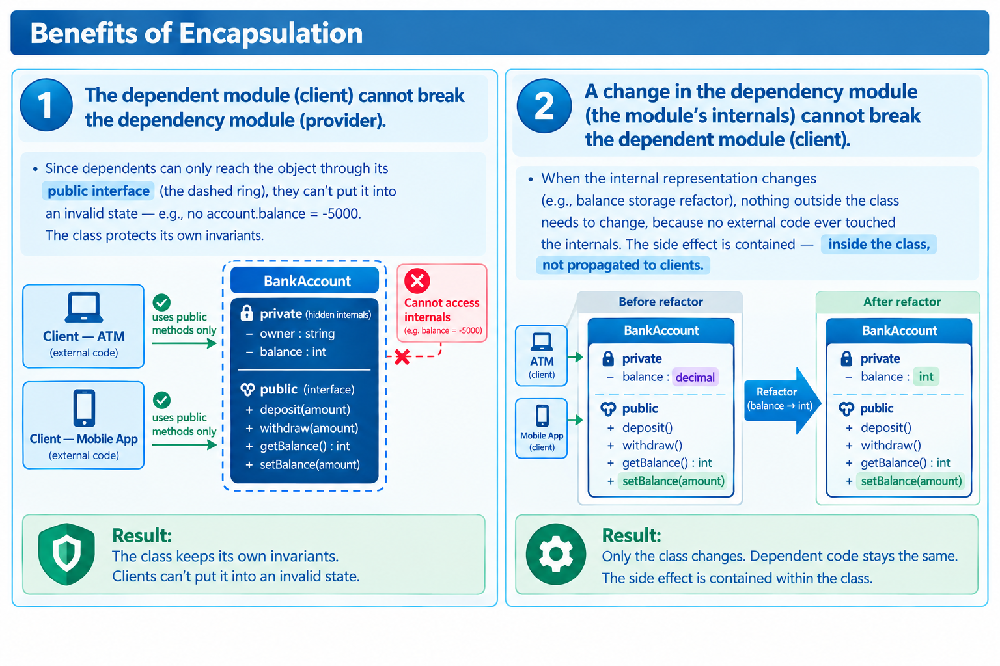

### Access Modifiers: Public, Private, Protected
**Define the visibility of classes, methods, and variables**

- **For methods and variables:**
  - `public` → accessible from anywhere.
  - `private` → accessible only within the same class.
  - `protected` → accessible within the same package and by subclasses.
  - *(no modifier)* → accessible only within the same package.

- **For classes:**
  - `public` → accessible from anywhere.
  - *(no modifier)* → accessible only within the same package.
  - `private` → allowed only for inner classes; accessible only within the enclosing class.


**Code Example**
~~~java
public class Circle {
    private int x;        // X coordinate of the circle's center
    private int y;        // Y coordinate of the circle's center
    private int radius;   // Radius of the circle
    
  

  // Public method
    public double calculateArea() {
        return Math.PI * square(radius);  // calling private method
    }

    // Private helper method
    private int square(int value) {
        return value * value;
    }
}
~~~


### Getters and Setters
- Methods used to access and update private attributes of a class.
- Helps enforce encapsulation and allows validation before changing values.


- **Getter** → returns the value of an attribute.
- **Setter** → updates or modifies the value of an attribute. 
We can apply any control logic such as validation, filtering, preprocessing/transformation etc.

**Code Example**

~~~java
public class Circle {
    private int x;        // X coordinate of the circle's center
    private int y;        // Y coordinate of the circle's center
    private int radius;   // Radius of the circle

    //......
  
    public void setX(int x) {
      this.x = x;
    }
  
    public int getX() {
      return x;
    }
  
    public void setY(int y) {
      this.y = y;
    }
  
    public int getY() {
      return y;
    }
  
  
    // Setter with validation
    public void setRadius(int radius) {
      if (radius > 0) {         // validation rule: radius must be positive
        this.radius = radius;
      } else {
        System.out.println("Invalid radius. It must be positive.");
      }
    }
  
  
    public int getRadius() {
      return radius;
    }
  
  
  
    //.....

}
~~~


**Code Example: Extend the Circle class**

> Add a new attribute and functionality to the existing `Circle` class by following these steps:

1. **Add a new attribute**
  - Define a private field named `label` (type `String`) to store the label of the circle.

2. **Define constructors**
  - Define three constructors:
    - i) one with no input parameters,
    - ii) one with x and y input parameters, and
    - iii) one with all parameters.
  - If no label is provided, set a default value such as `"Unnamed"`.

3. **Add getter and setter methods**
  - Define a `getLabel()` method to return the circle’s label.
  - Define a `setLabel(String label)` method to update the label. 
    Before assigning the label it must check for null value and convert to the uppercase.

4. **Add a method to calculate circumference**
  - Define a new method `calculateCircumference()` using the formula:

    ```
    Circumference = 2 × π × radius
    ```

  - (Note: The circumference is the perimeter of a circle.)

5. **Update the `toString()` method**
  - Extend the existing `toString()` to include the `label` field in the output.

6. **Extend your application**
- In the `CircleMain` class:
- Use a loop structure (e.g., `while` or `do-while`) to repeatedly:
  - Ask the user to enter the following details for the circle:
    - `x` (int) → X coordinate of the circle’s center.
    - `y` (int) → Y coordinate of the circle’s center.
    - `radius` (int) → Radius of the circle.
    - `color` (String) → The circle’s color.
    -  `label` (String) → A name for the circle.
  - Instantiate a new `Circle` object with these values.
  - Print the circle using `toString()`.
  - Call and print the result of `calculateArea()` and `calculateCircumference()`.
- After each iteration, ask the user whether they want to instantiate another circle.
- Exit the loop if the user chooses not to continue.

**Code Example**
>[Circle.java](./extendedcircleobject/Circle.java) | [CircleMain,java](./extendedcircleobject/CircleMain.java)

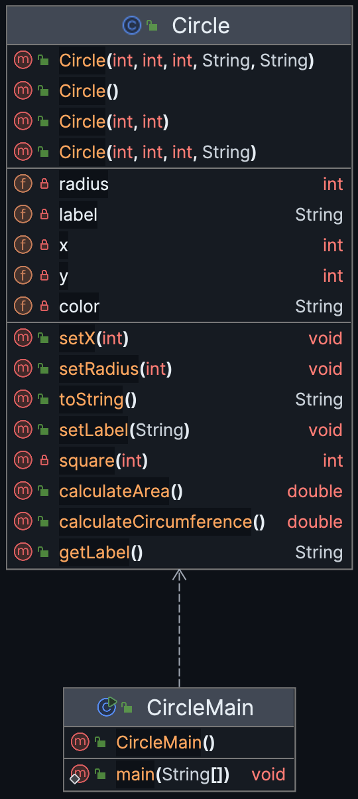


***
## [Hands-on Exercise 2](./exercises/README.md)
***


### static and final keywords

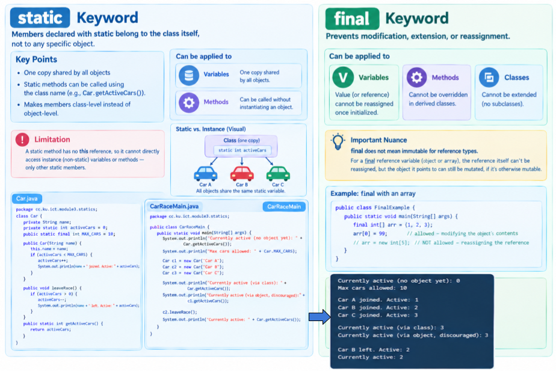

**static Keyword**

- Normally, members (attributes and methods) belong to individual **objects** (such members are called instance 
variables and instance methods).
- When declared with the **`static`** keyword, they belong to the **class itself**, not to any specific object.
- This means:
  - There is **only one copy** of a **static variable**, shared across all objects.
  - **Static methods** can be called using the class name (e.g., `Car.getActiveCars()`), without needing to instantiate an object.
- Therefore, `static` makes members **class-level** instead of **object-level**.
- Can be applied to:
  - **Variables** → one copy shared by all objects.
  - **Methods** → can be called without instantiating an object.
- **Limitation:** a static method has no `this` reference, so it **cannot directly access instance (non-static) variables or methods** — only other static members. This is why `main()`, being static, can't call an instance method without first creating an object.

**final Keyword**

- Used to declare constants or prevent modification/extension.
- Can be applied to:
  - **Variables** → value (or reference) cannot be reassigned once initialized.
  - **Methods** → cannot be overridden in derived classes.
  - **Classes** → cannot be extended (no subclasses).
- **Important nuance — `final` does not mean immutable for reference types:**
  - For a `final` reference variable (an object or array), the *reference itself* can't be reassigned to point elsewhere — but the *object it points to* can still be mutated internally, if that object is otherwise mutable.
  - Example:
```java
    final int[] arr = {1, 2, 3};
    arr[0] = 99;      // allowed — modifying the object's contents
    arr = new int[5]; // NOT allowed — reassigning the reference
```


**Example: Requirement List for A Car Race Application**
    
  We want to model a simple **Car Race** system.
  Class: Car
  - **Attributes**
    - `name` (String) → the name of the car.
    - `static activeCars` (int) → shared among all Car objects, counts how many cars are currently active in the race.
    - `static final MAX_CARS` (int) → constant that specifies the maximum number of cars allowed in the race.
  
    - **Methods**
      - **Constructor** `(Car(String name))`
        - When a new Car is instantiated, it joins the race.
        - Increments `activeCars` if it does not exceed `MAX_CARS`.
      - `leaveRace()`
        - Decreases `activeCars` when a car leaves the race.
      - `static getActiveCars()`
        - Returns the number of currently active cars.
  
  Class: CarRaceMain
  - **Methods**
    - `main(String[] args)`
      - Instantiate several `Car` objects.
      - Show how `activeCars` is updated when cars join or leave.
      - Demonstrate the effect of the `final` constant `MAX_CARS`.


**Code Example**
>[CarRaceMain.java](./statics/CarRaceMain.java) | [Car.java](./statics/Car.java)


### Scope of a Variable


**Scope** defines the region of a program where a variable is `visible` and can be `referenced` (closely tied 
to its lifetime — how long the variable exists during execution).

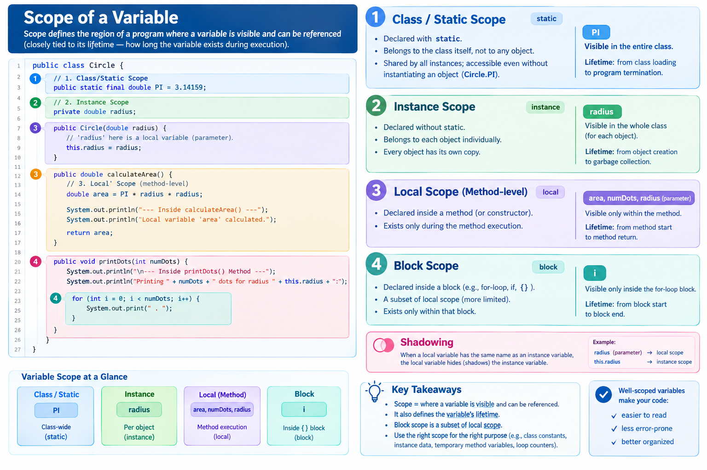

```java
public class Circle {

  // 1. Class/Static Scope
  // Declared with 'static' — belongs to the CLASS itself, not to any object.
  // Shared by all Circle instances; accessible even without instantiating an object (Circle.PI).
  public static final double PI = 3.14159;

  // 2. Instance Scope
  // Declared without 'static' — belongs to each OBJECT individually.
  // Every Circle has its own separate copy of 'radius'.
  private double radius;

  // Constructor — the parameter 'radius' here is a LOCAL variable (method-scoped).
  public Circle(double radius) {
    // SHADOWING: the parameter 'radius' has the same name as the instance
    // variable 'radius'. Inside this constructor, the plain name 'radius'
    // refers to the PARAMETER (the local one), not the instance variable —
    // the local variable "shadows" (hides) the instance variable.
    // 'this.radius' is required to explicitly reach the instance variable.
    this.radius = radius;
  }

  public double calculateArea() {
    // 3. Local Scope (method-level)
    // 'area' is allocated when the method starts and destroyed when it returns.
    // No shadowing here — there's no other 'area' variable anywhere else in the class.
    double area = PI * radius * radius;

    System.out.println("--- Inside calculateArea() ---");
    System.out.println("Local variable 'area' calculated.");

    return area;
  }

  public void printDots(int numDots) {
    // 'numDots' is also local scope (method-level) — lives for this method call only.
    System.out.println("\n--- Inside printDots() Method ---");
    System.out.println("Printing " + numDots + " dots for radius " + this.radius + ":");

    // 4. Block Scope
    // 'i' is local scope too, but narrower: it only exists inside the for-loop's { }.
    // Block scope is a SUBSET of local scope, not a separate category —
    // every block-scoped variable is also local, but it dies at the end of its block,
    // not at the end of the whole method.
    for (int i = 0; i < numDots; i++) {
      System.out.print(" . ");
    }

    // ERROR DEMONSTRATION:
    // 'i' no longer exists here — it was destroyed when the loop's block ended.
    // Uncommenting the next line causes a compile-time error: cannot find symbol 'i'
    // System.out.println("The value of i outside the loop is: " + i);
  }
}
```

## Collections: ArrayList

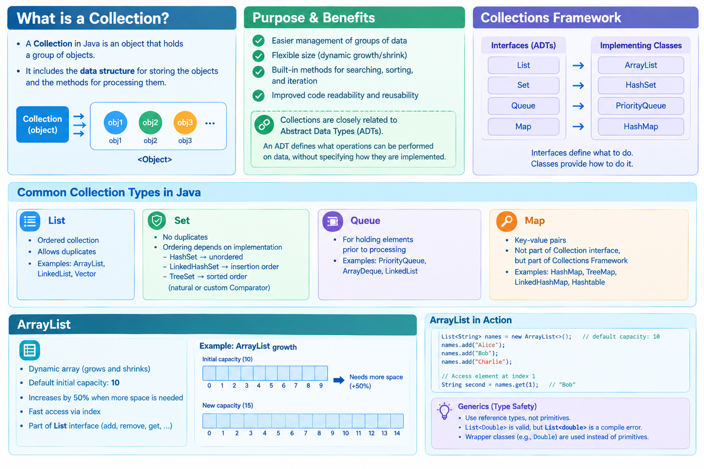

- A **Collection** in Java is an object that holds a group of objects.
- It includes both the data structure for storing the objects and the methods for processing them.
- Main purposes:
  - Easier management of groups of data
  - Flexible size (dynamic growth/shrink)
  - Built-in methods for searching, sorting, and iteration
  - Improved code readability and reusability
- Collections in Java are closely related to **Abstract Data Types (ADTs)**.
- An ADT defines *what operations* can be performed on data, without specifying *how* they are implemented.
- In Java:
  - Interfaces such as **List**, **Set**, **Queue**, and **Map** represent ADTs.
  - Classes such as **ArrayList**, **HashSet**, **PriorityQueue**, and **HashMap** provide concrete implementations of those ADTs.

**Common Collection Types in Java**
- **List** → Ordered collection, allows duplicates (e.g., ArrayList, LinkedList, Vector).
- **Set** → No duplicates allowed; ordering depends on the implementation:
  - `HashSet` → unordered (no guaranteed order)
  - `LinkedHashSet` → maintains insertion order
  - `TreeSet` → maintains sorted order (natural ordering or a custom `Comparator`)
- **Queue** → Designed for holding elements prior to processing (e.g., PriorityQueue, ArrayDeque, LinkedList).
- **Map** → Stores key-value pairs (not part of the Collection interface, but part of the Collections Framework) (e.g., HashMap, TreeMap, LinkedHashMap, Hashtable).

### ArrayList

- An **ArrayList** is a dynamic array that can grow and shrink in size.
- Default initial capacity is **10** if none is specified in the constructor.
- When it needs more space, its capacity increases by **50%**.
- Provides fast access to elements using their index.
- Part of the **List interface**, so it supports common operations like add, remove, and get.
- Can be defined in a **type-safe** way using generics, e.g., `List<Double>` instead of a primitive type.
  - Java generics don't support primitive types (`List<double>` is a compile error) — only reference types are allowed, which is why the wrapper class `Double` is used instead of `double`.

**Code Example**
>[Book.java](./collections/Book.java) | [CollectionsMain.java](./collections/CollectionsMain.java)


***
## [Hands-on Exercise 3](./exercises/README.md)
***


