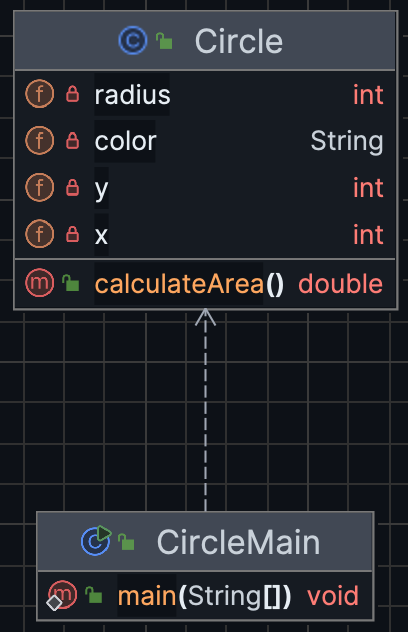

***
# Module 3: Object-Oriented Programming (OOP) I
***

<!-- TOC -->
* [Module 3: Object-Oriented Programming (OOP) I](#module-3-object-oriented-programming-oop-i)
  * [Software Development Life Cycle (SDLC)](#software-development-life-cycle-sdlc)
  * [The Core Concepts of OOP: Classes and Objects](#the-core-concepts-of-oop-classes-and-objects)
    * [Modeling Real-World Entities as Objects](#modeling-real-world-entities-as-objects)
    * [Identifying Objects from Requirements](#identifying-objects-from-requirements)
    * [Object Candidates (Craig Larman)](#object-candidates-craig-larman)
    * [Classes and Objects](#classes-and-objects)
  * [Hands-on Exercise 1](#hands-on-exercise-1)
    * [Constructors](#constructors)
    * [Encapsulation](#encapsulation)
    * [Access Modifiers: Public, Private, Protected](#access-modifiers-public-private-protected)
    * [Getters and Setters](#getters-and-setters)
  * [Hands-on Exercise 2](#hands-on-exercise-2)
  * [Hands-on Exercise 3](#hands-on-exercise-3)
    * [static and final keywords](#static-and-final-keywords)
    * [Scope of a Variable](#scope-of-a-variable)
  * [Collections: ArrayList](#collections-arraylist)
    * [ArrayList](#arraylist)
  * [Hands-on Exercise 4](#hands-on-exercise-4)
<!-- TOC -->

---

## Software Development Life Cycle (SDLC)
The SDLC is a structured process used to develop high-quality software in a systematic and efficient way. 
It breaks software development into distinct phases, each with specific goals and deliverables.

The Software Development Life Cycle (SDLC) consists of five fundamental phases.

Today, there are different software development process models such as
Waterfall, Spiral, Iterative/Incremental, Agile, and Unified Process. 
All of these models, in one way or another, include these fundamental phases.


")


## The Core Concepts of OOP: Classes and Objects

### Modeling Real-World Entities as Objects

- **Object-Oriented Programming (OOP)** was developed to model real-world entities more naturally and accurately.
- In real life, almost everything can be considered as an **object** (e.g., human, product, order, invoice, student, 
screen, TV, desk, bicycle, car, dog, etc.).
- Objects have **states** and **behaviors**:
  - Example (Human):
    - States → name, age, height
    - Behaviors → learn, understand, sleep, talk, run
  - Example (Bicycle):
    - States → color, current gear, speed, number of wheels, number of gears
    - Behaviors → brake, accelerate, decelerate, change gear
- Similarly, **software objects** also have states and behaviors:
  - **States** (also called **attributes** or **properties**) are represented using **member variables**.
  - **Behaviors** are represented using **member functions/methods**.


- The fundamental building blocks in OOP are **objects**, and programs are composed of objects and their interactions.
- An object contains both **data** and the **methods** that operate on that data.
- Developers focus on designing and implementing **classes**, which serve as blueprints for making (instantiating) objects.
- ***This way, the program's logic is distributed across all modules in a object-centric manner.***


### Identifying Objects from Requirements

- To identify objects, we use  **object modeling**.
- A textual analysis of the requirement list (such as use case descriptions) can be performed 
during the analysis phase, following **Abbott’s technique**.
- **Nouns and noun phrases** in the requirements often suggest potential **classes or objects**.
- Nouns or noun phrases that have **attributes (data)** or **behaviors (functions)** are strong candidates for **classes**.
- **Verbs** in the requirements often correspond to potential **methods** of objects.

### Object Candidates (Craig Larman)

- **Physical or tangible objects:** product, human, computer, keyboard, screen, etc.
- **Abstract or conceptual objects:** circle, rectangle, shape, account, order, invoice, etc.
- **Places:** school, building, campus, classroom, room, etc.
- **Processes/Transactions:** withdraw money, register, etc.
- **Roles:** administrator, student, staff, registered user, etc.
- **External systems:** databases, drivers, bank information system, web services, etc.
- **Organizations:** school, company, firm, etc.
- **Events:** ActionListener, ActionEvent, KeyListener, KeyEvent, logs, etc.

### Classes and Objects

- A **class** is a blueprint(template or prototype) that defines the structure (i.e.; attributes (data) and behaviors (methods) of something). 
- An **object** is a concrete instance of a class.

**Real world examples:**
* Think of a class as a car design, while each object is an actual car produced from that design. The design (class) 
specifies that every car has wheels, an engine, and doors, and can perform actions like start, stop, or accelerate. 
But each real car (object) can have its own unique values, such as being red or blue, having different engine sizes, 
or belonging to different owners.
* Think of a class as a blueprint for building houses, while each object is an individual house built from that 
blueprint. The blueprint defines the design, but each house can have its own paint color, furniture, or garden.

  
**Circle Object Example**

"We aim to develop a drawing application. We need to draw a **Circle** with **radius**, **x** and **y** coordinates,
and **color** properties. The Circle's area should also be calculated..."

After analyzing this requirement list, we identified Circle as an object, with
radius, x, y coordinates, and color as its attributes, and the calculate area function as its method.

>
>
>**UML Class Diagram**


**Code Example**
>[Circle.java](./circleobject/Circle.java) | [CircleMain,java](./circleobject/Circle.java)


***
## Hands-on Exercise 1
* Define the package `cc.ku.ict.module3.circleobject` in your Java project.
* Place your Java files (`Circle.java`, `CircleMain.java` given above) under this package and run the application.
***

### Constructors
- Special methods in a class used to initialize objects.
- Have the same name as the class and do not have a return type.
- Can take parameters to set initial values for object attributes.
- In Java development, the compiler defines a **default constructor** if none is provided.
  - It initializes the object with default values:
    - Numbers → 0
    - char → '\u0000'
    - Objects → null
    - boolean → false

**Code Example**

```java
   //No-parameter constructor (Default constructor)
   //This sets some default values for a new Circle object
   public Circle() {
        this.x = 0;         // Default X coordinate
        this.y = 0;         // Default Y coordinate
        this.radius = 1;    // Default radius (a minimal circle)
        this.color = "Black"; // Default color
    }
    
   //Overloaded full constructor: initializes all attributes
   public Circle(int x, int y, int radius, String color) {
        // "this" refers to the current object.
        // since the parameters and member variables have the same name
        // we must use this keyword to prevent ambiguity.
        this.x = x;
        this.y = y;
        this.radius = radius;
        this.color = color;
    }

   // Overloaded constructor: initializes only coordinates
   // Radius and color can be set later using setters
    public Circle(int x1, int y) {
        x = x1;
        this.y = y;
    }
```

### Encapsulation
- Principle of bundling data (attributes) and methods (functions) into a single unit (class).
- Restricts direct access to some of the object’s components (information hiding).
- Improves maintainability and prevents unintended modifications.

### Access Modifiers: Public, Private, Protected
- Define the visibility of classes, methods, and variables:
  - **public** → accessible from anywhere.
  - **private** → accessible only within the same class.
  - **protected** → accessible within the same package and by subclasses.

**Code Example**
~~~java
public class Circle {
    private int radius;

    // Public method
    public double calculateArea() {
        return Math.PI * square(radius);  // calling private method
    }

    // Private helper method
    private int square(int value) {
        return value * value;
    }
}
~~~


### Getters and Setters
- Methods used to access and update private attributes of a class.
- **Getter** → returns the value of an attribute.
- **Setter** → updates or modifies the value of an attribute.
- Helps enforce encapsulation and allows validation before changing values.

**Code Example**
~~~java
public class Circle {
    private int radius;

  // Setter with validation
  public void setRadius(int radius) {
    if (radius > 0) {         // validation rule: radius must be positive
      this.radius = radius;
    } else {
      System.out.println("Invalid radius. It must be positive.");
    }
  }

  // Getter
  public int getRadius() {
    return radius;
  }
}
~~~


**Code Example: Extend the Circle class**

> Add a new attribute and functionality to the existing `Circle` class by following these steps:

1. **Add a new attribute**
  - Define a private field named `label` (type `String`) to store the label of the circle.

2. **Update constructors**
  - Modify the existing constructors to also initialize the `label` field.
  - If no label is provided, set a default value such as `"Unnamed"`.

3. **Add getter and setter methods**
  - Define a `getLabel()` method to return the circle’s label.
  - Define a `setLabel(String label)` method to update the label. 
    Before assigning the label it must check for null value and convert to the uppercase.

4. **Add a method to calculate circumference**
  - Define a new method `calculateCircumference()` using the formula:

    ```
    Circumference = 2 × π × radius
    ```

  - (Note: The circumference is the perimeter of a circle.)

5. **Update the `toString()` method**
  - Extend the existing `toString()` to include the `label` field in the output.

6. **Extend your application**
- In the `CircleMain` class:
- Use a loop structure (e.g., `while` or `do-while`) to repeatedly:
  - Ask the user to enter the following details for the circle:
    - `label` (String) → A name for the circle.
    - `x` (int) → X coordinate of the circle’s center.
    - `y` (int) → Y coordinate of the circle’s center.
    - `radius` (int) → Radius of the circle.
    - `color` (String) → The circle’s color.
  - Instantiate a new `Circle` object with these values.
  - Print the circle using `toString()`.
  - Call and print the result of `calculateArea()` and `calculateCircumference()`.
- After each iteration, ask the user whether they want to instantiate another circle.
- Exit the loop if the user chooses not to continue.

**Code Example**
>[Circle.java](./extendedcircleobject/Circle.java) | [CircleMain,java](./extendedcircleobject/CircleMain.java)


***
## Hands-on Exercise 2
* Extend the Circle application in accordance with the instructions given above.
***


***
## [Hands-on Exercise 3](./exercises/README.md)
***

### static and final keywords

**static Keyword**

- Normally, members (attributes and methods) belong to **objects**.
- When declared with the **`static`** keyword, they belong to the **class itself**, not to any specific object.
- This means:
  - There is **only one copy** of a static variable shared across all objects.
  - Static methods can be called using the class name (e.g., `Car.getActiveCars()`), without needing to instantiate an object.
- Therefore, `static` makes members **class-level** instead of **object-level**.

- Can be applied to:
  - **Variables** → one copy shared by all objects.
  - **Methods** → can be called without instantiating an object.

**final Keyword**
- Used to declare constants or prevent modifications.
- Can be applied to:
  - **Variables** → value cannot be changed once assigned.
  - **Methods** → cannot be overridden in derived classes.
  - **Classes** → cannot be extended (no subclasses).

**Example: Requirement List for A Car Race Application**
    
    We want to model a simple **Car Race** system.
    Class: Car
    - **Attributes**
      - `name` (String) → the name of the car.
      - `static activeCars` (int) → shared among all Car objects, counts how many cars are currently active in the race.
      - `static final MAX_CARS` (int) → constant that specifies the maximum number of cars allowed in the race.
    
      - **Methods**
        - **Constructor** `(Car(String name))`
          - When a new Car is created, it joins the race.
          - Increments `activeCars` if it does not exceed `MAX_CARS`.
        - `leaveRace()`
          - Decreases `activeCars` when a car leaves the race.
        - `static getActiveCars()`
          - Returns the number of currently active cars.
    
    Class: CarRaceMain
    - **Methods**
      - `main(String[] args)`
        - Instantiate several `Car` objects.
        - Show how `activeCars` is updated when cars join or leave.
        - Demonstrate the effect of the `final` constant `MAX_CARS`.


**Code Example**
>[CarRaceMain.java](./statics/CarRaceMain.java) | [Car.java](./statics/Car.java)


### Scope of a Variable

`Scope` defines where a variable can be accessed or used:

Based on the following code example:

1) Class/Static Scope (PI) – Declared with static; shared by all objects of the class. Accessible also without an instance.

2) Instance/Object Scope (radius) – Declared without static; unique to each object. Accessible by all methods within that object.

3) Method/Local Scope (area, radius parameter in Circle(double radius), numDots in printDots() ) – Declared inside a method; exists only while the method runs.

4) Block Scope (i) – Declared inside a block (e.g., a loop); accessible only within that block.

```java
public class Circle {

    // 1. Class/Static Variable (Shared Scope) 🌐
    // Declared with the 'static' keyword. Shared by all Circle objects.
    public static final double PI = 3.14159; 

    // 2. Instance Variable (Object Scope) 🟠
    // Unique to each object (instance) of the Circle class.
    private double radius; 

    // Constructor to initialize the Instance Variable
    public Circle(double radius) { // (Method Scope) 
        this.radius = radius;
    }
    
    public double calculateArea() {
        // 3. Local Variable (Method Scope) 
        // Variable 'area' is created when the method starts and destroyed when it ends.
        double area = PI * radius * radius; 
        
        System.out.println("--- Inside calculateArea() ---");
        System.out.println("Local variable 'area' calculated.");
        
        // The local variable is returned, making its value available outside.
        return area; 
    }

    public void printDots(int numDots) { //(Method Scope) 
      System.out.println("\n--- Inside printDots() Method ---");
      System.out.println("Printing " + numDots + " dots for radius " + this.radius + ":");
  
      // The variable 'i' has Block Scope.
      // It is initialized and incremented only within the loop's execution.
      for (int i = 0; i < numDots; i++) {
        System.out.print(" . ");
      }
      
      // ERROR DEMONSTRATION: 
      // If you tried to access 'i' here, the compiler would throw an error 
      // because 'i' is out of scope.
      System.out.println("The value of i outside the loop is: " + i); 
    }
    
}
```

## Collections: ArrayList


- A Collection in Java is an object that holds a group of objects.
- It includes both the data structure for storing the objects and the methods for processing them.
- Main purposes:
  - Easier management of groups of data
  - Flexible size (dynamic growth/shrink)
  - Built-in methods for searching, sorting, and iteration
  - Improved code readability and reusability
- Collections in Java are closely related to **Abstract Data Types (ADTs)**.
- An ADT defines *what operations* can be performed on data, without specifying *how* they are implemented.
- In Java:
  - Interfaces such as **List**, **Set**, **Queue**, and **Map** represent ADTs.
  - Classes such as **ArrayList**, **HashSet**, **PriorityQueue**, and **HashMap** provide concrete implementations of those ADTs.


**Common Collection Types in Java**
- **List** → Ordered collection, allows duplicates (e.g., ArrayList, LinkedList, Vector).
- **Set** → Unordered collection, no duplicates allowed (e.g., HashSet, TreeSet, LinkedHashSet).
- **Queue** → Designed for holding elements prior to processing (e.g., PriorityQueue, ArrayDeque, LinkedList).
- **Map** → Stores key-value pairs (not part of Collection interface, but part of Collections Framework) (e.g., HashMap, TreeMap, LinkedHashMap, Hashtable).


### ArrayList

- An **ArrayList** is a dynamic array that can grow and shrink in size.
- When it needs more space, its capacity increases by **50%**.
- Provides fast access to elements using their index.
- Part of the **List interface**, so it supports common operations like add, remove, and get.
- Can be defined in a **type-safe** way using generics, e.g., `List<Double>` instead of primitive types.


**Code Example**
>[Book.java](./collections/Book.java) | [CollectionsMain,java](./collections/CollectionsMain.java)


***
## [Hands-on Exercise 4](./exercises/README.md)
***


