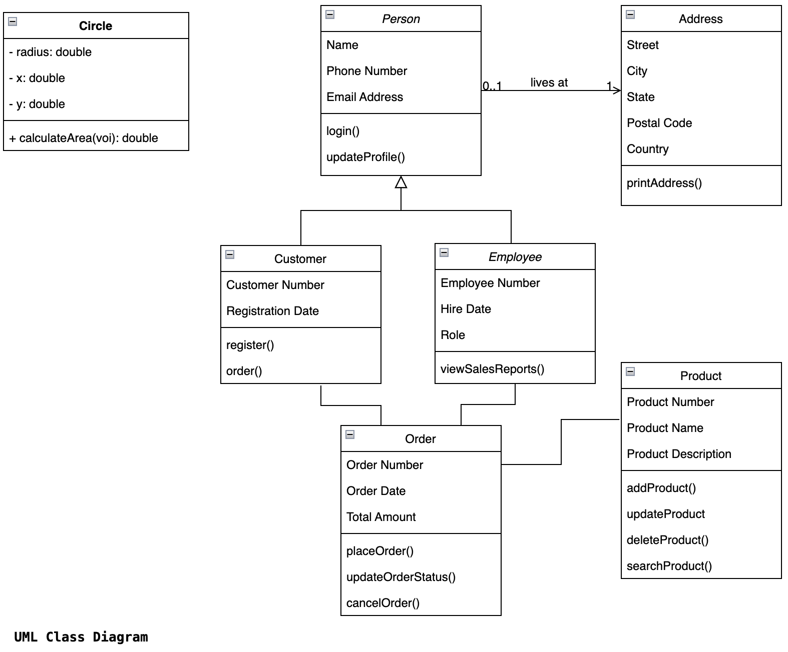
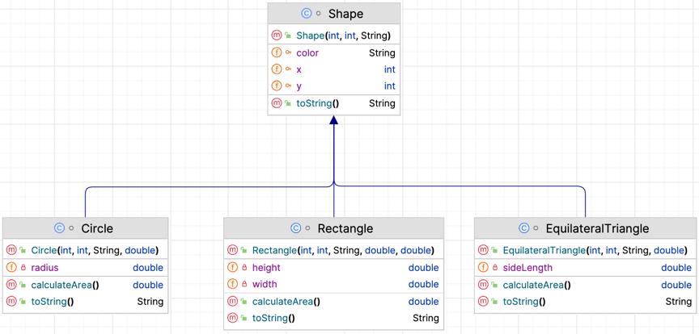
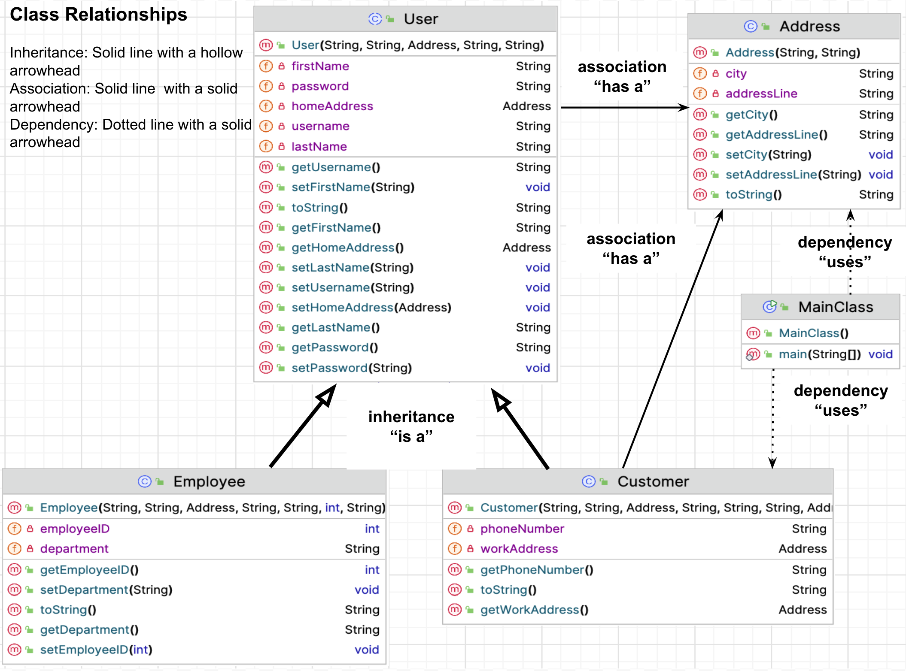
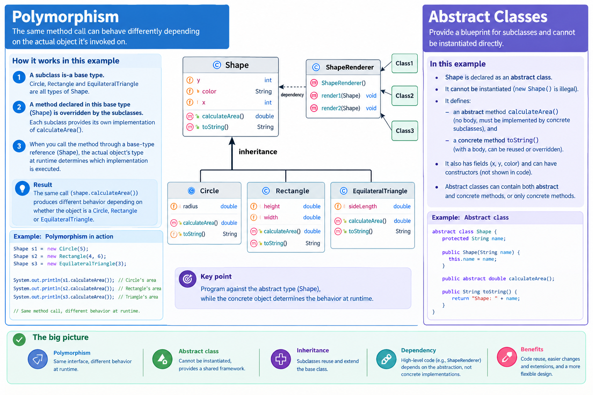
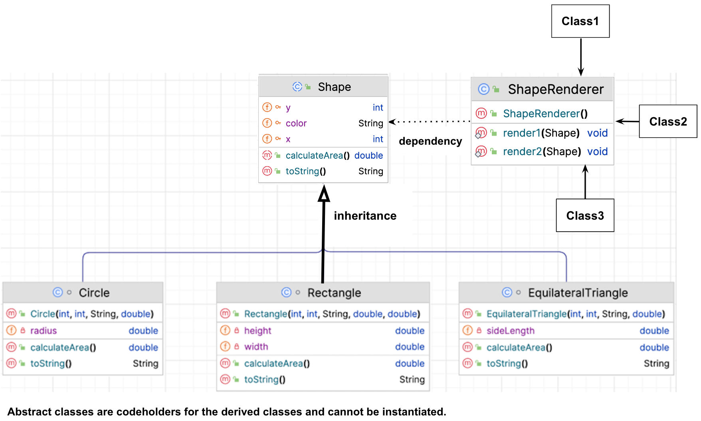
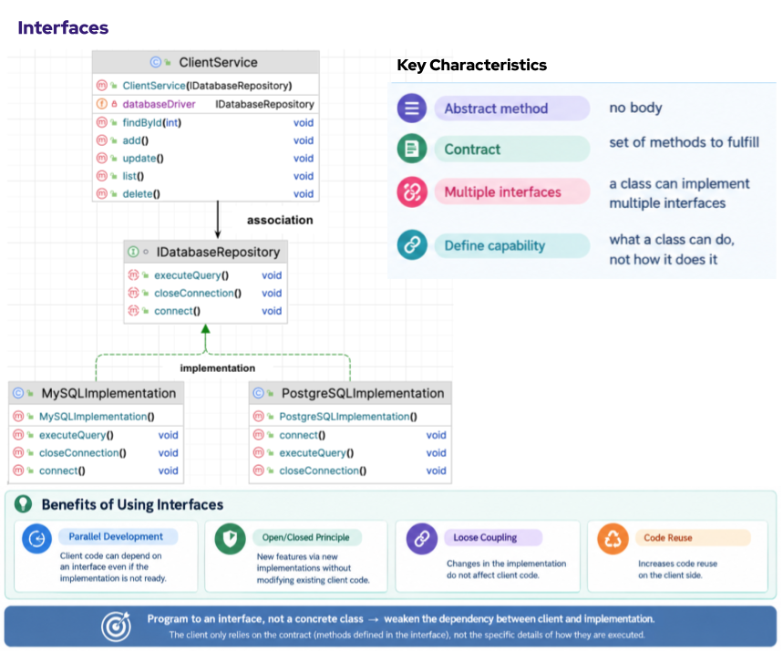

# Module 4: Object-Oriented Programming (OOP) II

<!-- TOC -->
* [Module 4: Object-Oriented Programming (OOP) II](#module-4-object-oriented-programming-oop-ii)
  * [Introduction to UML: Class Diagrams](#introduction-to-uml-class-diagrams)
    * [Class Diagram](#class-diagram)
  * [Inheritance](#inheritance)
    * [Method Overriding](#method-overriding)
    * [Annotations](#annotations)
    * [Inheritance and Constructors](#inheritance-and-constructors)
  * [Hands-on Exercise 1](#hands-on-exercise-1)
  * [Hands-on Exercise 2](#hands-on-exercise-2)
  * [Class Relationships](#class-relationships)
    * [Inheritance ("is-a")](#inheritance-is-a)
    * [Dependency ("uses")](#dependency-uses)
    * [Association ("has-a")](#association-has-a)
  * [Hands-on Exercise 3](#hands-on-exercise-3)
  * [Polymorphism](#polymorphism)
  * [Abstract Classes](#abstract-classes)
  * [Hands-on Exercise 5](#hands-on-exercise-5)
  * [Interfaces](#interfaces)
    * [Benefits of Using Interfaces](#benefits-of-using-interfaces)
  * [Hands-on Exercise 6](#hands-on-exercise-6)
<!-- TOC -->

## Introduction to UML: Class Diagrams

- **Modeling** is forming an abstraction (a simplified view) of reality.
- **Abstraction** hides unnecessary details and focuses on the relevant ones, reducing complexity.
- The level of detail depends on the **purpose of the model**.
- As software becomes more complex, models are used to represent different aspects of them with the required level of detail.

The **Unified Modeling Language™ (UML®)** is a standard visual modeling language for **business analysts, software architects, and developers**, used to **describe, specify, design, and document** the structure and behavior of software system components — whether newly designed or already existing.

### Class Diagram

A **Class Diagram** is the most common diagram in UML and is essential for visualizing the static structure of a system. It shows classes, their attributes, operations, and relationships.

A class is represented by a rectangle divided into three sections:

1. **Class Name** — the name of the class (required).
2. **Attributes** — the data members (instance variables) of the class.
  - Syntax: `visibility name : type [= defaultValue]`
  - Example: `- radius : int`
3. **Operations** — the methods/functions of the class.
  - Syntax: `visibility name(parameterName : parameterType) : returnType`
  - Example: `+ calculateArea() : double`

**Visibility symbols** (used for both attributes and operations):

| Symbol | Meaning   |
|--------|-----------|
| `+`    | public    |
| `-`    | private   |
| `#`    | protected |
| `~`    | package (default) |




## Inheritance

In software development, ***change is inevitable, not optional.*** Facilitating change is therefore essential in programming.

**Code reuse** is one of the most effective mechanisms to achieve this.

Instead of repeating the same code in multiple places, it is defined once and reused across the project or even in different projects.

**Inheritance** is a fundamental OOP feature that significantly supports code reuse:

- Enables a class (**subclass / child / derived class**) to be derived from another class (**superclass / parent / base class**).
- Prevents code repetition by reusing existing attributes and methods, since the derived class inherits the members of the base class.
  - Subclass inherits the **non-private** members of the superclass and may extend or override them.
  - **Important:** private members of the superclass still exist as part of the object but are **not directly 
  accessible** to the subclass. This is one reason `protected` exists — it allows subclass access while still hiding 
  a member from the outside world.
```java
    class Vehicle {
        private String vin;      // NOT accessible in Car
        protected int maxSpeed;  // accessible in Car
    }

    class Car extends Vehicle {
        void printVin() {
            System.out.println(vin); // compile error
        }
    }
```
- Should be applied only between similar entities with an **"is-a"** or **"is-kind-of"** relationship.
- Helps reduce duplication and improves maintainability.
- **Note:** inheritance is not the only way to achieve reuse — **composition** (building a class using instances of 
other classes) is often preferred in modern design when the relationship isn't a true "is-a" ("favor composition over inheritance").

**Examples of Inheritance:**
- User → Admin, RegisteredUser, GuestUser
- Shape → Circle, Rectangle, Square, Triangle
- Account → SavingsAccount, CheckingAccount, CreditAccount
- Product → Book, ElectronicProduct, ClothingProduct
- Vehicle → Car, Truck, Motorcycle, Bicycle
- Employee → Manager, Developer, Intern
- File → TextFile, AudioFile, VideoFile, ImageFile → PNG, JPEG, GIF, BMP *(a multi-level chain: ImageFile is itself a superclass of the image formats)*

***We can validate an inheritance relationship between classes using the "is-a" test.***
- `Car` is a `Vehicle`
- `Circle` is a `Shape`
- `Book` is a `Product`

In a UML Class Diagram, inheritance is drawn as a solid line with a hollow (unfilled) triangle pointing toward the Base Class.

```scss
[Derived Class] ─────────▷ [Base Class]

(solid line + hollow triangle)
```




**Code Example**
>[Shape.java](./inheritance/Shape.java) | [Circle.java](./inheritance/Circle.java) | [Rectangle.java](./inheritance/Rectangle.java) | [EquilateralTriangle.java](./inheritance/EquilateralTriangle.java) | [InheritanceMain.java](./inheritance/InheritanceMain.java)

### Method Overriding

- Occurs when a derived class provides a new implementation for a method already defined in its base class.
- The overriding method in the subclass must have the **same name and same parameter list** as in the base class. Same parameters is what distinguishes overriding from overloading — a different parameter list creates a new overload instead of overriding anything.
- The **return type** must be the same, or a **subtype** of the original return type (this is called a *covariant return type*) — it does not have to be strictly identical.
- The overriding method **cannot reduce visibility** (e.g., a `public` base method cannot be overridden as `protected` or `private`), though it may widen it.
- **`static`, `final`, and `private`** methods cannot be overridden — `static` methods belong to the class (not the object) and are hidden, not overridden, if redefined in a subclass; `final` methods are explicitly locked against overriding; `private` methods aren't visible to subclasses at all.
- The **`@Override`** annotation is recommended (not required) to ensure correctness.
- The overridden method in the base class can still be called from the derived class using **`super.methodName()`**.

***Best Practices / Performance Tips***
- The `@Override` annotation instructs the compiler to verify that a method actually overrides a method from the base class.
- If the method signature doesn't match (for example, due to a typo or wrong parameters), the compiler reports an error instead of silently creating an unintended overload — catching the mistake early.
- A common real-world example is overriding `toString()`: the base class version is often only partially useful — some information is provided, but a subclass may need to extend or customize it to include additional details specific to that subclass.


### Annotations

- Provide **metadata** about code (information for the compiler, tools, or runtime) rather than executable logic.
- An annotation has no effect on its own — it only does something if a tool actively reads it:
  - **Compiler-facing** (read at compile time, discarded afterward): `@Override`, `@SuppressWarnings`, `@Deprecated` (triggers a compiler warning on use).
  - **Framework/runtime-facing** (read via reflection at runtime to drive real behavior): `@Entity`, `@Autowired`, `@Test`.
- Help make code more **declarative** — you state *what* should happen (e.g., "this class is an entity") rather than writing the *how* yourself.
- Improve **readability** and reduce boilerplate/manual error.
- Do not directly affect program logic themselves, but can change how the code is **processed, validated, or executed** by whatever tool or framework reads them.

***

**Code Example**

```java
class Shape {
    // ...
    public String toString() {
        return "Shape at (" + x + "," + y + ") with color " + color;
    }
    // ...
}

class Circle extends Shape {
    // ...
    // Overriding parent's toString() to extend its behavior
    @Override
    public String toString() {
        return super.toString() + ", Circle with radius " + radius;
    }
    // ...
}
```

### Inheritance and Constructors

- Constructors are **not inherited** by derived classes.
- When instantiating a derived class object, the **base class constructor** is always called first to initialize base members.
- The call to `super(...)` (or `this(...)`, when delegating to another constructor in the same class) must be the **first statement** in the constructor body — no other code can precede it.
- If not explicitly called, the compiler inserts an implicit call to **`super()`** (the base class's no-argument constructor).
- This implicit call only succeeds if the base class actually has an accessible no-argument constructor:
  - If the base class defines **no constructors at all**, Java automatically provides a default no-argument constructor, so the implicit `super()` works.
  - If the base class defines **at least one constructor**, Java no longer supplies that automatic default — so if none of them takes zero arguments, the derived class **must** explicitly call a suitable `super(args)` constructor, or the code will not compile.
- This ensures proper **initialization along the inheritance chain**, from the topmost superclass down to the actual subclass being instantiated.


**Code Example**

```java
class Shape {
    // ...
    // Constructor: initializes common attributes
    public Shape(int x, int y, String color) {
        this.x = x;
        this.y = y;
        this.color = color;
    }
    // ...
}

class Circle extends Shape {
    // ...
    // Constructor: initializes inherited + specific properties
    public Circle(int x, int y, String color, double radius) {
        super(x, y, color);   // Calls parent constructor
        this.radius = radius;
    }
    // ...
}
```

***
## Hands-on Exercise 1
1. Make the necessary adjustments to the existing shape application to include a new Square class.
2. Modify the shape classes to support positioning in a 3-dimensional space. Add a new instance
   variable z for the third dimension and make any necessary changes to methods and constructors.
3. Add a method that calculates the perimeter.
4. Modify the `main()` method accordingly.
***

***
## [Hands-on Exercise 2](./exercises/README.md)
***


## Class Relationships

- Programs are composed of modules and the interactions between them. In object-oriented design, classes often interact through a **provider–consumer relationship**.
- The **provider** (or **low-level**) class offers certain functionality or services, while the **consumer** (or **high-level**) class depends on and uses that functionality.
- This separation *can* support **loose coupling** — but only if the consumer depends on an **abstraction** (an interface or abstract class) rather than a concrete provider class directly. If the consumer is hard-wired to a specific concrete class, the relationship is still tightly coupled, even though it's technically "provider–consumer." Loose coupling is the goal, not an automatic result of the pattern.

| Classes                    | Role / Description                                              |
|-----------------------------|-------------------------------------------------------------------|
| **Class to be used**        | **Provider**, **Dependency**, **Low-level class**, **Service**    |
| **Class that will use it**  | **Consumer**, **Dependent class**, **High-level class**, **Client** |

### Inheritance ("is-a")
Describes a relationship where a class is derived from a base class, reusing and extending its members.
- UML notation: solid line with a **hollow triangle** pointing to the base class.

### Dependency ("uses")
Describes a **temporary** relationship where one class uses another to perform a task — typically as a method parameter, a local variable, or a return type — without holding a lasting reference to it as a field.
- Can be validated using the **"uses"** test (e.g., `Printer` *uses* `Document`).
- UML notation: **dashed line** with an open arrowhead, pointing to the class being used.

### Association ("has-a")
Describes a relationship where one class holds a **lasting reference** (the reference is stored as an instance field) to another class as an attribute (a field), rather than just using it briefly within a method.
- Can be validated using a **"has-a"** test (e.g., `Car` *has-a* `Engine`).
- UML notation: **solid line**, optionally labeled with **multiplicity** (e.g., `1`, `0..*`) to show how many of one class relate to how many of the other.
- Two important derivatives, distinguished by **lifecycle ownership**:
  - **Composition** (strong ownership) — the part **cannot exist independently** of the whole; if the whole is destroyed, the part is destroyed with it (e.g., a `House` and its `Room`s).
    - UML notation: solid line with a **filled diamond** at the whole (owning) end.
  - **Aggregation** (weak ownership) — the part **can exist independently** of the whole and may be shared or reassigned (e.g., a `Team` and its `Player`s — a player can exist and move to another team).
    - UML notation: solid line with a **hollow diamond** at the whole end.



**Code Example**
> [User.java](./relationships/User.java) | [Customer.java](./relationships/Customer.java) |[Employee.java](./relationships/Employee.java) | [Address.java](./relationships/Address.java) | [RelationshipsMain.java](./relationships/RelationshipsMain.java)


**Different Types of Associations: Between `User` and `Address` Classes**


**Unidirectional (One-to-One)**
- User has one Address.
- Only User knows about Address.

User 1 —> 1 Address

```java
class User { 
    private Address address; 
}
```


**Unidirectional (One-to-Many)**
- User can have multiple Address objects (home, work, etc.).
- Only User knows about Address.

User 1 —> * Address

```java
class User { 
    private List<Address> addresses; 
}

```


**Bidirectional (One-to-One)**
- User has one Address and Address also knows its User.

User 1 <—> 1 Address

```java
class User { 
    private Address address; 
}

class Address { 
    private User user; 
}

```


**Bidirectional (One-to-Many)**
- User can have multiple Address objects.
- Each Address knows its owning User.

User 1 <—> * Address

```java
class User { 
    private List<Address> addresses; 
}

class Address { 
    private User user; 
}

```

**Bidirectional (Many-to-Many)**
- A User can be linked to multiple Address objects.
- An Address can also belong to multiple Users (e.g., shared residence).

User * <—> * Address

```java
class User {  
    private List<Address> addresses;  
}  

class Address {  
    private List<User> users;  
}
```


***
## [Hands-on Exercise 3](./exercises/README.md)
***


## Polymorphism

- **Polymorphism** is the ability of objects to take many forms — the same method call can behave differently depending 
on the actual object it's invoked on.
- Achieved through two mechanisms, both of which establish an **"is-a"** relationship:
  - **Inheritance** — a subclass can be treated as an instance of its base class, since it inherits the base class's 
  non-private properties and behaviors.
  - **Interface implementation** — a class implementing an interface can be treated as that interface type, even with 
  no inheritance relationship involved (e.g., `List<String> list = new ArrayList<>();`).
- Because a subclass **is-a** base type (or an implementing class **is-a** interface type), it can be referenced using 
the base/interface type. When a method **declared in that base/interface type** is **overridden** by the subclass, 
calls to it resolve at runtime based on the object's actual type — this is what produces observable polymorphic behavior.
  - A subclass method not declared in the base type is unreachable through a base-type reference entirely; an inherited 
  method left un-overridden is reachable, but shows no variation since every non-overriding subclass behaves identically.
- This mechanism boosts code reuse and makes changes and extensions easier, since new types can be added without 
modifying existing code.



## Abstract Classes

- Declared using the **`abstract`** keyword; cannot be instantiated directly (`new Shape()` is illegal if `Shape` is abstract).
- May contain:
  - **Abstract methods** — declared without a body (`public abstract double calculateArea();`). Every **concrete** (non-abstract) subclass must implement them (via overriding); an abstract subclass may leave them unimplemented, deferring the obligation further down the hierarchy.
  - **Concrete methods** — defined with a body. Can be reused directly by subclasses, or overridden if needed.
- An abstract class is **not required to contain any abstract methods** — it can be declared abstract purely to prevent direct instantiation, even with entirely concrete methods.
- Abstract classes **can have constructors** (and instance fields), typically called via `super(...)` from a subclass constructor to initialize shared state.
- Act as **blueprints** or **code holders** for derived classes.
- Primarily used for **inheritance**, providing a shared framework.
- Enhance **code reuse**, simplify **changes and extensions**, and support **polymorphism** — abstract methods specifically *guarantee* polymorphic variation, since every concrete subclass is forced to provide its own implementation (unlike a concrete base method, which a subclass may leave un-overridden with no variation).





**Code Example**
> [AbstractClassesMain.java](./abstractclasses/AbstractClassesMain.java) | [Shape.java](./abstractclasses/Shape.java) | [ShapeRenderer.java](./abstractclasses/ShapeRenderer.java) | [Circle.java](./abstractclasses/Circle.java) | [Rectangle.java](./abstractclasses/Rectangle.java)

***
## Hands-on Exercise 5
1. Modify the `AbstractClassesMain` application to also support the Square shape.
2. The Square class should inherit from the Shape class, include a sideLength attribute, and override the 
toString() and calculateArea()  methods.
3. Modify the `main()` method accordingly.
***


## Interfaces

- Traditionally contain only **abstract methods** (no body) and **constants** — but since Java 8, interfaces can also include:
  - **Default methods** — have a body, provide default behavior implementing classes may use as-is or override.
  - **Static methods** — utility methods called on the interface itself (`InterfaceName.method()`), not on instances.
  - **Private methods** (Java 9+) — internal helpers used only by the interface's own default/static methods.
- Fields declared in an interface are always implicitly **`public static final`** (constants), whether or not those modifiers are written explicitly.
- Define **what a class can do** ("is capable of") but not **how it does it** (for abstract methods, at least).
- Act as a **contract** (set of methods) that implementing classes agree to fulfill.
- A class can **implement multiple interfaces** (supports multiple inheritance of type).

### Benefits of Using Interfaces
- Client code can depend on an interface even if the implementation is not ready (supports parallel development).
- Enables the **Open/Closed Principle**: new features can be added via new implementations without modifying existing client code.
- Provides **loose coupling**: changes in the implementation do not affect client code.
- Increases **code reuse** on the client side.

By programming to an interface rather than a concrete class, we **weaken the dependency** between client and 
implementation. This ensures that changes in the implementation do not affect the client code. The client only relies 
on the **contract** (methods defined in the interface), not the specific details of how they are executed.





**Code Example**
>[InterfacesMain.java](./interfaces/InterfacesMain.java) | [ClientService.java](./interfaces/ClientService.java) | [IDatabaseRepository.java](./interfaces/IDatabaseRepository.java) | [PostgreSQLImplementation.java](./interfaces/PostgreSQLImplementation.java) | [MySQLImplementation.java](./interfaces/MySQLImplementation.java) 


***
## Hands-on Exercise 6
***


**For a comprehensive case study, please refer to the application available at https://github.com/cllckn/atm-application/tree/main**
