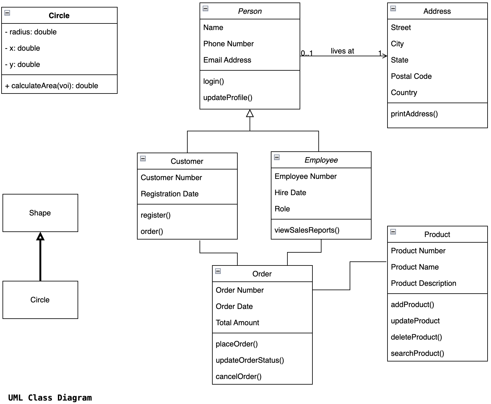

# Module 4: Object-Oriented Programming (OOP) II

<!-- TOC -->
* [Module 4: Object-Oriented Programming (OOP) II](#module-4-object-oriented-programming-oop-ii)
  * [Introduction to UML: Class Diagrams](#introduction-to-uml-class-diagrams)
  * [Inheritance](#inheritance)
    * [Method Overriding](#method-overriding)
    * [Inheritance and Constructors](#inheritance-and-constructors)
  * [Hands-on Exercise 1](#hands-on-exercise-1)
  * [Hands-on Exercise 2](#hands-on-exercise-2)
  * [Class Relationships](#class-relationships)
    * [Inheritance ("is a"):](#inheritance-is-a)
    * [Dependency ("uses"):](#dependency-uses)
    * [Association ("has a")](#association-has-a)
    * [Different Types of Associations: Between `User` and `Address` Classes](#different-types-of-associations-between-user-and-address-classes)
  * [Hands-on Exercise 3](#hands-on-exercise-3)
  * [Polymorphism](#polymorphism)
  * [Hands-on Exercise 4](#hands-on-exercise-4)
  * [Abstract Classes](#abstract-classes)
  * [Hands-on Exercise 5](#hands-on-exercise-5)
  * [Interfaces](#interfaces)
    * [Benefits of Using Interfaces](#benefits-of-using-interfaces)
  * [Hands-on Exercise 6](#hands-on-exercise-6)
<!-- TOC -->

## Introduction to UML: Class Diagrams

- **Modeling** is forming an abstraction (a simplified view) of reality.
- **Abstraction** hides unnecessary details and focuses on the relevant ones, reducing complexity.
- The level of detail depends on the **purpose of the model**.
- As software becomes more complex, models are used to represent different aspects of them with required levels of detail.

The **Unified Modeling Language™ (UML®)** is a standard visual modeling language for **business analysts, 
software architects and developers** used to **describe, 
specify, design, and document** existing or new business processes, 
structure and behavior of artifacts of software systems (https://www.uml-diagrams.org/).

A **Class Diagram**: A Class Diagram is the most common diagram in UML and is essential for visualizing the static 
structure of a system. It shows classes, their attributes, methods, and relationships.

A class is represented by a rectangle divided into three sections:
* Class Name: The name of the class (required).
* Attributes: The data members (instance variables) of the class. They often include visibility signs
(+ for public, - for private, # for protected).
* Operations: The methods/functions of the class. They also include visibility signs and may show 
parameters and return types.




## Inheritance

In software development, ***change is inevitable, not optional.*** Facilitating change is therefore 
essential in programming. 

**Code reuse** is one of the most effective mechanisms to achieve this.  

Instead of repeating the same code in multiple places, it is defined once and reused across the project 
or even in different projects.


**Inheritance** is a fundamental OOP feature that significantly maximizes code reuse:
- Enables a class (**subclass / child / derived class**) to be derived from another class (**superclass / parent / base class**).
- Prevents code repetition by reusing existing attributes and methods since the derived class inherits the members of the base class.
  - Subclass inherits the members of the superclass and may extend or override them.
- Should be applied only between similar entities with an **"is-a"** or **"is-kind-of"** relationship.
- Helps reduce duplication and improves maintainability.

**Examples of Inheritance:**
- User → Admin, RegisteredUser, GuestUser
- Shape → Circle, Rectangle, Square, Triangle
- Account → SavingsAccount, CheckingAccount, CreditAccount
- Product → Book, ElectronicProduct, ClothingProduct
- Vehicle → Car, Truck, Motorcycle, Bicycle
- Employee → Manager, Developer, Intern
- File → TextFile, AudioFile, VideoFile, ImageFile
- Image → PNG, JPEG, GIF, BMP

***We can validate an inheritance relationship between classes using the “is-a” test.***
- `Car` is a `Vehicle`
- `Circle` is a `Shape`
- `Book` is a `Product`


In UML Class Diagram, inheritance is drawn as a solid line with a hollow (unfilled) triangle pointing toward the Base Class.
```scss
[Derived Class] ─────────▷ [Base Class]
        
(solid line + hollow triangle)

```


**Code Example**
>[Shape.java](./inheritance/Shape.java) | [Circle.java](./inheritance/Circle.java) | [Rectangle.java](./inheritance/Rectangle.java) | [EquilateralTriangle.java](./inheritance/EquilateralTriangle.java) | [InheritanceMain.java](./inheritance/InheritanceMain.java)


### Method Overriding


- Occurs when a derived class provides a new implementation for a method already defined in its base class.
- The method in the subclass must have the **same name, return type, and parameters** as in the base class.
- The **@Override** annotation is recommended to ensure correctness.
- The overridden method in the base class can be called using **super.methodName()** in the derived class.

***Best Practices / Performance Tips***
* The @Override annotation instructs the compiler to verify that the toString() method actually overrides a method
  from the base class.
* If the method signature doesn’t match (for example, due to a typo or wrong parameters), the compiler will report an
  error, preventing misuse.
* The toString() method is overridden because the base class version is only partially useful — some information is
  provided, but it needs to be extended or customized to include additional details specific to the derived class.```java


**Code Example**


```java
class Shape{
    // ...  
    public String toString() {
      return "Shape at (" + x + "," + y + ") with color " + color;
    }
    // ...
    
}

class Circle extends Shape{
    // ...
    // Overriding parent's toString to extend its behavior
    @Override
    public String toString() {
      return super.toString() + ", Circle with radius " + radius;
    }
    
    // ...
}
```


### Inheritance and Constructors

- Constructors are **not inherited** by derived classes.
- When instantiating a derived class object, the **base class constructor** is always called first to initialize base members.
- If not explicitly called, the compiler inserts a call to **`super()`** (the base class’s no-argument constructor).
- If the base class has **no default constructor**, the derived class must explicitly call a suitable **`super(args)`** constructor.
- This ensures proper **initialization along the inheritance chain**.

**Code Example**

```java

class Shape{
    // ...  
    // Constructor: initializes common attributes
    public Shape(int x, int y, String color) {
      this.x = x;
      this.y = y;
      this.color = color;
    }
    // ...
    
}

class Circle extends Shape{
    // ...
    // Constructor: initializes inherited + specific properties
    public Circle(int x, int y, String color, double radius) {
      super(x, y, color);   // Calls parent constructor
      this.radius = radius;
    }
    
    // ...
}
```


***
## Hands-on Exercise 1
1. Make the necessary adjustments to the existing shape application to include a new Square class.
2. Modify the shape classes to support positioning in a 3-dimensional space. Add a new instance
   variable z for the third dimension and make any necessary changes to methods and constructors.
3. Add a method that calculates the perimeter.
4. Modify the `main()` method accordingly.
***

***
## [Hands-on Exercise 2](./exercises/README.md)
***


## Class Relationships

* Programs are composed of the modules and interaction between them. In object-oriented design, classes often 
interact through a **provider–consumer relationship**.  
* The **provider** (or **low-level**) class offers certain functionality or services,  
while the **consumer** (or **high-level**) class depends on and uses that functionality.  
* This separation supports **loose coupling** and makes the code easier to maintain and extend.


| Classes                    | Role / Description                                           |
|----------------------------|--------------------------------------------------------------|
| **Class to be used**       | **Provider**, **Dependency**, **Low-level class**, **Service** |
| **Class that will use it** | **Consumer**, **Dependent class**, **High-level class**, **Client** |


### Inheritance ("is a"):
    Describes a relationship where a class is a derived from a base class.

### Dependency ("uses"):
    Describes a temporary relationship where one class uses another to perform a task.
    Can be validated using the "uses" test.

### Association ("has a")
    Describes a relationship where one class has another class as an attribute. 
    We can use a "has a" test to validate this relationship.
    Derivatives are composition (strong ownership) and aggregation (weak ownership).


**Code Example**
> [User.java](./relationships/User.java) | [Customer.java](./relationships/Customer.java) |[Employee.java](./relationships/Employee.java) | [Address.java](./relationships/Address.java) | [RelationshipsMain.java](./relationships/RelationshipsMain.java)


### Different Types of Associations: Between `User` and `Address` Classes


**Unidirectional (One-to-One)**
- User has one Address.
- Only User knows about Address.

User 1 —> 1 Address

```java
class User { 
    private Address address; 
}
```


**Unidirectional (One-to-Many)**
- User can have multiple Address objects (home, work, etc.).
- Only User knows about Address.

User 1 —> * Address

```java
class User { 
    private List<Address> addresses; 
}

```


**Bidirectional (One-to-One)**
- User has one Address and Address also knows its User.

User 1 <—> 1 Address

```java
class User { 
    private Address address; 
}

class Address { 
    private User user; 
}

```


**Bidirectional (One-to-Many)**
- User can have multiple Address objects.
- Each Address knows its owning User.

User 1 <—> * Address

```java
class User { 
    private List<Address> addresses; 
}

class Address { 
    private User user; 
}

```

**Bidirectional (Many-to-Many)**
- A User can be linked to multiple Address objects.
- An Address can also belong to multiple Users (e.g., shared residence).

User * <—> * Address

```java
class User {  
    private List<Address> addresses;  
}  

class Address {  
    private List<User> users;  
}
```


***
## [Hands-on Exercise 3](./exercises/README.md)
***


## Polymorphism
- **Polymorphism** is the ability of objects to take many forms.
- It is a result of **inheritance**.
- A derived class can be treated as an instance of its base class because it inherits all properties and behaviors.
- The derived class demonstrates polymorphic behavior.
- Polymorphism boosts **code reuse** and makes changes and extensions easier.


**Code Example**
> [PolymorphismMain.java](./polymorphism/PolymorphismMain.java) | [ShapeRenderer.java](./polymorphism/ShapeRenderer.java)

***
## Hands-on Exercise 4
1. Modify the `PolymorphismMain` application to also support the Square shape. 
2. The Square class should inherit from the Shape class, include a sideLength attribute, and override the toString() method. 
3. Ensure that the square's details  displayed.
4. Modify the `main()` method accordingly.
***


## Abstract Classes
- Cannot be instantiated directly.
- May contain:
  - **Abstract methods** – declared without a body. Subclasses must implement them (function overriding).
  - **Concrete methods** – defined with a body. Can be reused directly by subclasses.
- Act as **blueprints** or **code holders** for derived classes.
- Primarily used for **inheritance**, providing a shared framework.
- Enhance **code reuse**, simplify **changes and extensions**, and support **polymorphism**.


**Code Example**
> [AbstractClassesMain.java](./abstractclasses/AbstractClassesMain.java) | [Shape.java](./abstractclasses/Shape.java) | [ShapeRenderer.java](./abstractclasses/ShapeRenderer.java) | [Circle.java](./abstractclasses/Circle.java) | [Rectangle.java](./abstractclasses/Rectangle.java)

***
## Hands-on Exercise 5
1. Modify the `AbstractClassesMain` application to also support the Square shape.
2. The Square class should inherit from the Shape class, include a sideLength attribute, and override the 
toString() and calculateArea()  methods.
3. Modify the `main()` method accordingly.
***


## Interfaces

- Contain only abstract methods (methods without a body) and constants by default.
- Define **what a class can do** ("is capable of") but not **how it does it**.
- Act as a **contract** (set of methods) without implementation.
- A class can **implement multiple interfaces** (supports multiple inheritance of type).

### Benefits of Using Interfaces
- Client code can depend on an interface even if the implementation is not ready (supports parallel development).
- Enables the **Open/Closed Principle**: new features can be added via new implementations without modifying existing client code.
- Provides **loose coupling**: changes in the implementation do not affect client code.
- Increases **code reuse** on the client side.

- By programming to an interface rather than a concrete class, we **weaken the dependency** between client and 
implementation. This ensures that changes in the implementation do not affect the client code. The client only relies 
on the **contract** (methods defined in the interface), not the specific details of how they are executed.


**Code Example**
>[InterfacesMain.java](./interfaces/InterfacesMain.java) | [ClientService.java](./interfaces/ClientService.java) | [IDatabaseRepository.java](./interfaces/IDatabaseRepository.java) | [PostgreSQLImplementation.java](./interfaces/PostgreSQLImplementation.java) | [MySQLImplementation.java](./interfaces/MySQLImplementation.java) 


***
## Hands-on Exercise 6
1. Modify the interface application to also support the MongoDB and Redis database management systems.
***
