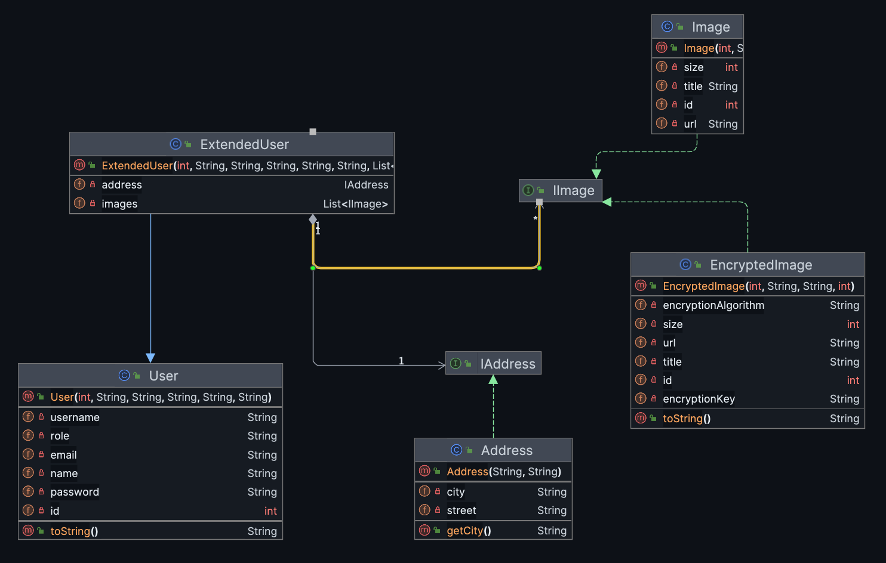

# Hands-on Exercise 2: Inheritance with User, Customer, and Employee

## Learning Objective
- Understand and practice **inheritance** in Java.
- Model real-world entities into classes and implement relationships.
- Observe how subclasses can extend functionality of a superclass.

## Requirement List
We want to design a system that keeps information about **users**, **customers**, and **employees**.

- A **User** has:
    - `id`
    - `name`
    - `email`
    - `username`
    - `password`
    - `role`

- A **Customer** is a **User** who additionally has:
    - `loyaltyPoints`

- An **Employee** is a **User** who additionally has:
    - `salary`
    - `department`

## Tasks

1**Define Classes**
    - `User` (base class)
    - `Customer` (derived class)
    - `Employee` (derived class)

2**Constructor Chaining**
    - Use `super(...)` in `Customer` and `Employee` to initialize inherited attributes.

3**Method Overriding**
    - Override `toString()` in `User`, `Customer`, and `Employee` to show information.

4**Testing**
    - Instantiate objects of `User`, `Customer`, and `Employee` in a main method.
    - Print their details.
    - Observe **inheritance** and **method overriding** in action.

## Additional Challenge
- Add a method in `Customer` to update loyalty points.
- Add a method in `Employee` to increase salary by a given percentage.
- Test these methods in your main class.

***
***

# Hands-on Exercise 3: Extending Exercise 2 (User, Customer, and Employee with Associations)

## Learning Objective
- Apply **inheritance** concepts from Exercise 2.
- Practice **association** relationships between classes.
- Understand how objects interact in real-world scenarios.

## Requirement List
Extend the system from **Hands-on Exercise 2** to include additional entities and relationships:

1. Extend the `User` class from Exercise 2 as `ExtendedUser` without modifying the original User class.

2. **Address**
    - Each User has one Address.
    - Use a **unidirectional one-to-one** association: User knows Address, but Address does not know User.

3. **Image**
    - Each User can have multiple images (profile pictures, gallery).
    - Use a **unidirectional one-to-many** association: User knows its Images.

## Tasks

1. Extend the `User` class from Exercise 2 as `ExtendedUser` without modifying the original User class.

2. **Enhance Classes**
    - Add `Address` class.
    - Update `ExtendedUser` to include a single `Address`.
    - Add `Image` class with attributes id,url,title, and size, including relevant methods.
    - Update `ExtendedUser` to include multiple `Image` objects.

2. **Constructor and toString**
    - Use constructor chaining with `super(...)` for derived class.
    - Override `toString()` methods to include association info.

3. **Testing**
    - Instantiate two ExtendedUser objects.
    - Assign an Address to each users.
    - Assign multiple Images to each User.
    - Print all objects to show inherited properties and associations.

## Additional Challenge
- Add methods to add/remove Images from a ExtendedUser.
- Print ExtendedUser details to see all associated Address and Images.

# Hands-on Exercise 6: Extending Exercise 3 with Interfaces for Loose Coupling

## Learning Objectives
- Reinforce inheritance and association.
- Apply the Dependency Inversion Principle.
- Use interfaces to weaken dependencies between classes.
- Demonstrate unidirectional one-to-one and one-to-many relationships using abstraction.
- Extend the system to support new features without modifying existing classes (Open/Closed Principle).

## Requirements

1. Define interfaces instead of directly depending on concrete classes:
    - Define an interface `IAddress` and let `Address` implement it.
    - Define an interface `IImage` and let `Image` implement it.

2. Extend the existing `User` class (from Exercise 2) as `ExtendedUser` without modifying the original `User` class.

3. Associations (implemented using interfaces):
    - `ExtendedUser` has a unidirectional one-to-one association with `IAddress`.
    - `ExtendedUser` has a unidirectional one-to-many association with a list of `IImage`.

4. Constructor chaining:
    - Use `super(...)` to initialize inherited properties.
    - Initialize `address` and image list in the derived class.

5. Override the `toString()` method in all classes to display detailed object information, including associated interface-based objects.

6. Testing:
    - Instantiate at least two `ExtendedUser` objects.
    - Assign concrete `Address` objects via `IAddress` reference.
    - Assign multiple `Image` objects via `IImage` reference.
    - Call the `toString()` method to show inheritance and associations.

7. Extend the system by introducing a new class called `EncryptedImage` that implements `IImage`:
    - Add attributes such as `encryptionAlgorithm` and `encryptionKey`.
    - Override the `getInfo()` method to show details relevant to encrypted images.
    - Demonstrate that `ExtendedUser` can accept this new class without any modification (proving loose coupling).

## Additional Challenge
- Add `addImage()` and `removeImage()` methods in `ExtendedUser`.
- Define alternative implementations such as `HomeAddress` and `OfficeAddress` to demonstrate polymorphism with `IAddress`.
- In the test program, add encrypted images to a user using `addImage()`.
