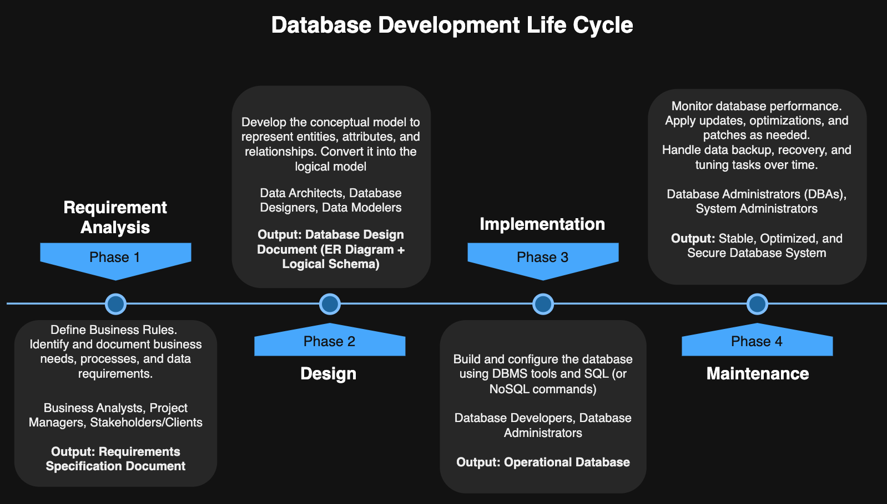

# Module 5: Database Management Systems (DBMS)

<!-- TOC -->
* [Module 5: Database Management Systems (DBMS)](#module-5-database-management-systems-dbms)
  * [Introduction to Database Management Systems](#introduction-to-database-management-systems)
  * [Database System](#database-system)
  * [Essential Features of a Database Management System (DBMS)](#essential-features-of-a-database-management-system-dbms)
  * [Database Development Lifecycle](#database-development-lifecycle)
    * [1. Requirement Analysis](#1-requirement-analysis)
    * [2. Design](#2-design)
    * [3. Implementation](#3-implementation)
    * [4. Maintenance](#4-maintenance)
    * [Business Rules](#business-rules)
    * [Data Model: Entity–Relationship (ER) Model](#data-model-entityrelationship-er-model)
    * [Benefits of Data Modeling](#benefits-of-data-modeling)
    * [The Data Modeling Process](#the-data-modeling-process)
    * [Key Components of a Data Model](#key-components-of-a-data-model)
  * [Relational Databases and Basic SQL](#relational-databases-and-basic-sql)
    * [**Setting Up the Working Environment**](#setting-up-the-working-environment)
      * [**Installing PostgreSQL**](#installing-postgresql)
      * [**Installing pgAdmin**](#installing-pgadmin)
      * [**Importing and Exporting Sample Databases**](#importing-and-exporting-sample-databases)
    * [Basic SQL](#basic-sql)
      * [CREATE DATABASE](#create-database)
      * [CREATE TABLE](#create-table)
      * [SELECT](#select)
      * [INSERT INTO](#insert-into)
      * [**UPDATE**](#update)
      * [**DELETE**](#delete)
  * [NoSQL Databases](#nosql-databases)
    * [Comparison with Relational DB:](#comparison-with-relational-db)
    * [Main Types of NoSQL Databases](#main-types-of-nosql-databases)
    * [MongoDB NoSQL Database](#mongodb-nosql-database)
  * [Using a Programming Language to Interact With a Database](#using-a-programming-language-to-interact-with-a-database)
    * [Database Drivers – Core Functions](#database-drivers--core-functions)
    * [Database Operations with Java and PostgreSQL](#database-operations-with-java-and-postgresql)
      * [Example Workflow (Conceptual)](#example-workflow-conceptual)
    * [Database Operations with Java and MongoDB](#database-operations-with-java-and-mongodb)
      * [Example Workflow (Conceptual)](#example-workflow-conceptual-1)
  * [Hands-on Exercise](#hands-on-exercise)
<!-- TOC -->


## Introduction to Database Management Systems
- A **database** is a collection of related data designed for efficient storage, retrieval, management, and manipulation.
- A **Database Management System (DBMS)** is specialized software that controls and manages databases and 
provides interfaces for database clients to store, retrieve, and manipulate data efficiently.


## Database System
A **Database System** consists of three main parts:
- **Database** = Raw Data + Metadata (used to define relationships and data characteristics, forming the logical 
structure of the database).
- **DBMS (Database Management System)** 
- **Database clients** = Application software or database client tools that interact with the DBMS.


## Essential Features of a Database Management System (DBMS)

- **Data Integration**:  
  Efficiently manages and organizes data to avoid unnecessary duplication.  
  *Relational DBMSs* enforce structured relationships, while *NoSQL systems* focus on flexible data organization.

- **Data Integrity**:  
  Ensures data remains accurate and consistent.  
  *Relational DBMSs* enforce integrity through schemas and constraints (e.g., primary and foreign keys),  
  whereas *NoSQL systems* often relax these rules to achieve higher performance and scalability.

- **Data Security**:  
  Protects data from unauthorized access, system failures, and attacks.  
  Both SQL and NoSQL systems implement authentication, authorization, and backup mechanisms, though methods differ.

- **Data Abstraction**:  
  Provides a logical view of data, hiding the complexity of storage structures.  
  *Relational DBMSs* use tables, while *NoSQL systems* use alternative models like key-value pairs, documents, or graphs.


## Database Development Lifecycle

The **Database Development Lifecycle** is a structured process used to design and build high-quality databases in a 
systematic and efficient way. It breaks database development into distinct phases, each with specific goals and 
deliverables. 

The Database Development Lifecycle typically consists of four fundamental phases.


### 1. Requirement Analysis
- Identify and document **business needs**, **processes**, and **data requirements**.
- Define **business rules** that govern how data should be used and constrained.

**Roles Involved:** Business Analysts, Project Managers, Stakeholders/Clients  
**Output:** Requirements Specification Document


### 2. Design
- Develop the **data model** to represent entities, attributes, and relationships (ER Diagram).
- Convert the conceptual model into a **logical schema** with **tables, columns, primary/foreign keys, and constraints**.
- Ensure that the design supports business rules, normalization, and integrity requirements.

**Roles Involved:** Data Architects, Database Designers, Data Modelers  
**Output:** Database Design Document (ER Diagram + Logical Schema)


### 3. Implementation
- Build and configure the database using **DBMS tools and SQL (or NoSQL commands)**.
- Populate the database with initial data and test for **structural integrity and performance**.

**Roles Involved:** Database Developers, Database Administrators (DBAs)  
**Output:** Operational Database


### 4. Maintenance
- Monitor database performance and ensure **availability, security, and reliability**.
- Apply **updates, optimizations, and patches** as needed.
- Handle **data backup, recovery, and tuning** tasks over time.

**Roles Involved:** Database Administrators (DBAs), System Administrators  
**Output:** Stable, Optimized, and Secure Database System





### Business Rules

Specific statements that define or constrain business data and operations. They often originate from 
requirement list.

* Data-oriented business rules → Define how data is structured and related (e.g., entities, attributes, relationships, 
constraints). They are used to design and build the database.
* Process-oriented business rules → Define business actions or workflows (e.g., approval steps, procedures). They are
  implemented in application logic, not database structure.

**Sources of Business Rules**

- **End users**
- **Managers and policymakers**
- **Written documentation** such as standards, regulations, and procedures

Direct interaction with **end users** ensures a clearer understanding of actual data needs and system expectations.

**Examples of Business Rules**

- An employee can belong to only one department.
- A customer must provide a valid email.
- A student can enroll in many courses, and a course can have many students.
- An order must include at least one product.
- A customer can place multiple orders, but each order is placed by only one customer.

Data-oriented business rules help identify **entities, attributes, relationships, and constraints** 
when developing the **Entity-Relationship (ER) model**.  

Once these rules are defined, the next step is to **model the database** to implement them effectively.


### Data Model: Entity–Relationship (ER) Model

A **data model** is a conceptual tool used to represent complex real-world data structures in a simplified, often **graphical**, form.

### Benefits of Data Modeling
1. **Improves Communication**
  - Promotes clear communication between database designers, developers, and end users. 
  - Ensures that all stakeholders share a common understanding of the data structure before implementation.
2. **Guides Database Implementation**
  - Directs the database development process and reduces implementation errors.

### The Data Modeling Process
Data modeling is an **iterative** process:
1. A **basic model** is designed first.
2. **Details** are gradually added.
3. The model evolves into a **complete blueprint** for database design.

### Key Components of a Data Model


- **Entities** – Represent real-world objects about which data is collected (e.g., `Student`, `Course`, `Employee`).
- **Attributes** – Describe properties or characteristics of entities (e.g., `Name`, `ProductCode`, `UnitPrice`).
- **Relationships** – Define associations between entities. Common types include:
  - **One-to-Many (1:M)**
  - **Many-to-Many (M:N)**
  - **One-to-One (1:1)**
- **Constraints** – Define rules that preserve data accuracy and consistency, for example:
  - An employee’s age must be between 18 and 65.
  - A phone number must follow the format `(XXX) XXX-XXXX`.
  - Each email address must be unique in the system.

> **In summary:**  
> Business rules form the foundation of the data model, and the ER model visualizes these rules to form the conceptual and 
logical structure of the database.


## Relational Databases and Basic SQL

- **Relational Database**: Organizes data into **tables** (rows = records, columns = attributes).
- Relationships established using **keys**:
  - **Primary Key** → unique identifier of a row.
  - **Foreign Key** → links rows between tables.
- **SQL (Structured Query Language)** is the standard language for relational databases.


### **Setting Up the Working Environment**

To work with SQL databases efficiently, a proper working environment is required.

#### **Installing PostgreSQL**
PostgreSQL is an open-source and powerful relational database management system.
- **Download Link**: [Download PostgreSQL](https://www.postgresql.org/download)
- Supports Windows, macOS, and Linux.
- Complies with SQL standards and offers extensive plugin support.

#### **Installing pgAdmin**
pgAdmin is the most commonly used graphical management tool for PostgreSQL.
- It is distributed along with PostgreSQL.
- Provides a user-friendly interface for managing databases, executing queries, and visualizing schemas.

#### **Importing and Exporting Sample Databases**

* **Northwind Sample Database**
  - A well-known example database that represents the data structure of a trading company.
  - Can be imported using **pgAdmin**.
  - [Download](../resources/dbs/northwind.backup)


### Basic SQL


| Command             | Description                             |
|---------------------|-----------------------------------------|
| **CREATE DATABASE** | Constructs a new database.              |
| **CREATE TABLE**    | Defines a new table.                    |
| **SELECT**          | Retrieves data from one or more tables. |
| **INSERT**          | Adds new data into a table.             |
| **UPDATE**          | Modifies existing records in a table.   |
| **DELETE**          | Removes specific records from a table.  |


#### CREATE DATABASE

Constructs a new database.

```sql
CREATE DATABASE ecommercedb
```

#### CREATE TABLE

Defines a new table.

```sql
CREATE TABLE products (  
    id SERIAL,
    code CHAR(6) NOT NULL,
    name VARCHAR(40) NOT NULL,
    date DATE DEFAULT '2019-01-01',
    price MONEY,
    quantity SMALLINT DEFAULT 0,
    CONSTRAINT "productsPK" PRIMARY KEY(id),
    CONSTRAINT "productsUnique" UNIQUE(code),
    CONSTRAINT "productsCheck" CHECK(quantity >= 0)
);

```

---
**The following queries are based on the Northwind sample database.**

---


#### SELECT

Retrieves data from one or more tables.

```sql
SELECT * FROM "customers" WHERE "Country"='Spain' OR "Country"='Türkiye'
ORDER BY "CustomerID";
```


**INNER JOIN**
Returns only the records that have matching values in both tables.
- Only products with a valid `CategoryID` in the **Categories** table are included.
- Any product with a `NULL` `CategoryID` is excluded.

```sql
SELECT "ProductID", "ProductName", "CategoryName"
FROM "products"
INNER JOIN "categories" ON "products"."CategoryID" = "categories"."CategoryID";
```

#### INSERT INTO

Add new records to a table.
- **Data integrity constraints** are enforced during the insertion process.
- It is possible to insert values into only specific columns.
- Columns that are not explicitly assigned a value will be set to **NULL** (empty).

```sql
INSERT INTO "customers" 
("CustomerID", "CompanyName", "ContactName", "Address", "City", "Country") 
VALUES ('X1', 'ABC', 'Jane', 'Address1', 'Astana', 'Kazakhstan');
```


#### **UPDATE**

The **UPDATE** statement is used to modify existing records in a table.
- **Data integrity constraints** are enforced during the update process.
- The `WHERE` clause is used to specify which records should be updated.
- If the `WHERE` clause is **not** included, **all rows** in the table are updated.


```sql
UPDATE "customers"
SET "ContactName" = 'Jane Lee',
    "City" = 'Astana'
WHERE "CustomerID" = '1';

```

#### **DELETE**

The **DELETE** statement is used to remove one or more records from a table.
- **Data integrity constraints** are enforced during the deletion process.
- The `WHERE` clause specifies which records should be deleted.
- If the `WHERE` clause is **not** included, **all records** in the table are deleted.


```sql
DELETE FROM "customers"
WHERE "CustomerID" = '1';
```


## NoSQL Databases
- **NoSQL** (AKA Not Only SQL) databases are  designed for scalability, flexibility, and high-performance.
- They are capable of handling large-scale, unstructured, semi-structured, and rapidly changing data.

### Comparison with Relational DB:


### Main Types of NoSQL Databases

1. **Document-Oriented Databases**
- Store data as documents (usually in JSON or BSON format).
- Each document can have a flexible structure.
- **Examples:** MongoDB, CouchDB, Firebase Firestore
- **Sample:**
  ```json
  {
    "id": 101,
    "name": "Jane Lee",
    "email": "jl@email.com",
    "orders": [
      { "orderId": 1, "total": 250 },
      { "orderId": 2, "total": 180 }
    ]
  }
  ```
- **Used in:**
    - Content management systems (CMS)
    - E-commerce product catalogs
    - Mobile and web apps with dynamic data structures

2. **Key–Value Stores**
- Store data as key–value pairs (like a dictionary or map).
- Very fast for lookups and caching.
- **Examples:** Redis, Amazon DynamoDB, Riak
- **Sample:**
  ```
  "user:101" -> { "name": "Alice", "balance": 300 }
  "user:102" -> { "name": "Bob", "balance": 450 }
  ```
- **Used in:**
    - Caching user sessions
    - Real-time analytics and leaderboards
    - High-speed transaction systems

3. **Column-Family Stores**
- Organize data into columns and column families instead of rows.
- Designed for high performance and scalability across distributed systems.
- **Examples:** Apache Cassandra, HBase, ScyllaDB
    - **Sample:**
      ```
      UserProfiles (Column Family)
      └── Row Key: user_101
          ├── name: "Jane"
          ├── email: "jane@email.com"
          └── country: "Kazakhstan"
    
      └── Row Key: user_102
          ├── name: "Jack"
          └── email: "jck@email.com"

      Customer (Column Family)
      └── Row Key: user_101
          ├── name: Alice
          ├── email: alice@email.com
          └── orders: [1, 2, 3]
      ```
- **Used in:**
    - Time-series data storage
    - IoT and sensor data collection
    - Large-scale analytics applications

4. **Graph Databases**
- Represent data as nodes (entities) and edges (relationships).
- Ideal for analyzing complex, interconnected data.
- **Examples:** Neo4j, Amazon Neptune, ArangoDB
- **Sample (relationships):**
  ```
  (Alice) -[:FRIEND]-> (Bob)
  (Alice) -[:PURCHASED]-> (Product_A)
  (Bob) -[:PURCHASED]-> (Product_B)
  ```
- **Used in:**
    - Social networking platforms
    - Recommendation engines
    - Fraud detection and knowledge graphs


### MongoDB NoSQL Database

MongoDB is a popular NoSQL database that stores data in a flexible, document-oriented format instead of the traditional 
table-and-row structure used by relational databases. Data is organized into collections, and each collection contains 
documents represented in BSON (Binary JSON). Because documents can have varying structures, MongoDB is schema-less, 
allowing applications to evolve without modifying fixed table definitions.

One of MongoDB’s key strengths is its ability to handle large volumes of unstructured or semi-structured data while 
maintaining high performance. It offers rich querying capabilities, indexing, and aggregation tools similar to SQL 
features but designed for flexible document data. MongoDB also provides automatic generation of a unique _id field 
for each document, acting like a primary key.

MongoDB is designed for scalability and reliability. It supports replication for high availability and sharding for 
horizontal scaling across multiple servers, making it suitable for modern distributed systems. Thanks to its 
flexibility, scalability, and ease of use, MongoDB is widely used in web applications, real-time analytics, IoT 
systems, and any environment where data structure can change over time.

1) A replica set provides high availability by copying the same data across multiple servers. In a replica set, read 
performance can also be improved by directing read operations to the nearest replica node.
```text
               +----------------------+
               |     Client App       |
               +-----------+----------+
                           |
                           v
                 +--------------------+
                 |     PRIMARY        |
                 |  (Read & Write)    |
                 +----+-----------+---+
                      |           |
        --------------+           +--------------
        |                                      |
        v                                      v
+--------------------+               +--------------------+
|   SECONDARY 1      |               |   SECONDARY 2      |
|  (Read / Failover) |               |  (Read / Failover) |
+--------------------+               +--------------------+

SECONDARIES replicate data **from the PRIMARY**
If PRIMARY fails → one SECONDARY becomes PRIMARY
```

2) Sharding splits big data across multiple servers (shards). The mongos router directs client requests to the correct shard.
     
```text

                               Config Servers
                              ┌──────┬──────┬──────┐
                              │  C1  │  C2  │  C3  │
                              └──────┴──────┴──────┘
                                    ↑
                              ┌─────────────┐
        Clients → → → → → → → │   MONGOS    │ ← Query Router
                              └─────────────┘
                                    ↓
        ┌─────────────┬────────────────┬───────────────┬
        │             │                │               │
┌─────────────┐ ┌─────────────┐ ┌─────────────┐ ┌─────────────┐
│   SHARD A   │ │   SHARD B   │ │   SHARD C   │ │   SHARD D   │
│  (Replica   │ │  (Replica   │ │  (Replica   │ │  (Replica   │
│    Set)     │ │    Set)     │ │    Set)     │ │    Set)     │
│ ┌─────────┐ │ │ ┌─────────┐ │ │ ┌─────────┐ │ │ ┌─────────┐ │
│ │ Primary │ │ │ │ Primary │ │ │ │ Primary │ │ │ │ Primary │ │
│ ├─────────┤ │ │ ├─────────┤ │ │ ├─────────┤ │ │ ├─────────┤ │
│ │Secondary│ │ │ │Secondary│ │ │ │Secondary│ │ │ │Secondary│ │
│ ├─────────┤ │ │ ├─────────┤ │ │ ├─────────┤ │ │ ├─────────┤ │
│ │Secondary│ │ │ │Secondary│ │ │ │Secondary│ │ │ │Secondary│ │
│ └─────────┘ │ │ └─────────┘ │ │ └─────────┘ │ │ └─────────┘ │
└─────────────┘ └─────────────┘ └─────────────┘ └─────────────┘

```


**Example**

Assume that we have the following docs in table view.

```text

+-----------------------------------------------------------+
|                        PRODUCTS                           |
+----+----------------------+---------+----------------------+
| ID |        name          | price   |      category        |
+----+----------------------+---------+----------------------+
|  1 | Laptop               | 1500.00 | Electronics          |
|  2 | Smartphone           | 999.99  | Electronics          |
|  3 | Headphones           | 199.99  | Electronics          |
|  4 | Monitor              | 300.00  | Electronics          |
|  5 | Keyboard             | 49.99   | Accessories          |
|  6 | Mouse                | 29.99   | Accessories          |
|  7 | Backpack             | 75.00   | Travel               |
|  8 | Water Bottle         | 20.00   | Lifestyle            |
|  9 | Camera               | 650.00  | Electronics          |
| 10 | Tripod               | 120.00  | Accessories          |
+-----------------------------------------------------------+
```

In replication, all nodes have EXACT same documents.
```text
                   REPLICA SET
         (High Availability, NOT data distribution)

            +-----------------------+
            |       PRIMARY         |
            +-----------------------+
            | Docs 1 to 10 (ALL)    |
            +-----------------------+

           /                         \
          /                           \
         v                             v

+-----------------------+   +-----------------------+
|     SECONDARY 1       |   |     SECONDARY 2       |
+-----------------------+   +-----------------------+
| Docs 1 to 10 (ALL)    |   | Docs 1 to 10 (ALL)    |
+-----------------------+   +-----------------------+

**Replica Set Rule:** Every node stores **all documents**.

```
In sharding, the data is partitioned and distributed across multiple shards, so each shard stores only a portion of the 
overall dataset, not the full copy.
Each shard is itself normally a Replica Set, so each shard’s data is also replicated internally.

```text
            SHARDED CLUSTER (Data Partitioning)

                      +------------+
                      |  mongos    |
                      |  router    |
                      +------------+
                       /          \
                      /            \
                     v              v

           +--------------------+      +--------------------+
           |      SHARD 1       |      |      SHARD 2       |
           | (IDs 1–5 only)     |      | (IDs 6–10 only)    |
           +---------+----------+      +----------+---------+
                     |                            |
                     v                            v

+-----------------------------------------------------+
|                 SHARD 1 DATA (Replica Set)          |
+----+----------------------+---------+----------------+
| ID | name                 | price   | category       |
+----+----------------------+---------+----------------+
|  1 | Laptop               | 1500.00 | Electronics    |
|  2 | Smartphone           | 999.99  | Electronics    |
|  3 | Headphones           | 199.99  | Electronics    |
|  4 | Monitor              | 300.00  | Electronics    |
|  5 | Keyboard             | 49.99   | Accessories    |
+-----------------------------------------------------+

+-----------------------------------------------------+
|                 SHARD 2 DATA (Replica Set)          |
+----+----------------------+---------+----------------+
| ID | name                 | price   | category       |
+----+----------------------+---------+----------------+
|  6 | Mouse                | 29.99   | Accessories    |
|  7 | Backpack             | 75.00   | Travel         |
|  8 | Water Bottle         | 20.00   | Lifestyle      |
|  9 | Camera               | 650.00  | Electronics    |
| 10 | Tripod               | 120.00  | Accessories    |
+-----------------------------------------------------+

Assume sharding by ID range:
Shard 1 → IDs 1–5
Shard 2 → IDs 6–10
```


## Using a Programming Language to Interact With a Database

Modern applications often need to store, retrieve, and manipulate data dynamically.  
To perform such database operations from within an application, **database drivers** are essential.  
These drivers facilitate communication between the **programming language** and the **database system**.

### Database Drivers – Core Functions
Database drivers typically provide the following core capabilities:
- **Establishing a connection** to the database.
- **Executing queries** (e.g., `SELECT`, `INSERT`, `UPDATE`, `DELETE`).
- **Retrieving results** and processing query outputs.
- **Managing transactions** to ensure data consistency.
- **Closing the connection** after operations are completed.


### Database Operations with Java and PostgreSQL

Java applications can seamlessly interact with PostgreSQL databases using **JDBC** (Java Database Connectivity).  
JDBC is a **standard API** that defines a set of interfaces and classes for connecting to relational databases, 
sending SQL statements, and processing results.

It provides:
- **Connection management**
- **Statement execution**
- **Result retrieval**
- **Error handling and transaction control**

The **PostgreSQL JDBC driver** implements this API and allows Java programs to work directly with PostgreSQL databases.

You can download the PostgreSQL JDBC driver from:  
 [https://jdbc.postgresql.org/download/](https://jdbc.postgresql.org/download/)


#### Example Workflow (Conceptual)
1. **Load the driver**(library or JAR file) in the project environment so that the Java application can 
communicate with the database.
2. **Establish a connection** to the PostgreSQL database using a connection string (URL(socket address), username, and password).
3. **Define and execute SQL statements**.
4. **Process the results** returned by the query.
5. **Close** the statement and connection to free resources.


***The Repository Pattern abstracts the logic of data access and storage from the business logic of an application.
It provides a clean separation between the domain layer and the data access layer.
Repositories act as mediators between the business logic and the data source (e.g., database, API, or file).
This abstraction improves maintainability, testability, and supports dependency inversion.***


**Code Example**

```sql
CREATE DATABASE ecommercedb;
```

```sql
CREATE TABLE products (
    id SERIAL PRIMARY KEY,
    name VARCHAR(100) NOT NULL,
    price DOUBLE PRECISION CHECK (price >= 0)
);
```


>[ProductRepositoryMain.java](./repository/ProductRepositoryMain.java) | [IProductRepository.java](./repository/IProductRepository.java) | [ClientService.java](./repository/ClientService.java) | [Product.java](./repository/Product.java) | [ProductPostgresqlImplementation.java](./repository/ProductPostgresqlImplementation.java) | [ProductMongodbImplementation.java](./repository/ProductMongodbImplementation.java)


### Database Operations with Java and MongoDB

You can use MongoDB Cloud (https://account.mongodb.com/account/login
) without installation, or install MongoDB on your computer from the following 
link: https://www.mongodb.com/try/download/community

#### Example Workflow (Conceptual)
1. **Load the driver** using maven package manager.

`pom.xml`
```xml

<?xml version="1.0" encoding="UTF-8"?>
<project xmlns="http://maven.apache.org/POM/4.0.0"
         xmlns:xsi="http://www.w3.org/2001/XMLSchema-instance"
         xsi:schemaLocation="http://maven.apache.org/POM/4.0.0 http://maven.apache.org/xsd/maven-4.0.0.xsd">
    <modelVersion>4.0.0</modelVersion>

    <groupId>cc.ku</groupId>
    <artifactId>java-projects</artifactId>
    <version>1.0-SNAPSHOT</version>

    <properties>
        <maven.compiler.source>17</maven.compiler.source>
        <maven.compiler.target>17</maven.compiler.target>
        <project.build.sourceEncoding>UTF-8</project.build.sourceEncoding>
    </properties>

    <dependencies>
        <!-- postgresql -->
        <dependency>
            <groupId>org.postgresql</groupId>
            <artifactId>postgresql</artifactId>
            <version>42.7.8</version>
        </dependency>
        <!-- mongodb -->
        <dependency>
            <groupId>org.mongodb</groupId>
            <artifactId>mongodb-driver-bom</artifactId>
            <version>5.6.0</version>
            <type>pom</type>
        </dependency>
        <dependency>
            <groupId>org.mongodb</groupId>
            <artifactId>mongodb-driver-sync</artifactId>
            <version>5.6.0</version>
        </dependency>
      
    </dependencies>
</project>


```
2. **Establish a connection** to the MongoDB database using 
a connection string (URL(socket address), username, and password).
3. **Perform db operations**.
4. **Process the results** returned by the query.
5. **Close** the connection.


**Code Example**

* Define `ecommercedb.products` collection.


>[ProductRepositoryMain.java](./repository/ProductRepositoryMain.java) | [IProductRepository.java](./repository/IProductRepository.java) | [ClientService.java](./repository/ClientService.java) | [Product.java](./repository/Product.java) | [ProductPostgresqlImplementation.java](./repository/ProductPostgresqlImplementation.java) | [ProductMongodbImplementation.java](./repository/ProductMongodbImplementation.java)


***
## Hands-on Exercise

1. Define the `ecommercedb` database and `products` table in `PostgreSQL`, using the SQL statements provided above the 
Class Diagram.
2. Define `ecommercedb.products` collection in `MongoDB`.
3. Initialize a new project with Maven support.
4. Include the necessary database drivers for PostgreSQL and MongoDB operations.
5. Define a package named `cc.ku.ict.module5.exercises.exercise1`.
6. Run the program given above that performs operations on the  PostgreSQL database (Check the db connection parameters).
7. Discuss how you can also add MariaDB support to the application without modifying the algorithm in the `ClientService`.
8. Define `findByName(String name)` and `findByPrice(double price)` methods in the product repository and modify 
the `ClientService` accordingly to test these methods.
***
