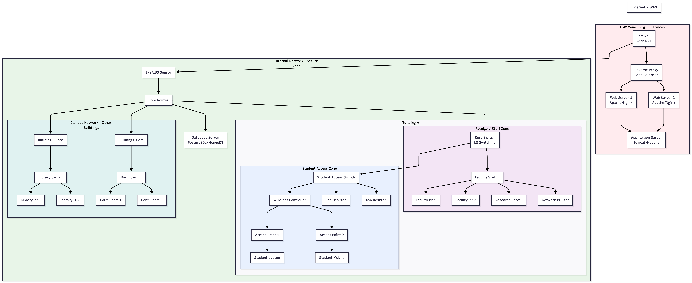

# Module 6: Computer Networks

<!-- TOC -->
* [Module 6: Computer Networks](#module-6-computer-networks)
  * [Network Basics](#network-basics)
  * [Network Protocol](#network-protocol)
  * [OSI & TCP/IP Models](#osi--tcpip-models)
    * [**OSI Model (7 Layers)**](#osi-model-7-layers)
    * [**TCP/IP Model (4 Layers)**](#tcpip-model-4-layers)
    * [**OSI Model and Common Networking Protocols and Technologies**](#osi-model-and-common-networking-protocols-and-technologies)
  * [Packet Switching in the TCP/IP Protocol](#packet-switching-in-the-tcpip-protocol)
  * [Encapsulation of Data in the TCP/IP Model (Data → Segment → Packet → Frame)](#encapsulation-of-data-in-the-tcpip-model-data--segment--packet--frame)
  * [IP Addressing, DNS, Ports, and Sockets](#ip-addressing-dns-ports-and-sockets)
  * [Client-Server Architecture](#client-server-architecture)
  * [Network Devices & Services in a Modern Infrastructure](#network-devices--services-in-a-modern-infrastructure)
    * [**Firewall**](#firewall)
    * [**NAT (Network Address Translation)**](#nat-network-address-translation)
    * [**IPS / IDS (Intrusion Prevention / Detection System)**](#ips--ids-intrusion-prevention--detection-system)
    * [**Router**](#router)
    * [**Switch**](#switch)
    * [**Wireless Controller (WLC)**](#wireless-controller-wlc)
    * [**Access Point (AP)**](#access-point-ap)
    * [**Reverse Proxy / Load Balancer**](#reverse-proxy--load-balancer)
    * [**Web Server**](#web-server)
    * [**Application Server**](#application-server)
    * [**Database Server**](#database-server)
    * [**DMZ (Demilitarized Zone)**](#dmz-demilitarized-zone)
    * [**Internal Network (Secure Zone)**](#internal-network-secure-zone)
    * [**User Access Zones**](#user-access-zones)
    * [Traffic Flow Examples](#traffic-flow-examples)
    * [**Defense in Depth**](#defense-in-depth)
    * [**Least Privilege Access**](#least-privilege-access)
  * [Common Networking Tools](#common-networking-tools)
  * [Hands-on Exercises 1](#hands-on-exercises-1)
<!-- TOC -->


## Network Basics
A **computer network** is a collection of interconnected devices that communicate and share resources.  
Networks allow data, files, and hardware (like printers or servers) to be shared efficiently.

**Types of Networks:**
- **LAN (Local Area Network):**  
  Covers a small geographic area such as a home, school, or office.
- **WAN (Wide Area Network):**  
  Covers large geographic areas, often connecting multiple LANs together (e.g., the Internet).
- **Internet:**  
  The global network connecting millions of private, public, academic, and government networks.


## Network Protocol

In data communication, a protocol is a set of rules that governs how data is exchanged between devices in a network.

A protocol defines what, when, and how information is exchanged.

Data transmission between devices involves complex processes — such as session establishment, error control, routing, 
and synchronization.

Instead of using a single, large module, these functions are divided into smaller, independent modules, 
similar to modular software design.

A protocol architecture is organized as a vertical stack of layers, where each layer performs specific 
functions and communicates with the layer above and below it.

The lower layer provides services to the upper layer.

On both sender and receiver sides, peer layers communicate using a common protocol.

## OSI & TCP/IP Models
Networking is organized into **layers** to simplify communication and troubleshooting.

The OSI (Open Systems Interconnection) model is a conceptual framework used to understand and design network architectures.

It defines a set of protocols that enable communication between different systems, independent of their 
hardware or software implementations.

The OSI model consists of seven distinct but related layers, each responsible for specific communication tasks.

Peer layers on sender and receiver sides use the same protocol to exchange data successfully.

### **OSI Model (7 Layers)**
1. **Application** – Provides services to end users (e.g., HTTP, FTP).
2. **Presentation** – Translates data formats and handles encryption.
3. **Session** – Manages sessions between communicating systems.
4. **Transport** – Ensures reliable data transfer (TCP/UDP).
5. **Network** – Handles logical addressing and routing (IP).
6. **Data Link** – Manages frames and error detection (Ethernet).
7. **Physical** – Transmits raw bits over the physical medium (cables, Wi-Fi).

### **TCP/IP Model (4 Layers)**
1. **Application** – Corresponds to OSI Application, Presentation, and Session layers.
2. **Transport** – Manages reliability and segmentation (TCP/UDP).
3. **Internet** – Handles addressing and routing (IP).
4. **Network Access** – Corresponds to OSI Data Link and Physical layers.


### **OSI Model and Common Networking Protocols and Technologies**


**Layer 7 – Application**
* Allows internet applications to access the network.
* **HTTP / HTTPS** – Provide web services to end users (HTTPS adds encryption for secure communication).  
* **FTP** – Transfer files between client and server systems.  
* **DNS** – Translate domain names into IP addresses.  
* **SMTP / POP3 / IMAP** – Send and receive email messages.  
* **Telnet** – Provide remote terminal access (unencrypted).  
* **SSH** – Enable secure remote login and command execution (encrypted).  
* **RTP / RTSP / SIP** – Support real-time streaming of voice and video.  
* **NetBIOS** – Network basic input/output system (naming & sessions)

**Layer 6 – Presentation**
* Handles syntax translation, encryption, and compression before transmission.
* **Data Formats** – JPEG, MPEG, ASCII, Unicode  
* **Encryption** – SSL/TLS (though operates across multiple layers)
* **Compression** – gzip, deflate


**Layer 5 – Session**
* Establishes, manages, and terminates communication sessions between systems.
* **SIP / RTSP** – Establish, manage, and terminate multimedia communication sessions.
* **PPTP** – Point-to-Point Tunneling Protocol
* **NetBIOS / RPC** – Manage and synchronize communication sessions between systems.


**Layer 4 – Transport**
* Performs application addressing.
* **TCP** – Provides reliable, ordered, and error-checked data transmission.  
* **UDP** – Enables fast, connectionless data transmission without reliability checks.


**Layer 3 – Network**
* Handles logical addressing and routing of data packets.
**IP (IPv4 / IPv6)** – Handles logical addressing and routing of data packets.  
**ICMP** – Sends error and diagnostic messages between network devices.  
**Routing Protocols (OSPF, RIP, BGP)** – Determine optimal paths for packet delivery.


**Layer 2 – Data Link**
* Performs MAC(physical) addressing.
**Ethernet / Wi-Fi (802.11) / PPP / Frame Relay** – Define framing, error detection, and physical addressing (MAC).
**ARP** – Maps IP addresses to physical (MAC) addresses.


**Layer 1 – Physical**
* Handles the processes that transmit data bits over the medium.
**Coaxial Cable / Fiber Optic / Twisted Pair** – Physical media that carry electrical or optical signals.  
**Air (Wireless Medium)** – Used by Wi-Fi for radio wave transmission of data.  
**Signaling and Bit Transmission** – Convert digital data into physical signals for communication.


## Packet Switching in the TCP/IP Protocol

In the **TCP/IP protocol suite**, data is transmitted using a method called **packet switching**.  
Instead of sending an entire message as a single continuous stream, the message is **divided into smaller packets**. 
Each packet travels **independently** across the network and may take **different routes** to reach the destination.

At each node, the entire packet is **received**, **temporarily stored**, and then **forwarded** to the next node until it reaches its destination.  
The path each packet follows is determined by **routing protocols** (such as RIP, OSPF, or BGP), which dynamically select 
the most efficient route based on network conditions and topology.


When all packets arrive, the **receiving device** reassembles them in the correct order to reconstruct the original message.

This method improves **network efficiency**, **reliability**, and **fault tolerance**:
- **Efficiency:** Bandwidth is used **more efficiently**, as packets share network paths with others.
- **Reliability:** Errors can be detected and corrected at the **transport layer** (e.g., TCP retransmission).
- **Fault Tolerance:** Alternate routes can be used if a path fails.

Packet switching is the foundation of **modern Internet communication**, enabling scalable and robust data transfer between billions of connected devices.


## Encapsulation of Data in the TCP/IP Model (Data → Segment → Packet → Frame)
As data moves through the TCP/IP layers, each layer **adds its own header information** — this process is called **encapsulation**.

When data is sent:
- Application Layer: Generates the original `data` (e.g., a web request). 
- Transport Layer: Divides data into `segments` and adds source and destination port numbers for process-level communication. 
- Internet Layer: Wraps each segment into a `packet` (also called a datagram) by adding IP addresses for routing across networks. 
- Network Access Layer: Encapsulates packets into `frames` by adding MAC addresses and error-checking information for physical transmission. 
- Finally, the frame is transmitted over the physical medium (cables, Wi-Fi, etc.) toward its destination.

When received, the reverse process (called **de-ecapsulation**) occurs.


## IP Addressing, DNS, Ports, and Sockets

- **IP Address:** A unique identifier for a device on a network (e.g., 192.168.1.10).
  - **IPv4:** 32-bit addresses (e.g., 192.168.0.1)
  - **IPv6:** 128-bit addresses for a larger address space.
- **DNS (Domain Name System):** Translates domain names (like `www.example.com`) into IP addresses.
- **Port Numbers:** Identify specific applications or services on a device (e.g., Port 80 for HTTP, Port 25 for SMTP).
- **Socket:** The combination of an IP address and port number (e.g., `192.168.1.10:8080`) — represents a unique endpoint in network communication.


## Client-Server Architecture
In most network applications, communication follows a **client-server model**:
- The **client** sends a request (e.g., a web browser requesting a webpage).
- The **server** processes the request and sends back a response (e.g., a web server sending the page data).

This model forms the foundation of Internet applications such as email, file sharing, and web browsing.


## Network Devices & Services in a Modern Infrastructure

This section introduces the core network devices, services, and security mechanisms commonly found in 
enterprise and campus networks.




### **Firewall**
 
A network security system that monitors and controls incoming and outgoing traffic based on predefined rules.

**Functions:**
- Acts as a barrier between **trusted internal** and **untrusted external** networks
- Implements **access control** policies using rule sets
- Performs **stateful inspection** (tracks connection states)
- Blocks malicious or unauthorized access attempts

**Example Rule:**  
Allow HTTP/HTTPS to DMZ, deny all other inbound traffic.


### **NAT (Network Address Translation)**
  
Modifies IP addresses in packet headers during transit to manage address spaces.

**Types:**
- **SNAT (Source NAT):** Converts private → public IP for outbound traffic
- **DNAT (Destination NAT):** Converts public → private IP for inbound traffic
- **PAT (Port Address Translation):** Multiple devices share a single public IP via port mapping

**Example Flow:**  
`Internal: 192.168.10.50:54321 → NAT → External: 203.0.113.10:62001`


### **IPS / IDS (Intrusion Prevention / Detection System)**
 
Monitors network traffic for malicious activity or policy violations.

**Differences:**
- **IDS:** Detects and alerts on suspicious activity
- **IPS:** Detects and blocks malicious traffic in real time

**Detection Methods:**
- Signature-based
- Anomaly-based
- Policy-based


### **Router**

Connects multiple networks and directs traffic between them using IP addresses.

**Functions:**
- Interconnects subnets or VLANs
- Makes routing decisions (based on routing tables)
- Uses routing protocols (e.g., **OSPF**, **BGP**)
- Provides **Quality of Service (QoS)** for prioritizing traffic


### **Switch**

Connects devices within the same local network (Layer 2).

**Types:**
- **Access Switch:** Connects end devices (PCs, printers)
- **Core Switch:** High-speed backbone interconnect
- **Layer 3 Switch:** Performs limited routing between VLANs

**Functions:**
- MAC address learning and frame forwarding
- VLAN segmentation
- Spanning Tree Protocol (STP) for loop prevention


### **Wireless Controller (WLC)**
 
Manages and controls multiple wireless access points from a central interface.

**Functions:**
- Configures and updates APs
- Manages authentication and client roaming
- Enforces wireless security (WPA2/WPA3)
- Provides centralized monitoring and reporting


### **Access Point (AP)**

Allows wireless devices to connect to a wired network.

**Functions:**
- Construct Wi-Fi networks (SSIDs)
- Converts radio signals ↔ Ethernet frames
- Handles user authentication and encryption


### **Reverse Proxy / Load Balancer**

Stands between clients and web servers, improving performance and security.

**Functions:**
- **Load Balancing:** Distributes requests among servers
- **SSL Termination:** Handles HTTPS encryption/decryption
- **Caching & Compression:** Improves performance
- **Web Application Firewall (WAF):** Adds security filtering

**Example Flow:**  
`User → Reverse Proxy → [Web Server 1, Web Server 2, Web Server 3]`


### **Web Server**

Serves websites and web applications over HTTP/HTTPS.

**Common Software:** Apache, Nginx, Microsoft IIS

**Functions:**
- Hosts static and dynamic web content
- Processes HTTP requests
- Runs server-side scripts (e.g., PHP, Python)


### **Application Server**
 
Executes application logic and processes client requests.

**Common Platforms:** Tomcat (Java), Node.js,  WSGI

**Functions:**
- Runs business logic
- Manages sessions and transactions
- Interfaces with databases


### **Database Server**
 
Stores, manages, and retrieves structured data.

**Common Systems:** PostgreSQL, MongoDB, Redis, MySQL, Cassandra

**Functions:**
- Data storage and retrieval
- Query execution
- Transaction and backup management


### **DMZ (Demilitarized Zone)**

Hosts public-facing services while isolating them from the internal network.

**Characteristics:**
- Externally accessible (e.g., web, mail servers)
- Strictly controlled internal access
- Enhanced security monitoring


### **Internal Network (Secure Zone)**

Contains sensitive systems and data.

**Characteristics:**
- Restricted external access
- Multi-layer security controls
- Used for internal applications and databases


### **User Access Zones**

Provide controlled access for different user groups.

**Examples:**
- **Student Network:** Internet and educational resources
- **Faculty Network:** Research and administrative systems
- **Staff Network:** Business applications


### Traffic Flow Examples

**External Web Request:**  
`Internet User → Firewall (NAT & Rules) → Reverse Proxy → Web Server → App Server → Database`

**Internal User Internet Access:**  
`User Device → Access Switch → Core Switch → Router → IPS → Firewall (NAT) → Internet`

**Faculty Research Access:**  
`Faculty PC → Faculty Switch → Core Router → Firewall (NAT) → Internet`


### **Defense in Depth**
Multiple security layers across the network:
- Firewall at perimeter
- IPS for traffic inspection
- VLAN segmentation internally
- Server-level security controls


### **Least Privilege Access**
Each zone and user has only the minimum access required:
- Students cannot access faculty resources
- DMZ servers have limited internal communication
- Databases only accessible via application servers


## Common Networking Tools
- **ifconfig/ipconfig:** Tests network connectivity between two devices.
```shell
ifconfig
```
- **ping:** Tests network connectivity between two devices.

```shell

```
- **traceroute (tracert):** Traces the path packets follow to reach a destination.

- **nslookup:** Queries DNS records for domain name or IP address information.

- tcpdump
```shell


```

- **netcat (nc):** Tests and manages network connections using TCP or UDP.

```shell
nc time.nist.gov 13

```


```bash
#!/bin/bash
# ================================================================
# Network commands — All entries shown in Bash (Ubuntu/macOS)
# Windows equivalents are included as commented lines (still inside this bash script)
# ================================================================

# ---------------------------
# ifconfig / IP configuration
# ---------------------------
ifconfig          # Show network interfaces and addresses (Ubuntu/macOS)
ipconfig          # Windows (PowerShell): Get-NetIPConfiguration
# Windows (CMD): 

ifconfig -a             # Show all interfaces (including down ones)
ipconfig /all

# ---------------------------
# ping — reachability & RTT
# ---------------------------
ping google.com               # Continuous pings until Ctrl+C (bash)
ping google.com -c 3          # Send exactly 3 ICMP echo requests       
ping -c 3 192.168.2.56          


# ---------------------------
# tcpdump / packet capture
# ---------------------------
  
sudo tcpdump -i en0                          # Capture on interface vboxnet0
sudo tcpdump -i en0 port 80             # Capture only port 80 traffic
sudo tcpdump -i en0 dst 173.194.116.162     # Packets destined to specific IP
sudo tcpdump -i en0 '(icmp or udp)'     # Capture only ICMP or UDP
sudo tcpdump -nnXSs 0 -i en0 'port 80'  # Show headers + payload (hex/ASCII)
sudo tcpdump -i en0 -w capture.pcap         # Save capture to file
# Windows equivalents:
# Use Wireshark/tshark or WinDump
# tshark -i 1 -w capture.pcap
# windump -i 1 port 80 -w capture.pcap
# Or pktmon (Windows 10+):
# pktmon start --capture -c 0
# pktmon stop
# pktmon pcapng PktMon.etl -o capture.pcapng

# ---------------------------
# netcat (nc / ncat) — socket testing, file transfer, raw requests
# ---------------------------
nc time.nist.gov 13                       # Query NIST daytime server (port 13)

# UDP listener (server) on port 8001 (bash)
nc -l -u 8001

# TCP listener (server) on port 8001 (bash)
nc -l 8001

# Client connect (TCP)
nc localhost 8001

# Client connect (UDP)
nc -u localhost 8001

# File transfer — receiver (save to file)
nc -l 8001 > dest.txt

# File transfer — sender (send file contents)
nc localhost 8001 < source.txt


# Raw HTTP GET for "/" (retrieve index)
printf "GET / HTTP/1.0\r\n\r\n" | nc localhost 80

# Raw HTTP GET for "/index1.html"
printf "GET /index1.html HTTP/1.0\r\n\r\n" | nc 192.168.56.103 80

# Port scan (zero-I/O scan)
nc -zv localhost 20-30
nc -zv localhost 20-80

# Notes about Windows:
# On Windows, use ncat (from Nmap) or nc if installed:
# ncat time.nist.gov 13
# ncat -l -u 8001
# ncat -l 8001 > Hedef.txt
# $req="GET / HTTP/1.0`r`n`r`n"; $req | ncat 192.168.56.103 80

# ---------------------------
# ssh — remote administration
# ---------------------------
#sudo service ssh start                      # Start OpenSSH server (Ubuntu)
ssh wsan@102.168.1.12                       # SSH login (CLI)


# ---------------------------
# nmap — port & service scanning
# ---------------------------
nmap xyz.com.tr
nmap 192.168.96.1
nmap -F 192.168.96.1                        # Fast scan (fewer ports)
nmap -p 22 192.168.96.1                     # Scan specific port
nmap -sT 192.168.96.1                       # TCP connect scan
nmap -sU 192.168.96.1                       # UDP scan
nmap -sV 192.168.96.1                       # Version detection
nmap 192.168.96.0/24                        # Scan the whole /24 network


# ---------------------------
# traceroute / path discovery
# ---------------------------
traceroute google.com
# Windows equivalent
# tracert google.com

# ---------------------------
# netstat — connections, interfaces, routing
# ---------------------------
cat /etc/services        # known services and ports
netstat                  # show active connections, routing, interface stats
netstat -n               # show numeric addresses (no DNS)
netstat -nt              # TCP connections (numeric)
netstat -nu              # UDP connections (numeric)
netstat -i               # interface statistics
netstat -nt | grep :80   # show TCP connections to port 80
# Windows:
# netstat -ano
# netstat -an | findstr :80

# ---------------------------
# Example workflows / demonstrations (bash)
# ---------------------------

# 1) Web server access from guest and capture with tcpdump on host:
# Start simple web server on host:
python3 -m http.server 80 &
# From guest: access http://<host-ip>/ (or use curl)
# On host: capture packets for HTTP (run as root)
sudo tcpdump -i eth0 -nnXSs 0 'port 80'

# 2) Observe Netcat client-server communication with tcpdump:
# On server: listen and save received file
nc -l 9000 > received.txt &
# On client: send file
nc <server-ip> 9000 < send.txt
# On server: capture packets for that port
sudo tcpdump -i eth0 port 9000 -w nc_transfer.pcap

# 3) Detect ping-flood (DoS-like) traffic (lab only):
sudo tcpdump -i eth0 icmp
# Monitor interface stats to see increased packet counts
netstat -i

# ---------------------------
# Safety & tips (bash)
# ---------------------------
# Use these tools only on machines/networks where you have permission.
# Avoid flood tests (ping -f) on shared/public networks.
# Use Ctrl+C to stop listeners/captures.
# For binary transfers, prefer scp/rsync over nc when possible.
# To convert Windows commands into PowerShell invocations from bash (if on WSL or Cygwin):
# powershell.exe -Command "Get-NetIPConfiguration"
# powershell.exe -Command "New-NetIPAddress -InterfaceAlias 'Ethernet' -IPAddress 192.168.2.11 -PrefixLength 24"

```


## Hands-on Exercises 1
1. Identify your computer’s IP address and default gateway.
2. Use `ping` to check connectivity to a known website (e.g., `ping google.com`).
3. Use `traceroute` to observe the route packets take across the Internet.
4. Perform a DNS lookup using `nslookup`.
5. Practice using `netcat` to establish a simple TCP connection between two devices.


