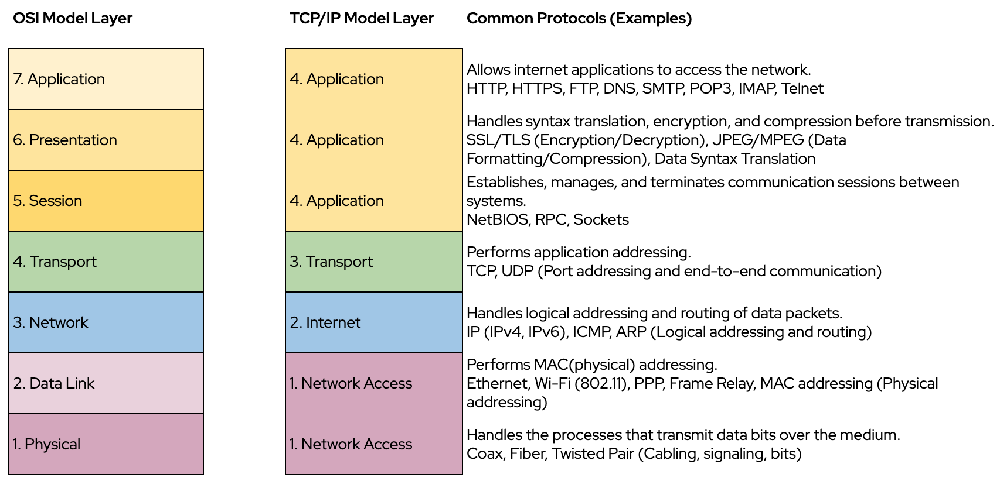

# Module 6: Computer Networks

<!-- TOC -->
* [Module 6: Computer Networks](#module-6-computer-networks)
  * [Network Basics](#network-basics)
  * [OSI & TCP/IP Models](#osi--tcpip-models)
    * [**OSI Model (7 Layers)**](#osi-model-7-layers)
    * [**TCP/IP Model (4 Layers)**](#tcpip-model-4-layers)
    * [**OSI Model and Common Networking Protocols and Technologies**](#osi-model-and-common-networking-protocols-and-technologies)
  * [Packet Switching in the TCP/IP Protocol](#packet-switching-in-the-tcpip-protocol)
  * [Encapsulation of Data in the TCP/IP Model (Data → Segment → Packet → Frame)](#encapsulation-of-data-in-the-tcpip-model-data--segment--packet--frame)
  * [IP Addressing, DNS, Ports, and Sockets](#ip-addressing-dns-ports-and-sockets)
  * [Client-Server Architecture](#client-server-architecture)
  * [Network Devices & Services in a Typical Network Infrastructure](#network-devices--services-in-a-typical-network-infrastructure)
    * [**Firewall**](#firewall)
    * [**NAT (Network Address Translation)**](#nat-network-address-translation)
    * [**IPS / IDS (Intrusion Prevention / Detection System)**](#ips--ids-intrusion-prevention--detection-system)
    * [**Router**](#router)
    * [**Switch**](#switch)
    * [**Wireless Controller (WLC)**](#wireless-controller-wlc)
    * [**Access Point (AP)**](#access-point-ap)
    * [1. Reverse Proxy / Load Balancer](#1-reverse-proxy--load-balancer)
    * [2. Web Server (DMZ Zone)](#2-web-server-dmz-zone)
    * [3. Application Server (Secure/Internal Zone)](#3-application-server-secureinternal-zone)
    * [4. Database Server (Secure/Internal Zone)](#4-database-server-secureinternal-zone)
    * [5. Network Zones](#5-network-zones)
  * [Common Networking Tools](#common-networking-tools)
  * [Hands-on Exercises 1](#hands-on-exercises-1)
<!-- TOC -->


## Network Basics
A computer network is a collection of interconnected devices that **communicate and share resources**. 
These resources include **data, applications**, and **hardware** such as printers, storage, and servers.

**Types of Networks:**
- **LAN (Local Area Network):**  
  Covers a small geographic area such as a home, school, or office.
- **WAN (Wide Area Network):**  
  Covers large geographic areas, often connecting multiple LANs together (e.g., the Internet).
- **Internet:**  
  The global system of interconnected private, public, academic, and government networks.


**Network Protocol**

In data communication, **a protocol is a set of rules that governs data exchange between devices** in a network. 

It defines what, when, and how information is exchanged.

Data transmission between devices involves complex processes — such as session establishment, error control, routing, 
and synchronization.

Instead of using a single, large module, these functions are divided into smaller, independent modules, 
similar to modular software design.

A protocol architecture is organized as a vertical stack of layers, where each layer performs specific 
functions and communicates with the layer above and below it.

The lower layer provides services to the upper layer.
    
    For example; In OSI, Layer 3 provides services to Layer 4 by handling logical addressing and routing, 
    enabling the Transport layer to deliver data to the correct destination across networks.

On both the sender and receiver sides, each layer communicates with its corresponding (peer) layer on the 
remote device using a common protocol.

    When mapping the TCP/IP protocol suite to the OSI model, peer layers communicate using the following protocols:
    Layer 4 ↔ Layer 4 use TCP/UDP
    Layer 3 ↔ Layer 3 use IP
    Layer 2 ↔ Layer 2 use Ethernet/Wi-Fi
    

## OSI & TCP/IP Models

The OSI (Open Systems Interconnection) model is a conceptual framework used to understand and design network architectures.

It defines a set of protocols that enable communication between different systems, **independent of their 
hardware or software** implementations.

The OSI model consists of seven distinct but related layers, each responsible for specific communication tasks.

Peer layers on sender and receiver sides use the same protocol to exchange data successfully.

### **OSI Model (7 Layers)**
1. **Application** – Provides network services to application programs (e.g., HTTP, FTP).
2. **Presentation** – Translates data formats, performs encryption and decryption, and handles data compression.
3. **Session** – Establishes, manages, and terminates sessions between communicating systems.
4. **Transport** – Ensures reliable (or best-effort) end-to-end data delivery and flow control (e.g., TCP/UDP).
5. **Network** – Handles logical addressing and routing of packets (e.g., IP).
6. **Data Link** – Manages framing, physical addressing (MAC), and error detection (e.g., Ethernet).
7. **Physical** – Transmits raw bits over the physical medium (cables, fiber, radio signals).

### **TCP/IP Model (4 Layers)**
1. **Application** – Corresponds to OSI Application, Presentation, and Session layers.
2. **Transport** – Corresponds to OSI Transport layer. Performs **application addressing** (TCP/UDP).
3. **Internet** – Corresponds to OSI Network layer. Performs **logical addressing** and routing (IP).
4. **Network Access** – Corresponds to OSI Data Link layer. Performs **physical addressing** (MAC).


### **OSI Model and Common Networking Protocols and Technologies**



**Layer 7 – Application**
* Allows internet applications to access the network.
* **HTTP / HTTPS** – Provide web services to end users (HTTPS adds encryption for secure communication).  
* **FTP** – Transfer files between client and server systems.  
* **DNS** – Translate domain names into IP addresses.  
* **SMTP / POP3 / IMAP** – Send and receive email messages.  
* **Telnet** – Provide remote terminal access (unencrypted).  
* **SSH** – Enable secure remote login and command execution (encrypted).  
* **RTP / RTSP / SIP** – Support real-time streaming of voice and video.  

**Layer 6 – Presentation**
* Handles syntax translation, encryption, and compression before transmission.
* **Data Formats** – JPEG, MPEG, ASCII, Unicode  
* **Encryption** – SSL/TLS (though operates across multiple layers)
* **Compression** – gzip, deflate


**Layer 5 – Session**
* Establishes, manages, and terminates communication sessions between systems.
* **SIP / RTSP** – Establish, manage, and terminate multimedia communication sessions.
* **PPTP** – Point-to-Point Tunneling Protocol
* **NetBIOS / RPC** – Manage and synchronize communication sessions between systems.


**Layer 4 – Transport**
* Performs application addressing.
* **TCP** – Provides reliable, ordered, and error-checked data transmission.  
* **UDP** – Enables fast, connectionless data transmission without reliability checks.


**Layer 3 – Network**
* Handles logical addressing and routing of data packets.
* **IP (IPv4 / IPv6)** – Handles logical addressing and routing of data packets.  
* **ICMP** – Sends error and diagnostic messages between network devices.  
* **Routing Protocols (OSPF, RIP, BGP)** – Determine optimal paths for packet delivery.


**Layer 2 – Data Link**
* Performs MAC(physical) addressing.
* **Ethernet / Wi-Fi (802.11) / PPP / Frame Relay** – Define framing, error detection, and physical addressing (MAC).
* **ARP** – Maps IP addresses to physical (MAC) addresses.


**Layer 1 – Physical**
* Handles the processes that transmit data bits over the medium.
* **Coaxial Cable / Fiber Optic / Twisted Pair** – Physical media that carry electrical or optical signals.  
* **Air (Wireless Medium)** – Used by Wi-Fi for radio wave transmission of data.  
* **Signaling and Bit Transmission** – Convert digital data into physical signals for communication.


## Packet Switching in the TCP/IP Protocol

In the **TCP/IP protocol suite**, data is transmitted using a method called **packet switching**.  
Instead of sending an entire message as a single continuous stream, the message is **divided into smaller packets**. 
Each packet travels **independently** across the network and may take **different routes** to reach the destination.

At each node, the entire packet is **received**, **temporarily stored**, and then **forwarded** to the next node until it reaches its destination.  
The path each packet follows is determined by **routing protocols** (such as RIP, OSPF, or BGP), which dynamically select 
the most efficient route based on network conditions and topology.

When all packets arrive, the **receiving device** reassembles them in the correct order to reconstruct the original message.

This method improves **network efficiency**, **reliability**, and **fault tolerance**:
- **Efficiency:** Bandwidth is used **more efficiently**, as packets share network paths with others.
- **Reliability:** Errors can be detected and corrected at the **transport layer** (e.g., TCP retransmission).
- **Fault Tolerance:** Alternate routes can be used if a path fails.

Packet switching is the foundation of **modern Internet communication**, enabling scalable and robust data transfer 
between billions of connected devices.


## Encapsulation of Data in the TCP/IP Model (Data → Segment → Packet → Frame)
As data moves through the TCP/IP layers, each layer **adds its own header information** — this process is called **encapsulation**.

***Network Access layer additionally appends a trailer for error detection.***

When data is sent:
- Application Layer: Generates the original `data` (e.g., a web request) as a single continuous stream. 
- Transport Layer: Divides data into `segments` and adds source and destination port numbers for process-level communication. Segment (TCP) / Datagram (UDP)
- Internet Layer: Wraps each segment into a `packet` (also called a datagram) by adding IP addresses for routing across networks. 
- Network Access Layer: Encapsulates packets into `frames` by adding MAC addresses and error-checking information for physical transmission. 
- Finally, the frame is transmitted over the physical medium (cables (electrical signal), fiber(optical signals), air(radio signals)) toward its destination.

When data is received, the reverse process, called **decapsulation**, occurs as each layer removes its header 
(and trailer) to extract the original data.


## IP Addressing, DNS, Ports, and Sockets

- **IP Address:** A unique identifier for a device on a network (e.g., 192.168.1.10).
  - **IPv4:** 32-bit addresses (e.g., 192.168.0.1) (4.3 billion unique addresses).
  - **IPv6:** 128-bit addresses for a larger address space (provides a vastly larger address space).
- **DNS (Domain Name System):** Translates domain names (like `www.example.com`) into IP addresses.
- **Port Numbers:** Identify specific applications or services on a device (e.g., Port 80 for HTTP, Port 25 for SMTP).
- **Socket:** The combination of an IP address and port number (e.g., `192.168.1.10:8080`) — 
represents a unique endpoint in network communication.


## Client-Server Architecture
In most network applications, communication follows a **client-server model**:
- The **client** sends a request (e.g., a web browser requesting a webpage).
- The **server** processes the request and sends back a response (e.g., a web server sending the page data).

This model forms the foundation of Internet applications such as email, file sharing, and web browsing.


## Network Devices & Services in a Typical Network Infrastructure

This section introduces the core network devices, services, and security mechanisms commonly found in a 
typical network infrastructure.


### **Firewall**
 
A network security system that **monitors and controls incoming and outgoing traffic** based on predefined rules.

**Functions:**
- Acts as a barrier between **trusted internal** and **untrusted external** networks
- Implements **access control** policies using rule sets
- Performs **stateful inspection** (tracks connection states)
- Blocks malicious or unauthorized access attempts

**Example Rule:**  
Allow HTTP/HTTPS to DMZ, deny all other inbound traffic.

~~~shell
sudo ufw allow ssh                          # allow incoming SSH (port 22) connections
sudo ufw enable                             # enable and activate the firewall
sudo ufw allow 80                           # allow HTTP traffic
sudo ufw allow 443                          # allow HTTPS (secure web) traffic
sudo ufw allow 3000                         # allow incoming traffic on port 3000
sudo ufw allow 3005
sudo ufw allow 5432/tcp                     # allow TCP traffic on port 5432 (PostgreSQL default)
sudo ufw status                             # display current firewall status and rules
sudo ufw allow from 176.106.98.12 to any port 5432 proto tcp   # allow only this IP to access port 5432 over TCP
sudo ufw status numbered                                        # list rules with index numbers
sudo ufw delete 4                         # delete rule number 4
sudo ufw deny 22/tcp                       # block all incoming SSH connections (TCP port 22)
sudo ufw disable                           # disable the firewall
~~~


### **NAT (Network Address Translation)**

Network Address Translation (NAT) is a technique used by routers and firewalls to **modify IP addresses** in packet 
headers during transit **to manage address spaces**. 

***It allows multiple devices on a private network to share a single 
public IP address and also adds a basic layer of security by hiding internal addresses.***

**Types:**
- **SNAT (Source NAT):** Converts private → public IP for outbound traffic
- **DNAT (Destination NAT):** Converts public → private IP for inbound traffic
- **PAT (Port Address Translation):** Multiple devices share a single public IP via port mapping


**Example Flow in a router:**  
`Internal: 192.168.10.50:54321 → NAT → External: 203.0.113.10:62001`

1. The internal device (192.168.10.50) sends a request from source port 54321.
2. The router replaces the private IP and port with its public IP (203.0.113.10) and a new port (62001).
3. The router stores the mapping in its NAT table:
   `192.168.10.50:54321 ↔ 203.0.113.10:62001`
4. When a reply arrives at 203.0.113.10:62001, the router checks the table.
5. The router forwards the response back to 192.168.10.50:54321.


***NAT is not performed by a standard switch, wireless controller, or wireless access point.
NAT requires Layer 3/4 processing and is typically handled by a router or firewall. Some advanced or multilayer devices
(Layer 3 (multilayer) switches, Wi-Fi routers(AP))may support NAT, but in that case, they are acting as routers, not 
just switches or access devices.***

### **IPS / IDS (Intrusion Prevention / Detection System)**

IPS/IDS are security systems that monitor network traffic to detect (IDS) or detect and block (IPS) 
malicious activity and policy violations.

**Differences:**
- **IDS:** Detects and alerts on suspicious activity
- **IPS:** Detects and blocks malicious traffic in real time

**Detection Methods:**
- Signature-based
- Anomaly-based
- Policy-based

***An IDS only monitors and alerts, while an IPS can actively control both incoming and outgoing traffic 
to prevent malicious activity.***

### **Router**

Router is a network device that connects multiple networks and forwards data packets between them based on IP addresses.

Connects devices in **different broadcast domains**.

***A broadcast domain is the portion of a network in which a broadcast packet is received by all devices at 
Layer 2 (Data Link layer).***


**Functions:**
- Interconnects subnets or VLANs
- Makes routing decisions (based on routing tables)
- Uses routing protocols (e.g., **OSPF**, **BGP**)
- Provides **Quality of Service (QoS)** for prioritizing traffic


### **Switch**

Connects devices within the same local network (Layer 2). Connects devices in the **same broadcast domain**

**Types:**
- **Access Switch:** Connects end devices (PCs, printers)
- **Core Switch:** High-speed backbone interconnect
- **Layer 3 Switch:** Performs limited routing between VLANs

**Functions:**
- MAC address learning and frame forwarding
- VLAN segmentation

***A switch connects devices within the same broadcast domain (same LAN or VLAN), while a router connects devices in 
different broadcast domains (different networks/subnets) and does not forward broadcast traffic by default.***

### **Wireless Controller (WLC)**
 
Manages and controls multiple wireless access points from a central interface.

**Functions:**
- Configures and updates APs
- Manages authentication and client roaming
- Enforces wireless security (WPA2/WPA3)
- Provides centralized monitoring and reporting


### **Access Point (AP)**

Allows wireless devices to connect to a wired network.

**Functions:**
- Construct Wi-Fi networks (SSIDs)
- Converts radio signals ↔ Ethernet frames
- Handles user authentication and encryption


### 1. Reverse Proxy / Load Balancer

Stands between external clients and internal web servers to improve **performance, scalability, and security**.

Functions:
- **Load Balancing**: Distributes traffic among multiple web servers
- **SSL/TLS Termination**: Handles HTTPS encryption/decryption
- **Caching & Compression**: Improves response time
- **Web Application Firewall (WAF)**: Filters malicious traffic (SQLi, XSS, etc.)
- **Request Routing**: Routes traffic based on URL, headers, or host

Example Flow:
User → Reverse Proxy → [Web Server 1 | Web Server 2 | Web Server 3]

> Common tools: NGINX, HAProxy, Cloudflare, etc.


### 2. Web Server (DMZ Zone)

Serves client web content (HTML/CSS/JS and requests for backend).

Common Software:
- Apache
- NGINX

Functions:
- Serves static content
- Forwards dynamic requests to App Server
- Performs minimal processing
- No direct database access (best practice)

Security Notes:
- Hardened OS
- No sensitive data stored
- Only required ports are open (80/443)
- Logs forwarded to SIEM/monitoring


### 3. Application Server (Secure/Internal Zone)

Executes backend / business logic.

Common Platforms:
- Tomcat (Java)
- Node.js
- Django / Flask (Python)
- ...

Functions:
- Runs business logic
- Validates users and sessions
- Processes transactions
- Communicates with database
- Handles APIs

Security Notes:
- Not accessible directly from the Internet
- Only accessible from Web Servers
- Authentication & authorization enforced


### 4. Database Server (Secure/Internal Zone)

Stores all structured/critical data.

Common Systems:
- PostgreSQL
- MariaDB
- MongoDB
- Redis
- Cassandra
- ...

Functions:
- Data storage
- Query execution
- Backups & replication
- High-availability clustering

Security Notes:
- Accessible only by Application Servers
- Strong authentication & encryption
- Regular auditing & backup


### 5. Network Zones

a) DMZ (Demilitarized Zone)

Public-facing systems are placed in the DMZ (Demilitarized Zone) to protect the internal network from external threats.

**Contains:**
- Reverse Proxy / Load Balancer
- Web Servers
- Optional Mail / VPN Gateways

**Characteristics:**
- Accessible from Internet
- Limited access to internal networks
- Monitored continuously


b) Internal Network (Secure Zone)

Contains trusted and sensitive systems.

**Examples:**
- Application Servers
- Database Servers
- File Servers
- Domain Controllers

**Characteristics:**
- Cannot be accessed directly from Internet
- Only specific traffic allowed from DMZ


## Common Networking Tools

Brief overview of essential command-line utilities used to test, diagnose, and troubleshoot network connectivity.


```bash
#!/bin/bash
# ================================================================
# Network commands — All entries shown in Bash (Ubuntu/macOS)
# Windows equivalents are included as commented lines (still inside this bash script)
# ================================================================

# ---------------------------
# ifconfig / IP configuration
# ---------------------------

# ifconfig/ipconfig (interface configuration) is a command-line utility used to view and configure network 
# interfaces on a system. (IP, MAC, Subnet mask ...)

ifconfig          # Show network interfaces and addresses (Ubuntu/macOS)
ipconfig          # Windows (PowerShell): Get-NetIPConfiguration
# Windows (CMD): 

ifconfig -a             # Show all interfaces (including down ones)
ipconfig /all

sudo ifconfig en0 down    # disable Wi-Fi (often en0 on macOS)
sudo ifconfig eth0 down   # disable Ethernet (Linux)
sudo ifconfig en0 up      # enable Wi-Fi (often en0 on macOS)

# Loopback is a special virtual network interface that a computer uses to communicate with itself.
# Loopback IP addresses:
# IPv4: 127.0.0.1
# IPv6: ::1


# ---------------------------
# ping — reachability & RTT
# ---------------------------

# Ping is a network utility used to test reachability between two devices on a network.
# Ping sends an ICMP (Internet Control Message Protocol) Echo Request packet from the source device to the destination IP address.
# If the destination device is reachable, it replies with an ICMP Echo Reply packet.
# The Ping utility measures the Round-Trip Time (RTT)—the time it takes for the request to reach the destination and the reply to return.


ping google.com               # Continuous pings until Ctrl+C (bash)
ping google.com -c 3          # Send exactly 3 ICMP echo requests       
ping -c 3 192.168.2.56          


# ---------------------------
# tcpdump / packet capture
# ---------------------------

# tcpdump is a command-line packet sniffer and network analyzer that captures and displays TCP/IP and other protocol 
# traffic passing through a network interface. It is commonly used for troubleshooting, monitoring, 
# and security analysis.

sudo tcpdump -i en0                     # Capture on Wi-fi interface
sudo tcpdump -i lo0 port 3000           # Capture on loopback interface
sudo tcpdump -i en0 port 80             # Capture only port 80 traffic
sudo tcpdump -i en0 dst 173.194.116.162     # Packets destined to specific IP
sudo tcpdump -i en0 '(icmp or udp)'     # Capture only ICMP or UDP
sudo tcpdump -nnXSs 0 -i en0 'port 80'
sudo tcpdump -nnXSs 0 -i en0 'port 3000'# Show headers + payload (hex/ASCII)
sudo tcpdump -i en0 -w capture.pcap         # Save capture to file
# Windows equivalents:
# Use Wireshark/tshark or WinDump
# tshark -i 1 -w capture.pcap
# windump -i 1 port 80 -w capture.pcap
# Or pktmon (Windows 10+):
# pktmon start --capture -c 0
# pktmon stop
# pktmon pcapng PktMon.etl -o capture.pcapng

# ---------------------------
# netcat (nc / ncat) — socket testing, file transfer, raw requests
# ---------------------------
# Netcat (nc) is a lightweight networking tool used to establish basic TCP/UDP client or server connections 
# for testing network communication.

# * Establishes client or server connections
# * Useful for testing ports and services
# * Transfers files and data streams
# * Performs simple chat and debugging
# * Often used in security testing and troubleshooting

nc time.nist.gov 13                       # Query NIST daytime server (port 13)

# UDP listener (server) on port 8001 (bash)
nc -l -u 8001

# TCP listener (server) on port 8001 (bash)
nc -l 8001

# Client connect (TCP)
nc localhost 8001

# Client connect (UDP)
nc -u localhost 8001

# File transfer — receiver (save to file)
nc -l 8001 > dest.txt

# File transfer — sender (send file contents)
nc localhost 8001 < source.txt


# Raw HTTP GET for "/" (retrieve index)
printf "GET / HTTP/1.0\r\n\r\n" | nc localhost 80

# Raw HTTP GET for "/index1.html"
printf "GET /index1.html HTTP/1.0\r\n\r\n" | nc 192.168.56.103 80

# Port scan (zero-I/O scan)
nc -zv localhost 20-30
nc -zv localhost 20-80

# Notes about Windows:
# On Windows, use ncat (from Nmap) or nc if installed:
# ncat time.nist.gov 13
# ncat -l -u 8001
# ncat -l 8001 > Hedef.txt
# $req="GET / HTTP/1.0`r`n`r`n"; $req | ncat 192.168.56.103 80

# ---------------------------
# ssh — remote administration
# ---------------------------
#sudo service ssh start                      # Start OpenSSH server (Ubuntu)

ssh wsan@102.168.1.12                       # SSH login (CLI)
# SSH (Secure Shell) is used to securely access and manage remote systems over a network.

# ---------------------------
# nmap — port & service scanning
# ---------------------------
#nmap xyz.com.tr
#nmap 192.168.96.1
#nmap -F 192.168.96.1                        # Fast scan (fewer ports)
#nmap -p 22 192.168.96.1                     # Scan specific port
#nmap -sT 192.168.96.1                       # TCP connect scan
#nmap -sU 192.168.96.1                       # UDP scan
#nmap -sV 192.168.96.1                       # Version detection
#nmap 192.168.96.0/24                        # Scan the whole /24 network


# ---------------------------
# traceroute / path discovery
# ---------------------------

# Traceroute is a network diagnostic tool that shows the path packets take from your computer to a destination server, 
# revealing each "hop" along the way.

# Maps the route - Shows every router (hop) between you and the destination (can be used for topology discovery)
# Measures latency - Reports round-trip time for each hop
# Identifies problems - Shows where packets get lost or delayed


traceroute google.com

traceroute -n google.com        # Don't resolve hostnames (faster)
traceroute -q 5 google.com      # Send 5 queries per hop (default: 3)
traceroute -m 20 google.com     # Set max hops to 20 (default: 30)
traceroute -w 2 google.com      # Wait 2 seconds for response

# Windows equivalent
# tracert google.com

# ---------------------------
# netstat — connections, interfaces, routing
# ---------------------------

# Netstat (Network Statistics) is a command-line utility used to display network connections and 
# related statistics on a device.

cat /etc/services        # is a system file that lists well-known network services and their default port numbers and protocols.
netstat                  # show active connections, routing, interface stats
netstat -n               # show numeric addresses (no DNS)
netstat -nt              # TCP connections (numeric)
netstat -nu              # UDP connections (numeric)
netstat -i               # interface statistics
netstat -nt | grep 8899  # show TCP connections to port 8899
netstat en0              # 
# Windows:
# netstat -ano
# netstat -an | findstr :80

# ---------------------------
# nslookup — translates domain names into IP addresses (and vice versa)
# ---------------------------

# nslookup is a command-line tool used to perform DNS queries, 
# such as translating domain names into IP addresses (and vice versa).

nslookup google.com

Server:		172.16.0.1                 # DNS server your system is using (usually router / local DNS)
Address:	172.16.0.1#53               # DNS server IP and port (53 = DNS)

Non-authoritative answer:          # Response is from cache or another DNS server, not the main owner

Name:	google.com                    # The domain name being resolved
Address: 64.233.162.102             # One of Google's IPv4 addresses (load balancing)
Name:	google.com
Address: 64.233.162.113             # Another Google server IP
Name:	google.com
Address: 64.233.162.100             # Another IP for redundancy / global distribution
Name:	google.com
Address: 64.233.162.139             # Load-balanced server in Google's network
Name:	google.com
Address: 64.233.162.101             # Additional Google server
Name:	google.com
Address: 64.233.162.138             # Additional Google server

# Multiple IPs = Load balancing + redundancy + global availability


# ---------------------------
# Example workflows / demonstrations (bash)
# ---------------------------

# 1) Web server access from guest and capture with tcpdump on host:
# Start simple web server on host:
python3 -m http.server 8899 &
# From a web browser: access http://localhost (or use curl)
# On host: capture packets for HTTP (run as root)
sudo tcpdump -i lo0 -nnXSs 0 'port 8899'

# 2) Observe Netcat client-server communication with tcpdump:
# On server: listen and save received file
nc -l 9000 > received.txt &
# On client: send file
nc <server-ip> 9000 < send.txt
# On server: capture packets for that port
sudo tcpdump -i eth0 port 9000 -w nc_transfer.pcap

# 3) Detect ping-flood (DoS-like) traffic (lab only):
sudo tcpdump -i lo0 icmp
ping localhost

# Monitor interface stats to see increased packet counts
netstat -i

# ---------------------------
# Safety & tips (bash)
# ---------------------------
# Use these tools only on machines/networks where you have permission.
# Avoid flood tests (ping -f) on shared/public networks.
# Use Ctrl+C to stop listeners/captures.
# For binary transfers, prefer scp/rsync over nc when possible.
# To convert Windows commands into PowerShell invocations from bash (if on WSL or Cygwin):
# powershell.exe -Command "Get-NetIPConfiguration"
# powershell.exe -Command "New-NetIPAddress -InterfaceAlias 'Ethernet' -IPAddress 192.168.2.11 -PrefixLength 24"
```

## Hands-on Exercises 1
1. Identify your computer’s IP address and default gateway.
2. Use `ping` to check connectivity to a known website (e.g., `ping google.com`).
3. Use `traceroute` to observe the route packets take across the Internet.
4. Perform a DNS lookup using `nslookup`.
5. Practice using `netcat` to establish a simple TCP connection between two devices.
